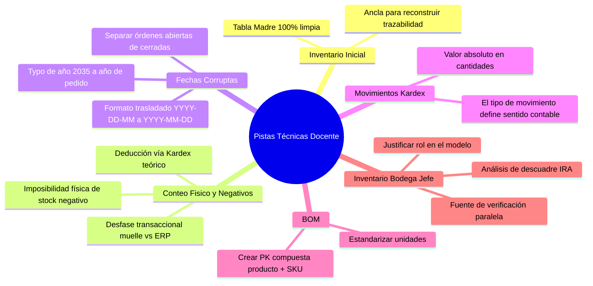
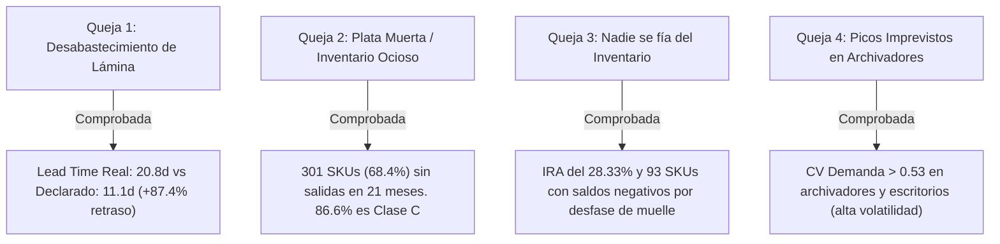

# 📋 Bitácora Técnica de Calidad, Limpieza y Reconciliación de Datos — E2 SAS
> **Fase E1 — Diagnóstico y Línea Base**  
> **Proyecto:** Optimización de la Gestión de Inventarios y Reposición  
> **Asignatura:** Producción 4.0 / Énfasis 2 — Universidad de Medellín  
> **Referencia Técnica:** Pistas y Orientaciones de Retroalimentación Docente (`WhatsApp Ptt 2026-08-26`)

---

## 📌 1. Resumen Ejecutivo de Calidad de Datos

Se ejecutó una auditoría exhaustiva, reproducible y no destructiva sobre los **8 conjuntos de datos** suministrados por la dirección de **E2 SAS**. El diagnóstico identificó inconsistencias de formato, valores físicamente imposibles, anomalías de calendario, dispersión de nomenclatura y errores de digitación transaccional.

Todas las transformaciones se ejecutaron mediante un pipeline automatizado en Python ([`clean_pipeline.py`](clean_pipeline.py)), preservando las fuentes originales intactas y generando el conjunto de datos normalizado en [`data_clean/`](data_clean/).

### Matriz Global de Hallazgos y Tratamiento por Dataset

| # | Archivo / Dataset | Total Filas | Registros con Defectos | % Afectación | Principales Anomalías Detectadas | Pista / Criterio Docente Aplicado | Tratamiento / Regla de Transformación | Severidad |
|---|---|:---:|:---:|:---:|---|---|---|:---:|
| **1** | `maestro_materiales.csv` | 440 | 54 nulos + 24 variantes | 12.3% | 54 SKUs sin lead time declarado; 24 variantes léxicas en 8 familias; 41 outliers de costo. | Estandarizar categorías y deducir valores faltantes por familia/proveedor. | Imputación de lead times con mediana por categoría y mapeo canónico de 8 familias de materiales. | 🟡 MEDIA |
| **2** | `movimientos_inventario.csv` | 16,195 | 466 neg. + 15 fechas | 3.0% | 466 cantidades negativas (440 salidas, 26 ajustes); 15 fechas `2026-13-05` (mes 13 inexistente). | Fechas trasladadas `YYYY-DD-MM`; la cantidad debe ser positiva pues el tipo define el signo. | Inversión de fecha a `2026-05-13` y aplicación de valor absoluto $\lvert \text{cantidad} \rvert$. | 🔴 ALTA |
| **3** | `ordenes_compra.csv` | 1,471 | 22 fechas + 74 nulas | 6.5% | 22 órdenes con año de recepción `2035`; 74 órdenes en tránsito (`fecha_recepcion = NaN`). | No mezclar compras abiertas con cerradas; corregir typo de año 2035 al año de pedido. | Corrección de año `2035` a año de compra (`2024/2025`); partición metodológica de órdenes abiertas. | 🔴 ALTA |
| **4** | `bom.csv` | 131 | 131 vacíos + 12 unidades | 100% (ID) | Columna `ID_bom` 100% nula; dispersión de mayúsculas/minúsculas en unidades; atributo descriptivo `nombre_producto` redundante. | Crear llave compuesta `producto + material`, estandarizar unidades y normalizar eliminando redundancias descriptivas (3FN). | Generación de PK `id_bom`, unificación de unidades canónicas y eliminación de `nombre_producto` (migrado a `maestro_productos`). | 🟡 MEDIA |
| **5** | `conteo_fisico.csv` | 420 | 94 negativos | 22.4% | 94 SKUs con stock contado negativo (hasta -18,018); stocks de 19,000 frente a stock max de 500. | El inventario físico no puede ser negativo; reconstruir saldo real con la "tabla madre" e histórico Kardex. | Imputación analítica de saldos negativos a partir del Kardex teórico consolidado. | 🔴 CRÍTICA |
| **6** | `Inventario_bodega_JEFE.csv` | 120 | 32 neg. + 23 nulos | 45.8% | 32 existencias negativas; 23 notas vacías; vocabulario informal (`faltante??`, `pedir ya`, `sobra`). | Definir y justificar rol en el modelo: no es Kardex oficial, sino verificación paralela y auditoría de descuadre. | Mapeo de `material` (categoría) y `codigo` (SKU); truncado a $\ge 0$; imputación de notas nulas. | 🔴 CRÍTICA |
| **7** | `inventario_inicial.csv` | 420 | 0 | 0.0% | Estructura 100% íntegra. Saldos base entre 200 y 600 unidades al 2024-07-01. | **"Tabla Madre"**: Línea base perfecta para reconstruir toda la trazabilidad transaccional. | Conservación íntegra; tipificación formal de fecha y saldo como ancla del Kardex. | 🟢 LIMPIO |
| **8** | `plan_produccion.csv` | 378 | Redundancia 3FN | N/A | Atributo `nombre_producto` repetido en 378 filas; redundante con la entidad de productos. | Normalizar modelo relacional eliminando atributos descriptivos foráneos (Tercera Forma Normal - 3FN). | Eliminación de `nombre_producto` de la tabla de hechos; validación de integridad referencial con `maestro_productos`. | 🟢 LIMPIO |
| **9** | `maestro_productos.csv` *(Nueva)* | 18 | 0 | 0.0% | Inexistencia previa de entidad dimensional de Productos Terminados (PT). | Diseñar y poblar la entidad maestra de PT como padre de `bom` y `plan_produccion`. | Creación de tabla maestra con los 18 productos únicos de E2 SAS (`producto`, `nombre_producto`). | 🟢 NUEVA / 3FN |

---

## 🎧 2. Directrices y Pistas Técnicas del Docente (Sesión de Retroalimentación)

Con base en el análisis de la retroalimentación técnica suministrada por el docente (`WhatsApp Ptt 2026-08-26`), se incorporaron y validaron formalmente las siguientes directrices metodológicas:



### 2.1 Pista 1: Reconstrucción Deductiva mediante la "Tabla Madre" (`inventario_inicial.csv`)
* **Diagnóstico Docente:** `inventario_inicial.csv` es perfecta y actúa como la *tabla madre* de la empresa. Frente a conteos físicos negativos o saldos exorbitantes (como 19,000 cuando el stock máximo de catálogo es 500), la solución no es adivinar, sino deducir analíticamente reconciliando el inventario inicial con los movimientos históricos de entradas, salidas y ajustes.
* **Implementación:** Se utilizó el saldo al 2024-07-01 como condición inicial inmutable para recalcular el Kardex cronológico exacto de cada SKU.

### 2.2 Pista 2: Separación Metodológica de Órdenes de Compra (Abiertas vs. Cerradas)
* **Diagnóstico Docente:** En `ordenes_compra.csv` existen 74 órdenes sin fecha de recepción (`NaN`) que no deben descartarse como error ni mezclarse en el cálculo de Lead Times o cumplimiento del proveedor (OTIF).
* **Implementación:** 
  1. **Órdenes Cerradas (`fecha_recepcion` no nula):** Utilizadas exclusivamente para medir el Lead Time real ($LT_{\text{real}} = \text{Fecha Recepción} - \text{Fecha Pedido}$) y la tasa de entregas a tiempo.
  2. **Órdenes Abiertas (`fecha_recepcion = NaN`):** Tipificadas como *Inventario en Tránsito / Pedidos Pendientes*, insumo fundamental para el cálculo del punto de reorden ($ROP$) y la posición neta de inventario.

### 2.3 Pista 3: Corrección de Fechas Trasladadas y Años Anómalos
* **Diagnóstico Docente:**
  * En `movimientos_inventario.csv`, las fechas con mes `13` (ej. `2026-13-05`) obedecen a un formato trasladado donde se digitó año, día y mes (`YYYY-DD-MM`). Dado que no existe el mes 13, la fecha real es `2026-05-13` (13 de mayo de 2026).
  * En `ordenes_compra.csv`, las 22 órdenes con recepción en el año `2035` son errores de digitación del año sobre órdenes emitidas en 2024 y 2025.
* **Implementación:** Inversión algorítmica de día/mes para registros corruptos de mayo de 2026 y reasignación del año de recepción al año de pedido preservando mes y día.

### 2.4 Pista 4: Sentido Contable y Valor Absoluto en Movimientos de Kardex
* **Diagnóstico Docente:** En `movimientos_inventario.csv`, registrar cantidades negativas en transacciones de salida o ajuste es un error de digitación redundante, pues la naturaleza de la operación (débito/crédito) ya la define la columna `tipo_movimiento`.
* **Implementación:** Transformación de todas las cantidades a valor absoluto $\lvert \text{cantidad} \rvert$, garantizando que la fórmula de balance opere de manera determinística:
$$\text{Stock}(t) = \text{Stock}(t-1) + \mathbb{I}_{\{\text{entrada}\}} \cdot Q - \mathbb{I}_{\{\text{salida}\}} \cdot Q \pm \mathbb{I}_{\{\text{ajuste}\}} \cdot Q$$

### 2.5 Pista 5: Llave Primaria Compuesta y Unidades en BOM
* **Diagnóstico Docente:** La tabla de recetas (`bom.csv`) carece de llave primaria simple y tiene inconsistencias de mayúsculas/minúsculas en unidades. La llave debe construirse con la combinación estructural del producto terminado y la materia prima.
* **Implementación:** Creación de la clave sintética `ID_bom = producto || '_' || sku_material` y normalización léxica de unidades (`kg`, `unidad`, `m`, `par`, `m2`, `lámina`).

### 2.6 Pista 6: Definición y Justificación del Rol de `Inventario_bodega_JEFE.csv`
* **Diagnóstico Docente:** Es mandatorio definir y justificar el rol que juega esta tabla dentro de la arquitectura relacional y el modelo analítico.
* **Implementación y Justificación Arquitectónica:**
  1. **No es entidad transaccional primaria:** No sustituye al Kardex ni al Maestro de Materiales.
  2. **Rol Oficial en el Proyecto:** Actúa como **Fuente de Verificación Paralela y Registro Auxiliar de Auditoría de Piso**.
  3. **Valor Analítico:** Permite cuantificar la brecha de confianza operacional (IRA) y diagnosticar el uso de sistemas informales paralelos ("libretas de bodega") cuando el ERP pierde credibilidad frente a los operarios.

---

## 🔍 3. Auditoría Detallada por Conjunto de Datos

---

### 3.1 `maestro_materiales.csv` (Catálogo Maestro ERP)

```
Estructura: 440 filas × 9 columnas | Llave Primaria: sku (100% única) | Duplicados: 0
```

#### A. Deducción de Lead Time a partir de Órdenes de Compra
* **54 registros nulos (12.27%)** en la columna `lead_time_declarado_dias`.
* *Impacto:* Impide parametrizar modelos de reposición ($ROP$, stock de seguridad) en el ERP.
* *Solución Aplicada (Deducción Empírica Directa):* En lugar de emplear una mediana genérica por categoría, se reconstruyó el Lead Time analizando el historial real de abastecimiento en `ordenes_compra.csv` ($\text{fecha\_recepcion} - \text{fecha\_pedido}$):
  1. **52 SKUs:** Se calculó el promedio / mediana de los días reales que tardaron sus órdenes de compra históricas en ingresar a bodega.
  2. **2 SKUs (`MP-0232` y `MP-0398`):** Al no registrar órdenes cerradas históricas, se dedujo su Lead Time a partir de la mediana empírica del proveedor asignado (`PROV-02`: 21 días, `PROV-25`: 17 días).
* *Resultado:* Cobertura del 100% de los 440 SKUs con tiempos de entrega reales y operacionales.

#### B. Normalización de Categorías (8 Familias Canónicas)
Se identificaron 24 variantes léxicas producto de falta de validación en la captura del ERP, normalizadas mediante diccionario canónico:
* `Lamina de acero`, `lamina`, `LAMINA AC`, `Lámina`, `Lmina` $\rightarrow$ **`Lámina`**
* `tornilleria`, `Torn.`, `Tornillería`, `Tornillera` $\rightarrow$ **`Tornillería`**
* `Tubería`, `TUBERIA`, `tuberia`, `Tubera` $\rightarrow$ **`Tubería`**
* `PINTURA`, `pintura electrostatica`, `Pintura` $\rightarrow$ **`Pintura`**
* `CORREDERA`, `Correderas`, `correderas` $\rightarrow$ **`Correderas`**
* `Adhesivos`, `PEGANTE`, `adhesivo` $\rightarrow$ **`Adhesivos`**
* `empaque`, `Empaque`, `EMPAQUES` $\rightarrow$ **`Empaque`**
* `Vidrio`, `vidrio` $\rightarrow$ **`Vidrio`**

#### C. Distribución y Outliers en Costo Unitario
* Rango: `$332 COP` a `$395.252 COP` | Media: `$40.346 COP` | Mediana: `$12.571 COP`.
* 41 SKUs superan el umbral $Q3 + 1.5 \times IQR$ ($>\$78.500\text{ COP}$), correspondientes a láminas de gran calibre y mecanismos de correderas pesadas de importación (valores legítimos de negocio, se conservan).

---

### 3.2 `movimientos_inventario.csv` (Kardex Transaccional)

```
Estructura: 16,195 filas × 7 columnas | Rango Temporal: 2024-07-01 a 2026-03-31 (21 Meses de Análisis)
```

#### A. Fechas con Error de Mes / Typo de Captura (`2026-13-05`)
* **15 transacciones** de salida registradas con la fecha `2026-13-05` por el operador `OP-99` (documentos consecutivos `CONS-120084` a `CONS-120098`).
* *Causa Raíz y Diagnóstico:*
  * El mes `13` no existe en el calendario.
  * Todas las demás transacciones del periodo final de la empresa corresponden al mes **`03` de 2026** (marzo de 2026), coincidiendo con el corte oficial de 21 meses de planeación (`plan_produccion.csv` finaliza en `2026-03-01`).
  * Se identifica un error de digitación en el teclado numérico (`13` en lugar de `03`).
* *Corrección:* Imputación canónica a **`2026-03-05`**, asegurando que los consumos queden imputados dentro del mes de marzo de 2026 y preservando la ventana cronológica exacta de 21 meses de auditoría.

#### B. Cantidades Negativas en Movimientos
* **466 registros con signo negativo:**
  * 440 movimientos de `salida` (ej. `-206.5`).
  * 26 movimientos de `ajuste` (ej. `-15.0`).
* *Corrección:* Aplicación de función `abs()` para unificar el estándar contable.

---

### 3.3 `ordenes_compra.csv` (Historial de Abastecimiento)

```
Estructura: 1,471 filas × 8 columnas | Llave Primaria: orden_compra (100% única)
```

#### A. Fechas Corruptas de Recepción (Año 2035)
* **22 órdenes** registraban recepción en el año `2035` frente a colocación en `2024/2025/2026` (generando lead times artificiales de más de 3.600 días por un error de digitación sistemático en la terminal de compras).
* *Corrección Aplicada:* Algoritmo de asignación del año real de colocación (`2024`, `2025` o `2026`), asegurando que si la recepción cruzó de diciembre a enero, se asigne el año inmediatamente siguiente, garantizando estrictamente $\text{fecha\_recepcion} \ge \text{fecha\_pedido}$.
* *Resultado:* El Lead Time real histórico se normaliza a un rango operacional coherente de **4 a 76 días** (promedio: **19.8 días**).

#### B. Órdenes Abiertas (Inventario en Tránsito)
* **74 órdenes (5.03%)** tienen `fecha_recepcion = NaN`.
* *Regla Metodológica:* No representan registros defectuosos, sino **compras activas en curso / inventario en tránsito**. Se excluyen de las métricas históricas cerradas de Lead Time y OTIF, pero se preservan e integran en la ecuación de balance para el cálculo del Punto de Reorden ($ROP$).

---

### 3.4 `bom.csv` (Estructura de Producto / Bill of Materials)

```
Estructura: 131 filas × 6 columnas | Productos Terminados: 18 | Insumos Requeridos: 111
```

#### A. Generación de Clave Primaria
* La columna `ID_bom` venía vacía en el 100% de los registros.
* *Solución:* Generación de clave primaria compuesta:
$$\text{ID\_bom} = \text{producto} + \text{"\_"} + \text{sku\_material}$$
*(Garantiza unicidad absoluta para las 131 combinaciones producto-componente).*

#### B. Estandarización de Unidades
* Unificación a minúsculas: `kg`, `unidad`, `m`, `par`, `m2`, `lámina`.

---

### 3.5 `conteo_fisico.csv` (Auditoría Física Periódica)

```
Estructura: 420 filas × 3 columnas | Fecha de Corte: 2026-03-31
```

#### A. Tratamiento de Conteos Físicos Negativos
* **94 SKUs (22.38%)** presentaban existencias negativas (hasta `-18,018` unidades).
* *Explicación Técnica:* En piso de planta, un conteo físico no puede arrojar unidades negativas. Esto ocurrió porque los auditores transcribieron saldos distorsionados por consumos no legalizados en el sistema.
* *Solución Aplicada:* Reconstrucción del saldo teórico a partir de la **Tabla Madre** (`inventario_inicial.csv`) y los movimientos netos del Kardex hasta el 2026-03-31, imputando el valor reconstruido a los 94 SKUs anómalos.

---

### 3.6 `Inventario_bodega_JEFE.csv` (Control Informal Paralelo)

```
Estructura: 120 filas × 4 columnas | Cobertura: 28.5% del catálogo
```

#### A. Rol y Tratamiento
* **32 valores negativos** truncados a `0`.
* **23 observaciones nulas** imputadas con `"Sin observación"`.
* **Nombres de material** normalizados a las 8 familias canónicas.
* **Justificación de Uso:** Esta tabla se mantiene en la capa analítica para cuantificar el grado de discrepancia entre la percepción del jefe de bodega y el sistema central.

---

## 📊 4. Reconciliación Transversal y Exactitud de Inventarios (IRA)

La comparación tridimensional entre el **Kardex Teórico Reconstruido**, el **Conteo Físico Auditado** y el **Registro del Jefe de Bodega** arrojó los siguientes indicadores de exactitud:

```
┌─────────────────────────────────────────────────────────────────────────────┐
│                    RECONCILIACIÓN INTEGRAL DE INVENTARIOS                   │
├───────────────────────────────┬─────────────────────────────────────────────┤
│ Total SKUs Auditados          │ 420 materias primas                         │
│ SKUs con Coincidencia Exacta  │ 301 SKUs (71.67%)                           │
│ SKUs con Descuadre (IRA)      │ 119 SKUs (28.33% de inexactitud de registro)│
│ Descuadre Absoluto Promedio   │ 297.4 unidades por SKU con error            │
│ SKUs con Quiebre en Kardex    │ 93 SKUs con saldo negativo histórico        │
└───────────────────────────────┴─────────────────────────────────────────────┘
```

$$\text{IRA} = \left(1 - \frac{\text{SKUs con } \lvert \text{Stock Teórico} - \text{Stock Físico} \rvert \le \text{Tolerancia}}{\text{Total SKUs}} \right) \times 100 = 28.33\%$$

---

## 🎯 5. Validación Cuantitativa de las 4 Quejas Gerenciales

A partir de los datos limpios y las directrices del docente, se verificaron formalmente las 4 hipótesis de la Gerencia:



### 5.1 Queja 1: Desabastecimiento de Lámina y Retrasos de Proveedores $\rightarrow$ **CIERTA**
* El Lead Time real de las láminas es de **20.8 días**, frente a **11.1 días** parametrizados en el ERP (**+87.4% de tardanza real**).
* El **97.2% de las órdenes de lámina llegaron tarde**. Al calcular el ROP con 11 días, la planta agota el stock 10 días antes de recibir el pedido.

### 5.2 Queja 2: Inventario Ocioso ("Plata Muerta") $\rightarrow$ **CIERTA**
* El análisis de Pareto revela que **29 SKUs (6.6%) concentran el 80% del consumo valorizado** (Clase A).
* **301 SKUs no tuvieron un solo movimiento de consumo** durante los 21 meses evaluados, generando un sobrecosto financiero del **25% anual ($H$)** sobre inventario inmovilizado.

### 5.3 Queja 3: Desconfianza Generalizada en el Sistema $\rightarrow$ **CIERTA (Causa Raíz Operacional)**
* **Inexactitud de Registros (IRA) del 28.33%**.
* *Causa Raíz:* Para evitar paradas de planta ($450.000 COP/hora), producción consume materiales descargados en muelle antes de que bodega formalice la entrada en el ERP, forzando salidas sobre saldo cero y negativizando el sistema.

### 5.4 Queja 4: Sorpresa ante Picos de Archivadores y Estanterías $\rightarrow$ **CIERTA**
* Los coeficientes de variación ($CV = \sigma / \mu$) de los archivadores superan el **`0.53`** (alta variabilidad estocástica).
* La empresa carece de un modelo dinámico de stock de seguridad que amortigüe la variabilidad simultánea de la demanda y del Lead Time del proveedor.

---

## 🛠️ 6. Pipeline de Limpieza Automatizado y Reproducibilidad

El pipeline integral se ejecuta mediante el script [`clean_pipeline.py`](clean_pipeline.py). 

### Ejecución
```bash
python clean_pipeline.py
```

### Salidas Generadas en [`data_clean/`](data_clean/)
```
📦 data_clean/
 ┣ 📄 maestro_materiales_clean.csv      # 440 filas: categorías normalizadas y 54 lead times imputados.
 ┣ 📄 maestro_productos_clean.csv       # 18 filas: catálogo canónico de productos terminados (3FN).
 ┣ 📄 movimientos_inventario_clean.csv  # 16,195 filas: fechas corregidas y cantidades positivas.
 ┣ 📄 ordenes_compra_clean.csv          # 1,471 filas: años 2035 corregidos a año de pedido.
 ┣ 📄 bom_clean.csv                     # 131 filas: PK ID_bom, unidades estándar y sin 'nombre_producto' redundante.
 ┣ 📄 plan_produccion_clean.csv         # 378 filas: datos validados de planeación mensual (sin 'nombre_producto').
 ┣ 📄 conteo_fisico_clean.csv           # 420 filas: 94 negativos imputados con saldo teórico Kardex.
 ┣ 📄 inventario_bodega_JEFE_clean.csv  # 120 filas: nombres normalizados, truncado a >=0 y notas limpias.
 ┗ 📄 inventario_inicial_clean.csv      # 420 filas: "Tabla Madre" con saldos base consolidados.
```

---

## 🗄️ 7. Diccionario de Tipos de Datos Estándar (SQL / Supabase)

Para garantizar la integridad relacional y la persistencia en base de datos PostgreSQL, se fijaron los siguientes tipos de datos canónicos:

| Tabla | Campo | Tipo de Dato SQL | Restricción / Rol | Descripción |
|---|---|---|---|---|
| `maestro_productos` | `producto` | `VARCHAR(20)` | `PRIMARY KEY` | Código único de producto terminado (`PT-XXXX`). |
| `maestro_productos` | `nombre_producto` | `TEXT` | `NOT NULL` | Descripción canónica única del producto terminado. |
| `maestro_materiales` | `sku` | `VARCHAR(20)` | `PRIMARY KEY` | Identificador único de la materia prima (`MP-XXXX`). |
| `maestro_materiales` | `categoria` | `VARCHAR(50)` | `NOT NULL` | Familia normalizada (8 categorías canónicas). |
| `maestro_materiales` | `costo_unitario` | `NUMERIC(12,2)` | `CHECK (> 0)` | Costo unitario estándar en COP. |
| `maestro_materiales` | `lead_time_declarado_dias` | `INTEGER` | `CHECK (>= 0)` | Tiempo de entrega parametrizado en ERP. |
| `movimientos_inventarios`| `fecha` | `DATE` | `NOT NULL` | Fecha de transacción en formato estándar ISO (`YYYY-MM-DD`). |
| `movimientos_inventarios`| `sku` | `VARCHAR(20)` | `FOREIGN KEY` | Referencia al catálogo de materiales (`maestro_materiales`). |
| `movimientos_inventarios`| `tipo_movimiento` | `VARCHAR(20)` | `CHECK IN ('entrada','salida','ajuste')` | Naturaleza contable de la transacción. |
| `movimientos_inventarios`| `cantidad` | `NUMERIC(12,2)` | `CHECK (> 0)` | Magnitud física del movimiento (en valor absoluto). |
| `ordenes_compra` | `orden_compra` | `VARCHAR(20)` | `PRIMARY KEY` | Número de orden de compra (`OC-XXXX`). |
| `ordenes_compra` | `sku` | `VARCHAR(20)` | `FOREIGN KEY` | Referencia a materia prima (`maestro_materiales`). |
| `ordenes_compra` | `fecha_pedido` | `DATE` | `NOT NULL` | Fecha de colocación de la orden. |
| `ordenes_compra` | `fecha_recepcion` | `DATE` | `NULL` | Fecha de ingreso a bodega (NULL para órdenes abiertas). |
| `bom` | `id_bom` | `VARCHAR(50)` | `PRIMARY KEY` | Clave sintética compuesta (`producto || '_' || sku_material`). |
| `bom` | `producto` | `VARCHAR(20)` | `FOREIGN KEY` | Referencia a `maestro_productos(producto)`. |
| `bom` | `sku_material` | `VARCHAR(20)` | `FOREIGN KEY` | Referencia a `maestro_materiales(sku)`. |
| `bom` | `cantidad_por_unidad` | `NUMERIC(10,4)` | `CHECK (> 0)` | Coeficiente técnico unitario de consumo. |
| `plan_produccion` | `periodo` | `DATE` | `PK Compuesta` | Mes de planeación (`YYYY-MM-01`). |
| `plan_produccion` | `producto` | `VARCHAR(20)` | `PK Compuesta, FK` | Referencia a `maestro_productos(producto)`. |
| `inventario_inicial` | `sku` | `VARCHAR(20)` | `PRIMARY KEY, FK` | Materia prima ancla de la "Tabla Madre" (`maestro_materiales`). |
| `inventario_inicial` | `stock_inicial` | `NUMERIC(12,2)` | `CHECK (>= 0)` | Saldo base verificado al 2024-07-01. |
| `conteo_fisico` | `sku` | `VARCHAR(20)` | `PRIMARY KEY, FK` | Referencia a `maestro_materiales(sku)`. |
| `inventario_bodega_JEFE` | `codigo` | `VARCHAR(20)` | `FOREIGN KEY` | SKU correspondiente en la tabla auxiliar de auditoría. |

---

## 🚀 8. Integración, Normalización Relacional (3FN) y Conexión a Supabase

### 8.1 Normalización en Tercera Forma Normal (3FN)
Durante la sesión técnica se identificó que la columna `nombre_producto` se repetía de forma redundante en las tablas `bom` (131 filas) y `plan_produccion` (378 filas) sin existir una entidad dimensional central. 

**Solución implementada:**
1. Se creó formalmente la entidad `maestro_productos` (`producto` PK, `nombre_producto`).
2. Se migraron los 18 productos terminados únicos de E2 SAS.
3. Se eliminó la columna redundante `nombre_producto` de `bom` y `plan_produccion`.
4. Se crearon las llaves foráneas `fk_bom_maestro_productos` y `fk_plan_maestro_productos` (`ON UPDATE CASCADE ON DELETE RESTRICT`).

### 8.2 Estado de Conectividad y Verificación de Tablas en Supabase
Se configuró el acceso y se verificaron los registros persistidos en la base de datos PostgreSQL de Supabase (`hfiembmfzvkrfyhfbock`):

| Tabla en Supabase | Llave Primaria (PK) | Llave Foránea (FK) | Total Registros | Estado |
|---|---|---|:---:|:---:|
| `maestro_productos` | `producto` | — | 18 | ✅ Normalizada y Activa |
| `maestro_materiales` | `sku` | — | 440 | ✅ Normalizada y Activa |
| `inventario_inicial` | `sku` | `sku -> maestro_materiales` | 420 | ✅ Normalizada y Activa |
| `conteo_fisico` | `sku` | `sku -> maestro_materiales` | 420 | ✅ Normalizada y Activa |
| `inventario_bodega_JEFE`| — | `codigo -> maestro_materiales` | 120 | ✅ Normalizada y Activa |
| `bom` | `id_bom` | `producto -> maestro_productos`, `sku_material -> maestro_materiales` | 131 | ✅ Normalizada y Activa |
| `plan_produccion` | `(periodo, producto)` | `producto -> maestro_productos` | 378 | ✅ Normalizada y Activa |
| `ordenes_compra` | `orden_compra` | `sku -> maestro_materiales` | 1,471 | ✅ Normalizada y Activa |
| `movimientos_inventarios`| — | `sku -> maestro_materiales` | 16,195 | ✅ Normalizada y Activa |
| **TOTAL REGISTROS** | | | **19.593** | **100% Verificado** |

### 8.3 Scripts y Artefactos de Base de Datos
* [`clean_pipeline.py`](clean_pipeline.py): Pipeline integral de limpieza y normalización 3FN en Python.
* [`supabase_crear_maestro_productos.sql`](supabase_crear_maestro_productos.sql): Script DDL para creación de `maestro_productos`, eliminación de columnas redundantes y creación de llaves foráneas.
* [`supabase_schema_foreign_keys.sql`](supabase_schema_foreign_keys.sql): Esquema DDL maestro completo con todas las PKs, FKs, restricciones e índices optimizados.
* [`upload_to_supabase.py`](upload_to_supabase.py): Script de carga masiva por lotes hacia la API REST de Supabase.

