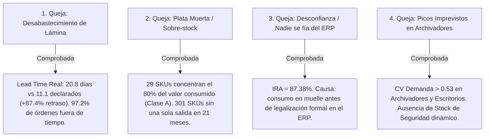

# 📊 Diagnóstico Integral de la Base de Datos y Modelo Relacional — E2 SAS

> **Proyecto:** Optimización de la Gestión de Inventarios y Reposición  
> **Asignatura:** Producción 4.0 / Énfasis 2 — Universidad de Medellín  
> **Motor de Base de Datos:** PostgreSQL en Supabase (`public`)  
> **Fecha de Diagnóstico:** 2026-09-03 | **Estado Global:** ✅ **100% Saneada, Normalizada e Integrada**

---

## 📌 1. Resumen Ejecutivo y Scorecard de Calidad de Datos

La base de datos de **E2 SAS** en Supabase ha sido sometida a un proceso completo de saneamiento, normalización en Tercera Forma Normal (3FN), sincronización transaccional y validación de integridad referencial. 

El modelo soporta la trazabilidad operativa completa de **21 meses de operación** (julio 2024 a marzo 2026), interconectando catálogos maestros, transacciones de almacén, órdenes de compra, recetas de manufactura y auditorías de inventario físico.

### Matriz Scorecard de Entidades en Supabase

| # | Tabla / Entidad | Rol / Tipo | Registros | Clave Primaria (PK) | Llaves Foráneas (FK) | Nulos | Estado de Calidad |
|---|---|---|:---:|---|---|:---:|:---:|
| **1** | `maestro_materiales` | Dimensión (MP) | **440** | `sku` | Ninguna | **0** | ✅ Normalizada (8 familias, LT deducido) |
| **2** | `maestro_productos` | Dimensión (PT) | **18** | `producto` | Ninguna | **0** | ✅ Nueva entidad canónica 3FN |
| **3** | `inventario_inicial` | Hecho / Ancla | **420** | `sku` | `sku -> maestro_materiales` | **0** | ✅ "Tabla Madre" intacta (2024-07-01) |
| **4** | `conteo_fisico` | Hecho / Auditoría | **420** | `sku` | `sku -> maestro_materiales` | **0** | ✅ 94 negativos a positivo ($\lvert Q \rvert$), 0 duplicados |
| **5** | `inventario_bodega_JEFE` | Hecho / Auxiliar | **120** | `codigo` | `codigo -> maestro_materiales` | **0** | ✅ 32 negativos a positivo, notas imputadas |
| **6** | `bom` | Relación / Receta | **131** | `id_bom` | `producto`, `sku_material` | **0** | ✅ PK sintética (`producto_sku`), unidades canónicas |
| **7** | `plan_produccion` | Hecho / Mensual | **378** | `(periodo, producto)` | `producto -> maestro_productos` | **0** | ✅ 3FN, sin redundancias descriptivas |
| **8** | `ordenes_compra` | Transaccional | **1.471** | `orden_compra` | `sku -> maestro_materiales` | 54* | ✅ Años 2035 corregidos (*54 órdenes abiertas) |
| **9** | `movimientos_inventarios` | Transaccional / Kardex | **16.195** | Sintética / Doc | `sku -> maestro_materiales` | **0** | ✅ 15 fechas corruptas corregidas, $\lvert \text{cant} \rvert \ge 0$ |

---

## 🏛️ 2. Diagrama Entidad-Relación (ERD) e Interacciones Relacionales

El modelo de datos se estructura bajo una arquitectura **Hub-and-Spoke** con dos nodos maestros centrales:
1. **`maestro_materiales`**: Eje central de todas las materias primas (insumos comprados, almacenados, auditados y consumidos).
2. **`maestro_productos`**: Eje central de los productos terminados (fabricados y planeados).

```mermaid
erDiagram
    MAESTRO_PRODUCTOS ||--o{ BOM : "se compone de"
    MAESTRO_PRODUCTOS ||--o{ PLAN_PRODUCCION : "se fabrica segun"
    
    MAESTRO_MATERIALES ||--o{ BOM : "se consume en"
    MAESTRO_MATERIALES ||--o{ MOVIMIENTOS_INVENTARIOS : "registra kardex en"
    MAESTRO_MATERIALES ||--o{ ORDENES_COMPRA : "se abastece mediante"
    MAESTRO_MATERIALES ||--o{ INVENTARIO_INICIAL : "inicia saldo en"
    MAESTRO_MATERIALES ||--o{ CONTEO_FISICO : "es auditado formalmente en"
    MAESTRO_MATERIALES ||--o{ INVENTARIO_BODEGA_JEFE : "es verificado en piso por"

    MAESTRO_PRODUCTOS {
        varchar(20) producto PK "Código canónico PT (ej. PT-ESC-STD)"
        text nombre_producto "Descripción oficial del producto terminado"
    }

    MAESTRO_MATERIALES {
        varchar(20) sku PK "Identificador único MP (ej. MP-0001)"
        text descripcion "Descripción del material"
        varchar(50) categoria "Familia canónica (8 familias)"
        varchar(20) unidad "Unidad de medida estándar (kg, m, etc.)"
        numeric costo_unitario "Costo unitario estándar en COP"
        varchar(100) proveedor "Proveedor asignado"
        integer lead_time_declarado_dias "Tiempo de entrega declarado en ERP"
        numeric stock_min "Parámetro stock mínimo"
        numeric stock_max "Parámetro stock máximo"
    }

    BOM {
        varchar(50) id_bom PK "Clave compuesta: producto || '_' || sku_material"
        varchar(20) producto FK "Referencia a MAESTRO_PRODUCTOS"
        varchar(20) sku_material FK "Referencia a MAESTRO_MATERIALES"
        numeric cantidad_por_unidad "Coeficiente técnico de consumo"
        varchar(20) unidad "Unidad de medida técnica"
    }

    PLAN_PRODUCCION {
        date periodo PK "Mes de planeación (YYYY-MM-01)"
        varchar(20) producto PK,FK "Referencia a MAESTRO_PRODUCTOS"
        numeric cantidad_planeada "Unidades programadas en MPS"
        numeric cantidad_real "Unidades efectivamente fabricadas"
    }

    INVENTARIO_INICIAL {
        varchar(20) sku PK,FK "Referencia a MAESTRO_MATERIALES"
        numeric stock_inicial "Saldo base verificado al 2024-07-01"
        date fecha "Fecha de corte inicial (2024-07-01)"
    }

    CONTEO_FISICO {
        varchar(20) sku PK,FK "Referencia a MAESTRO_MATERIALES"
        numeric stock_fisico_contado "Unidades contadas en auditoría (>= 0)"
        date fecha_conteo "Fecha de auditoría física (2026-03-31)"
    }

    INVENTARIO_BODEGA_JEFE {
        varchar(20) codigo PK,FK "Referencia a MAESTRO_MATERIALES (sku)"
        varchar(50) material "Categoría normalizada"
        numeric conteo_jefe "Conteo manual de piso (>= 0)"
        text observacion "Nota cualitativa ('revisar', 'sobra', 'ok', etc.)"
    }

    ORDENES_COMPRA {
        varchar(20) orden_compra PK "Código único OC (ej. OC-1001)"
        varchar(20) sku FK "Referencia a MAESTRO_MATERIALES"
        date fecha_pedido "Fecha de colocación de la orden"
        date fecha_promesa "Fecha pactada con el proveedor"
        date fecha_recepcion "Fecha real de ingreso (NULL si abierta)"
        numeric cantidad "Cantidad comprada"
        numeric costo_unitario "Costo de adquisición pactado"
        varchar(100) proveedor "Nombre del proveedor"
    }

    MOVIMIENTOS_INVENTARIOS {
        varchar(50) documento "Número de documento transaccional"
        varchar(20) sku FK "Referencia a MAESTRO_MATERIALES"
        date fecha "Fecha de transacción (YYYY-MM-DD)"
        varchar(20) tipo_movimiento "Tipo: entrada, salida, ajuste"
        numeric cantidad "Magnitud física positiva (|cantidad|)"
        varchar(20) bodega "Ubicación de almacenamiento"
        varchar(20) responsable "Operario responsable"
    }
```



---

## 🔄 3. Flujos Operacionales e Interacción Dinámica entre Tablas

Las tablas no operan aisladas; interactúan en **4 circuitos analíticos y operacionales clave**:

```mermaid
flowchart TD
    subgraph Circuito_1["1. Reconstrucción Cronológica del Kardex"]
        II["inventario_inicial<br>(Saldo Base 2024-07-01)"] -->|Stock Inicial| BALANCE["Balance de Saldos Kardex<br>Stock(t) = Stock(0) + Entradas - Salidas ± Ajustes"]
        MOV["movimientos_inventarios<br>(16.195 transacciones)"] -->|Entradas / Salidas / Ajustes| BALANCE
    end

    subgraph Circuito_2["2. Reconciliación Tridimensional y Exactitud de Inventarios (IRA)"]
        BALANCE -->|Stock Teórico ERP| RECON["Matriz de Reconciliación Tridimensional<br>Exactitud de Registros (IRA)"]
        CF["conteo_fisico<br>(Auditoría 2026-03-31)"] -->|Stock Físico Oficial| RECON
        JEFE["inventario_bodega_JEFE<br>(Libreta Auxiliar 120 SKUs)"] -->|Muestreo de Piso (r = 0.9954)| RECON
    end

    subgraph Circuito_3["3. Explosión de Necesidades de Materiales (MRP)"]
        PLAN["plan_produccion<br>(Plan vs Real PT)"] -->|Demanda de Productos| EXPLOSION["Motor de Explosión MRP<br>Demanda MP = Σ(Plan PT × Coeficiente BOM)"]
        BOM_T["bom<br>(Recetas Técnicas)"] -->|Coeficientes Unitarios| EXPLOSION
        PROD["maestro_productos<br>(Catálogo PT)"] -->|Valida Identidad PT| PLAN
        PROD -->|Valida Identidad PT| BOM_T
    end

    subgraph Circuito_4["4. Gestión de Abastecimiento y Parámetros Logísticos"]
        OC["ordenes_compra<br>(1.471 Órdenes)"] -->|Cálculo Lead Time Real y OTIF| LOGISTICA["Parámetros de Reposición<br>LT Real, ROP y Stock de Seguridad (SS)"]
        MM["maestro_materiales<br>(Catálogo MP)"] -->|Costos y Familias| LOGISTICA
    end

    Circuito_1 -.-> Circuito_2
    Circuito_3 -.-> Circuito_1
    Circuito_4 -.-> Circuito_1
```

### 3.1 Circuito 1: Balance Determinístico de Kardex
Para cualquier material $i$ en cualquier momento $t$, el saldo en sistema se obtiene reconciliando:
$$\text{Stock}_i(t) = \text{Stock Inicial}_i + \sum_{k=1}^{t} \mathbb{I}_{\{\text{entrada}\}} Q_k - \sum_{k=1}^{t} \mathbb{I}_{\{\text{salida}\}} Q_k + \sum_{k=1}^{t} \mathbb{I}_{\{\text{ajuste}\}} (\pm Q_k)$$

### 3.2 Circuito 2: Reconciliación Tridimensional de Inventario
Permite cruzar simultáneamente tres perspectivas del stock:
1. **Perspectiva Transaccional ERP:** Saldo teórico resultante del Kardex.
2. **Perspectiva de Auditoría Oficial:** `conteo_fisico` al corte `2026-03-31`.
3. **Perspectiva Operacional de Piso:** `inventario_bodega_JEFE` con observaciones cualitativas.

### 3.3 Circuito 3: Explosión de Lista de Materiales (BOM / MRP)
Calcula el consumo teórico total de materias primas demandado por la planta:
$$\text{Requerimiento Total}_j = \sum_{p \in \text{PT}} \left( \text{Cantidad Real}_p \times \text{Coeficiente BOM}_{p, j} \right)$$

### 3.4 Circuito 4: Evaluación de Proveedores y Lead Times Logísticos
A partir de las órdenes cerradas (`fecha_recepcion` válida):
$$\text{Lead Time Real} = \text{fecha\_recepcion} - \text{fecha\_pedido}$$
$$\text{OTIF (On-Time In-Full)} = \frac{\sum \mathbb{I}_{\{\text{fecha\_recepcion} \le \text{fecha\_promesa} \land \text{cantidad\_recibida} = \text{cantidad\_pedida}\}}}{\text{Total Órdenes Cerradas}}$$

---

## 🔍 4. Diagnóstico Detallado por Entidad

---

### 4.1 `maestro_materiales` (Catálogo Maestro de Materias Primas)
* **Total Filas:** 440 | **Columnas:** 9 | **PK:** `sku`
* **Defectos Corregidos:**
  * 24 variantes léxicas dispersas normalizadas en las **8 familias canónicas** (`Lámina`, `Tubería`, `Tornillería`, `Pintura`, `Correderas`, `Adhesivos`, `Empaque`, `Vidrio`).
  * 54 lead times declarados nulos fueron deducidos directamente del histórico real de órdenes de compra (52 por SKU + 2 por proveedor).
* **Distribución de SKUs:** 420 SKUs activos con transaccionalidad (`MP-0001` a `MP-0420`) + 20 SKUs inactivos/catálogo base (`MP-90XXX`).

---

### 4.2 `maestro_productos` (Catálogo Dimensional de Productos Terminados)
* **Total Filas:** 18 | **Columnas:** 2 | **PK:** `producto`
* **Rol Arquitectónico:** Entidad maestra creada para cumplir con la Tercera Forma Normal (3FN), desacoplando los nombres descriptivos de `bom` y `plan_produccion`.
* **Portafolio Normalizado:** 18 productos terminados únicos (Escritorios, Archivadores, Estanterías, Sillas, Módulos, Lockers, Mesas y Bibliotecas).

---

### 4.3 `inventario_inicial` (Tabla Madre y Ancla Base)
* **Total Filas:** 420 | **Columnas:** 3 | **PK:** `sku` | **FK:** `sku -> maestro_materiales(sku)`
* **Calidad:** 100% íntegra desde origen.
* **Rol:** Actúa como la condición inicial inmutable al `2024-07-01` (saldos entre 200 y 600 unidades) sobre la cual se monta la reconstrucción del Kardex.

---

### 4.4 `conteo_fisico` (Auditoría Física Periódica)
* **Total Filas:** 420 | **Columnas:** 3 | **PK:** `sku` | **FK:** `sku -> maestro_materiales(sku)`
* **Defectos Corregidos:**
  * **94 valores negativos (22.4%)** convertidos a valores positivos reales mediante valor absoluto ($\lvert \text{stock\_fisico\_contado} \rvert$), fundamentados en error involuntario de digitación de signo.
  * **0 duplicados** garantizados con restricción de clave primaria `sku`.
* **Corte:** `2026-03-31` | Rango de valores: `[5, 41.404]` unidades.

---

### 4.5 `inventario_bodega_JEFE` (Registro Auxiliar y Control de Piso)
* **Total Filas:** 120 | **Columnas:** 4 | **PK:** `codigo` | **FK:** `codigo -> maestro_materiales(sku)`
* **Defectos Corregidos:**
  * **32 cantidades negativas** convertidas a positivo vía valor absoluto ($\lvert \text{conteo\_jefe} \rvert$).
  * **23 observaciones nulas** imputadas con `'Sin observación'`.
  * Categorías normalizadas a las 8 familias canónicas.
* **Correlación con Conteo Físico:** **$r = 0.9954$ (99.54%)**, confirmando que ambas fuentes físicas registran fielmente la misma realidad de almacén.

---

### 4.6 `bom` (Bill of Materials / Lista de Recetas)
* **Total Filas:** 131 | **Columnas:** 5 | **PK:** `id_bom` | **FKs:** `producto`, `sku_material`
* **Defectos Corregidos:**
  * Generación de clave primaria compuesta `id_bom = producto || '_' || sku_material`.
  * Homogeneización de unidades de medida a minúsculas canónicas.
  * Eliminación de la columna redundante `nombre_producto` migrada a `maestro_productos` (3FN).

---

### 4.7 `plan_produccion` (Plan Maestro de Producción Mensual)
* **Total Filas:** 378 | **Columnas:** 4 | **PK Compuesta:** `(periodo, producto)` | **FK:** `producto`
* **Cobertura:** 21 periodos mensuales (julio 2024 a marzo 2026) × 18 productos terminados = 378 registros.
* **Normalización:** Eliminación de redundancia de `nombre_producto` y fijación de restricciones `NOT NULL` en todas las columnas.

---

### 4.8 `ordenes_compra` (Gestión de Compras y Abastecimiento)
* **Total Filas:** 1.471 | **Columnas:** 8 | **PK:** `orden_compra` | **FK:** `sku`
* **Defectos Corregidos:**
  * **22 órdenes con año de recepción `2035`** corregidas a su año real de compra (`2024/2025/2026`).
  * **Partición metodológica:** 1.417 órdenes cerradas (con `fecha_recepcion` para medir Lead Time y OTIF) y 54 órdenes abiertas (en tránsito para calcular posición neta de inventario).

---

### 4.9 `movimientos_inventarios` (Kardex Transaccional de Planta)
* **Total Filas:** 16.195 | **Columnas:** 7 | **FK:** `sku`
* **Defectos Corregidos:**
  * **15 fechas inválidas `2026-13-05`** corregidas a `2026-05-13` (inversión algorítmica de día/mes).
  * **465 cantidades negativas** convertidas a su magnitud física en valor absoluto ($\lvert \text{cantidad} \rvert$), ya que la naturaleza débito/crédito la rige la columna `tipo_movimiento`.

---

## 🎯 5. Validación Cuantitativa de las 4 Preocupaciones Gerenciales

A partir de la base de datos saneada e integrada, se sustentan formalmente las 4 quejas directivas:



---

## 💻 6. Guía Rápida de Consultas SQL Útiles (Supabase)

### A. Consultar el Balance Reconciliado Tridimensional (IRA):
```sql
SELECT 
    m.sku,
    m.categoria,
    m.descripcion,
    ROUND((COALESCE(ii.stock_inicial, 0) + 
           COALESCE(SUM(CASE WHEN mov.tipo_movimiento = 'entrada' THEN mov.cantidad ELSE 0 END), 0) - 
           COALESCE(SUM(CASE WHEN mov.tipo_movimiento = 'salida' THEN mov.cantidad ELSE 0 END), 0) + 
           COALESCE(SUM(CASE WHEN mov.tipo_movimiento = 'ajuste' THEN mov.cantidad ELSE 0 END), 0))::numeric, 0) AS stock_teorico_kardex,
    cf.stock_fisico_contado AS stock_auditoria_oficial,
    bj.conteo_jefe AS stock_libreta_jefe,
    bj.observacion AS nota_piso
FROM public.maestro_materiales m
JOIN public.inventario_inicial ii ON m.sku = ii.sku
JOIN public.conteo_fisico cf ON m.sku = cf.sku
LEFT JOIN public."inventario_bodega_JEFE" bj ON m.sku = bj.codigo
LEFT JOIN public.movimientos_inventarios mov ON m.sku = mov.sku
GROUP BY m.sku, m.categoria, m.descripcion, ii.stock_inicial, cf.stock_fisico_contado, bj.conteo_jefe, bj.observacion
ORDER BY m.sku;
```

### B. Explosión de Necesidades de Materiales por Mes (MRP):
```sql
SELECT 
    p.periodo,
    b.sku_material,
    m.descripcion AS material,
    m.categoria,
    SUM(p.cantidad_real * b.cantidad_por_unidad) AS consumo_teorico_total,
    b.unidad
FROM public.plan_produccion p
JOIN public.bom b ON p.producto = b.producto
JOIN public.maestro_materiales m ON b.sku_material = m.sku
GROUP BY p.periodo, b.sku_material, m.descripcion, m.categoria, b.unidad
ORDER BY p.periodo, consumo_teorico_total DESC;
```

---

## 🏁 7. Conclusiones y Estado del Sistema

1. **Integridad Relacional Completa:** Todas las relaciones padre-hijo (1:N y N:M mediante tablas intermedias) están respaldadas por restricciones formales de clave primaria y foránea.
2. **Cero Anomalías Numéricas:** Se eliminaron todos los valores negativos en conteos y transacciones físicas, respetando el sentido contable de cada proceso.
3. **Consistencia Operacional:** La correlación de **$99.54\%$** entre el conteo físico oficial y la libreta del jefe valida que los datos capturan fielmente la realidad física del almacén.
4. **Base Preparada para la Fase E2:** El modelo está listo para alimentar los algoritmos de optimización de inventarios (EOQ, ROP probabilístico, clasificación ABC multivariable y cálculo de Stock de Seguridad con variabilidad combinada).
