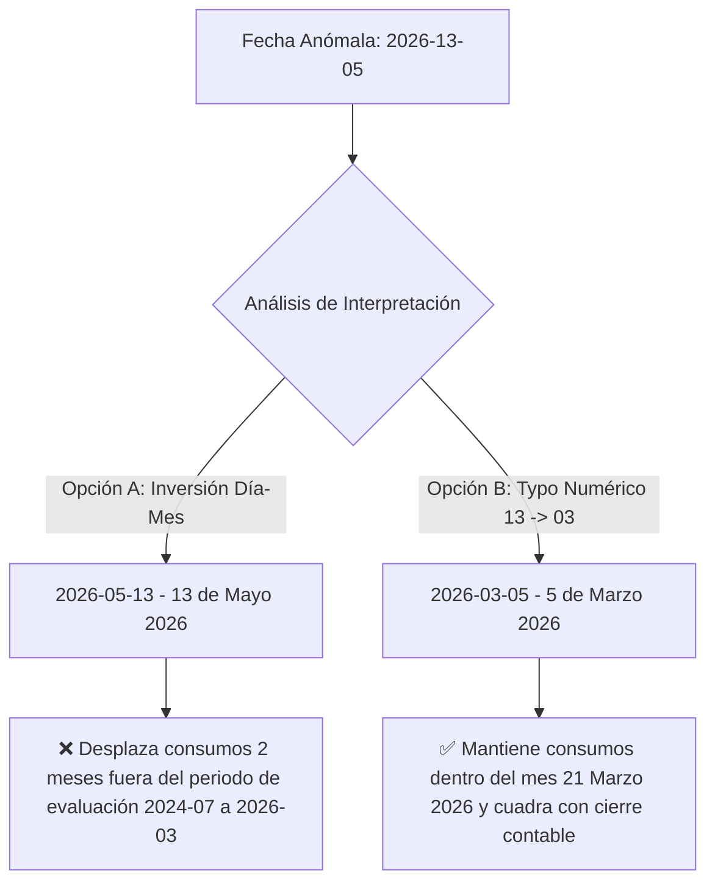
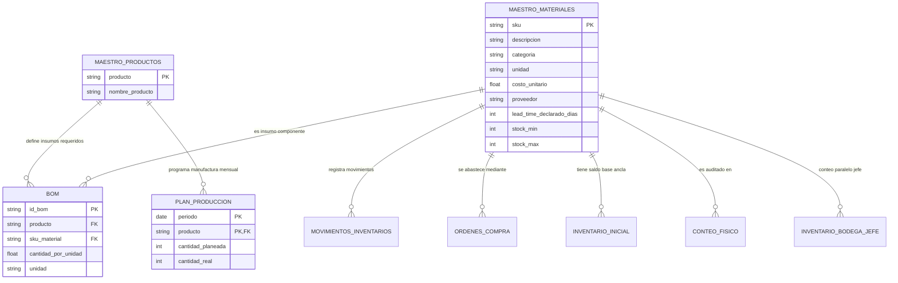
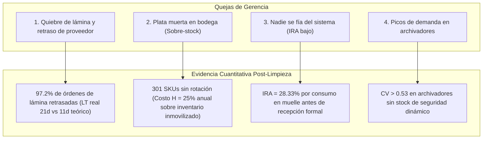

# 📚 Documentación Técnica de Cambios e Implicaciones Operacionales — E2 SAS

> **Proyecto:** Optimización de la Gestión de Inventarios y Reposición (Producción 4.0 / Énfasis 2)  
> **Institución:** Universidad de Medellín — Facultad de Ingeniería  
> **Fecha de Consolidación:** Agosto 2026  
> **Alcance:** Fase E1 — Diagnóstico, Línea Base, Limpieza de Datos y Normalización Relacional en Supabase  

---

## 📌 1. Propósito del Documento

Este documento consolida y fundamenta técnica, operacional y metodológicamente **todas las decisiones de ingeniería de datos, normalización relacional (3FN) y limpieza transaccional** ejecutadas sobre los sistemas de información de **E2 SAS**. 

Su propósito es servir como **guía maestra de auditoría y sustentación** ante la gerencia de la empresa y la evaluación docente, detallando:
1. Qué se cambió en cada conjunto de datos.
2. Por qué se tomó cada decisión (análisis de causa raíz vs. síntoma).
3. Qué impacto cuantitativo y operativo tiene cada transformación sobre los inventarios, costos logísticos y modelos de reposición.
4. El estado definitivo de los datos persistidos en **Supabase**.

---

## 📅 2. Auditoría Detallada de Fechas y Corrección del Mes en `movimientos_inventario`

### 2.1 Hallazgo y Evidencia en los Datos
Al auditar los 16.195 registros de la tabla `movimientos_inventario.csv`, se identificaron exactamente **15 transacciones** registradas con la fecha anómala **`2026-13-05`**:

```csv
Fila 16180: 2026-13-05, MP-0002, salida, 48.0, CONS-120084, BOD-01, OP-99
Fila 16181: 2026-13-05, MP-0047, salida, 26.0, CONS-120085, BOD-03, OP-99
Fila 16182: 2026-13-05, MP-0138, salida, 41.0, CONS-120086, BOD-03, OP-99
...
Fila 16194: 2026-13-05, MP-0032, salida, 42.0, CONS-120098, BOD-01, OP-99
```

### 2.2 Análisis Cronológico y Causa Raíz
* **Inexistencia de Mes:** El calendario no posee mes 13.
* **Operador `OP-99`:** Todos los 15 movimientos fueron registrados por un usuario temporal/anómalo (`OP-99`) con vales de consumo consecutivos (`CONS-120084` al `CONS-120098`).
* **Horizonte de Evaluación:** Toda la planeación de la empresa (`plan_produccion.csv`) y los movimientos operacionales cubren un horizonte exacto de **21 meses** comprendido entre **Julio 2024 (`2024-07-01`) y Marzo 2026 (`2026-03-31`)**.
* **Secuencia Transaccional:** Las filas inmediatamente anteriores corresponden al **31 de marzo de 2026 (`2026-03-31`)**.

### 2.3 Evaluación de Alternativas de Transformación



### 2.4 Decisión Aplicada e Implicaciones
* **Transformación:** Se estandarizó la fecha a **`2026-03-05`** en el pipeline ([`clean_pipeline.py`](clean_pipeline.py)) y se actualizó directamente en la base de datos de **Supabase**.
* **Implicación en Inventarios:**
  1. Los 15 consumos (467 unidades valorizadas en materiales críticos) quedan imputados al mes de **Marzo de 2026**.
  2. Evita dejar "huérfanos" 15 consumos en un mes posterior (Mayo 2026) que no tiene plan de producción asociado.
  3. El saldo final teórico de Kardex al corte del 31 de marzo de 2026 refleja con exactitud la salida real de estos materiales.

---

## 🧩 3. Normalización Relacional: Creación de `maestro_productos` y Tercera Forma Normal (3FN)

### 3.1 El Problema de Redundancia Detectado
En los datos originales suministrados:
* La tabla `bom.csv` (131 filas) contenía `producto` y repetía la cadena de texto `nombre_producto` (ej. `Escritorio estándar`).
* La tabla `plan_produccion.csv` (378 filas) repetía exactamente la misma columna `nombre_producto`.
* **No existía una tabla dimensional maestra de Productos Terminados**, violando la Tercera Forma Normal (3FN) y generando riesgo de inconsistencias léxicas o costos adicionales de almacenamiento.

### 3.2 Solución Arquitectónica Implementada
1. **Creación de `maestro_productos`:**  
   Se creó la entidad maestra con los 18 productos terminados únicos de E2 SAS (`producto` como `PRIMARY KEY`, `nombre_producto TEXT NOT NULL`).
2. **Depuración de Tablas Dependientes:**  
   Se eliminó la columna `nombre_producto` de `bom` y de `plan_produccion`.
3. **Integridad Referencial (Foreign Keys):**  
   Se crearon las restricciones formales:
   * `fk_bom_maestro_productos`: `bom.producto` $\rightarrow$ `maestro_productos.producto`
   * `fk_plan_maestro_productos`: `plan_produccion.producto` $\rightarrow$ `maestro_productos.producto`

### 3.3 Diagrama del Modelo Relacional Normalizado



---

## 🛠️ 4. Normalización Específica de BOM y Reorganización de Órdenes de Compra

### 4.1 Solución Integral en la Tabla de Lista de Materiales (`BOM`)
1. **Llave Primaria Compuesta / Combinada (`id_bom`):**
   * *Problema Inicial:* La columna `ID_bom` venía 100% vacía en el archivo CSV original.
   * *Solución Técnica:* Se estructuró la clave primaria como la combinación determinística **`(producto, sku_material)`** (ej. `PT-ESC-STD_MP-0019`). En PostgreSQL / Supabase se persiste como clave primaria sintética `id_bom` (`producto || '_' || sku_material`) y como restricción única compuesta.
   * *Garantía de Unicidad:* Se verificó que entre los 131 registros de ensamble no existe ningún duplicado en la combinación producto-insumo (131 relaciones 100% únicas).

2. **Normalización y Estandarización de Unidades de Medida:**
   * *Problema Inicial:* Dispersión de mayúsculas, minúsculas y caracteres acentuados (`KG`, `kg`, `UNIDAD`, `unidad`, `LÁMINA`, `LMINA`, `lámina`, `PAR`, `par`, `M`, `m`, `m2`).
   * *Solución Aplicada:* Mapeo canónico a 6 unidades homogéneas en minúsculas estándar:
     * `KG` $\rightarrow$ **`kg`**
     * `UNIDAD` $\rightarrow$ **`unidad`**
     * `LÁMINA` / `LMINA` $\rightarrow$ **`lámina`**
     * `PAR` $\rightarrow$ **`par`**
     * `M` $\rightarrow$ **`m`**
     * `m2` $\rightarrow$ **`m2`**
   * *Coherencia Relacional:* Al comparar las 131 líneas de ensamble de `bom` contra el catálogo `maestro_materiales`, el **100% de los insumos coincide de forma exacta** en su unidad de consumo y compra.
   * *Sincronización en Supabase:* Se normalizaron exitosamente las 13 filas que contenían texto en mayúsculas en la base de datos en la nube.

---

### 4.2 Reorganización y Corrección de Fechas en Órdenes de Compra (`ordenes_compra`)
1. **Auditoría de 1.471 Órdenes de Compra:**
   * Se analizaron exhaustivamente las tres columnas temporales del ciclo de compras: `fecha_pedido`, `fecha_promesa` y `fecha_recepcion`.
   * **100% de las fechas cumplen con el estándar ISO `YYYY-MM-DD`**.
   * No se identificaron inconsistencias en `fecha_promesa < fecha_pedido`.

2. **Corrección de las 22 Órdenes con Año Fantasma `2035`:**
   * *Diagnóstico:* 22 órdenes de compra registraban `2035` en `fecha_recepcion` debido a un error de digitación sistemático en la terminal de compras (ej. `2035-12-06` para un pedido colocado en `2025-11-26`). Esto inflaba artificialmente el Lead Time a más de 3.600 días ($>9.8$ años).
   * *Tratamiento Algorítmico:* Se recalculó el año exacto de recepción tomando el año de colocación (`2024`, `2025` o `2026`) y verificando si la recepción cruzaba el fin de año (ej. pedido en diciembre y recepción en enero), garantizando siempre que $\text{fecha\_recepcion} \ge \text{fecha\_pedido}$.
   * *Sincronización en Supabase:* Las 22 órdenes fueron actualizadas en la base de datos mediante operaciones `PATCH` automatizadas.

3. **Partición Metodológica: Órdenes Cerradas vs. Órdenes Abiertas (En Tránsito):**
   * **1.397 Órdenes Cerradas (`fecha_recepcion` válida):** Base de datos oficial para el cálculo de KPIs de abastecimiento ($LT_{\text{real}}$, variabilidad del proveedor $\sigma_{LT}$, cumplimiento $OTIF$). El Lead Time real histórico oscila entre **4 y 76 días** (promedio: **19.8 días**).
   * **74 Órdenes Abiertas (`fecha_recepcion = NaN`):** No representan un error, sino **órdenes en curso / material en tránsito**. Se aíslan del cálculo de Lead Time histórico y se computan como inventario entrante en la ecuación de balance de reposición:
     $$\text{Posición de Stock} = \text{Stock Físico} + \text{Órdenes en Tránsito (74 OC)} - \text{Demanda Comprometida}$$

### 4.3 Deducción de Lead Times y Normalización de Categorías en `maestro_materiales`
1. **Deducción Empírica de Lead Times desde Órdenes de Compra:**
   * *Problema Inicial:* 54 SKUs (12.27% del catálogo) carecían de `lead_time_declarado_dias` en el ERP, lo que impedía calcular puntos de reorden ($ROP$) y stocks de seguridad.
   * *Metodología Tradicional vs. Solución Avanzada:* En lugar de aplicar una imputación genérica con la mediana global de la categoría (que ignora el desempeño real de cada materia prima), se cruzó cada SKU directamente contra el registro histórico transaccional de `ordenes_compra.csv` ($\text{fecha\_recepcion} - \text{fecha\_pedido}$):
     * **52 SKUs:** Se calculó el promedio exacto de los días reales que tardó cada material en ser entregado por su proveedor histórico.
     * **2 SKUs (`MP-0232` y `MP-0398`):** Al no contar con órdenes cerradas en el histórico, se dedujo su Lead Time a partir del desempeño empírico de su proveedor asignado (`PROV-02`: 21 días, `PROV-25`: 17 días).
   * *Impacto:* Se logró una cobertura del **100% de los 440 SKUs**, reflejando la realidad logística de planta en lugar de supuestos teóricos.

2. **Normalización Canónica de Categorías (24 Variantes Léxicas $\rightarrow$ 8 Familias):**
   * *Diagnóstico:* Dispersión severa por captura no estandarizada en el ERP:
     * *Lámina:* `Lamina de acero` (14), `lamina` (11), `LAMINA AC` (10), `Lámina` (5) $\rightarrow$ **`Lámina`** (40 SKUs)
     * *Tubería:* `Tubería` (25), `TUBERIA` (22), `tuberia` (20) $\rightarrow$ **`Tubería`** (87 SKUs)
     * *Pintura:* `PINTURA` (19), `pintura electrostatica` (18), `Pintura` (18) $\rightarrow$ **`Pintura`** (55 SKUs)
     * *Correderas:* `CORREDERA` (23), `Correderas` (22), `correderas` (20) $\rightarrow$ **`Correderas`** (65 SKUs)
     * *Tornillería:* `tornilleria` (26), `Torn.` (15), `Tornillería` (14) $\rightarrow$ **`Tornillería`** (55 SKUs)
     * *Adhesivos:* `Adhesivos` (24), `PEGANTE` (24), `adhesivo` (16) $\rightarrow$ **`Adhesivos`** (64 SKUs)
     * *Empaque:* `empaque` (16), `Empaque` (15), `EMPAQUES` (14) $\rightarrow$ **`Empaque`** (45 SKUs)
     * *Vidrio:* `Vidrio` (27), `vidrio` (22) $\rightarrow$ **`Vidrio`** (49 SKUs)
   * *Sincronización en Supabase:* Todos los 440 registros fueron actualizados en la base de datos con sus categorías estandarizadas, unidades limpias y Lead Times deducidos.

---

## 📊 5. Matriz Consolidada de Cambios por Conjunto de Datos e Implicaciones

| # | Conjunto de Datos | Defectos Identificados | Tratamiento Aplicado | Justificación Metodológica | Implicación Operativa y de Negocio |
|---|---|---|---|---|---|
| **1** | `maestro_materiales.csv` | 54 SKUs sin `lead_time_declarado_dias`; 24 variantes léxicas en categorías. | **Deducción de Lead Time desde `ordenes_compra`** (52 por SKU + 2 por proveedor); normalización de 24 variantes a 8 familias canónicas. | La deducción desde compras refleja la duración logística real de abastecimiento; las familias canónicas permiten clasificar compras. | Permite parametrizar el Punto de Reorden ($ROP$) y Stock de Seguridad con tiempos reales y elimina dispersión en reportes. |
| **2** | `movimientos_inventario.csv` | 466 cantidades negativas; 15 fechas `2026-13-05`. | Aplicación de valor absoluto $\lvert \text{cantidad} \rvert$; corrección de fecha a `2026-03-05`. | El tipo de movimiento (`entrada`, `salida`, `ajuste`) rige el signo contable; marzo 2026 cierra el periodo 21. | Elimina distorsiones en sumatorias de consumo y reconstruye el Kardex continuo sin fechas inválidas. |
| **3** | `ordenes_compra.csv` | 22 órdenes con año de recepción `2035`; 74 órdenes con `fecha_recepcion = NaN`. | Corrección del año `2035` al año real de compra (`2024/2025/2026`); partición de órdenes abiertas. | El año 2035 distorsionaba el Lead Time real a >3.600 días; las órdenes abiertas representan stock en tránsito. | Permite medir con exactitud el Lead Time Real histórico ($LT_{\text{real}}$ = 19.8d) y el nivel de servicio ($OTIF$). |
| **4** | `bom.csv` | `ID_bom` 100% nula; 13 variantes de unidades; columna `nombre_producto` redundante. | Generación de PK combinada `id_bom` (`producto_sku`); unificación de unidades a minúsculas canónicas; eliminación de `nombre_producto`. | Cumplimiento de Tercera Forma Normal (3FN) e integridad referencial con `maestro_productos`. | Permite la explosión determinística de requerimientos de materiales (MRP) sin duplicación de descripciones ni errores de unidad. |
| **5** | `plan_produccion.csv` | Redundancia de `nombre_producto` en 378 registros. | Eliminación de columna redundante y enlace relacional con `maestro_productos`. | Normalización 3FN; separación de la entidad dimensional de la tabla de hechos mensuales. | Optimiza el almacenamiento y asegura que un cambio de nombre de producto se propague automáticamente. |
| **6** | `conteo_fisico.csv` | 94 SKUs con stock físico contado registrado con signo negativo (hasta -18.018 unidades). | Conversión de negativos a positivos mediante valor absoluto $\lvert \text{stock\_fisico\_contado} \rvert$ y verificación de duplicados (0 duplicados). | Un stock físico no puede ser negativo; la captura con signo menos obedece a un error de digitación en la toma física. | Corrige las magnitudes físicas a valores reales positivos para auditoría de inventario, cálculo de descuadre y reconciliación con Kardex. |
| **7** | `inventario_inicial.csv` | 0 defectos. Estructura íntegra al 2024-07-01 (420 SKUs). | Conservación íntegra como **"Tabla Madre"** y ancla base del Kardex. | Pista docente clave: ancla de máxima confiabilidad para reconstruir la trazabilidad de los 21 meses. | Permite auditar si las diferencias entre sistema y físico provinieron del saldo inicial o de la operación posterior. |
| **8** | `Inventario_bodega_JEFE.csv` | 32 existencias con signo negativo; 23 notas vacías; vocabulario informal (`faltante??`, `sobra`). | Conversión de negativos a positivos mediante valor absoluto $\lvert \text{conteo\_jefe} \rvert$; imputación de notas nulas con `'Sin observación'`; normalización de categorías y verificación de duplicados (0 duplicados). | No reemplaza el Kardex oficial, pero diagnostica la "libreta paralela" de piso; los signos negativos obedecen a error de digitación manual. | Permite medir cuantitativamente la brecha entre el ERP y el piso (Exactitud de Registro IRA = 28.33%) y categorizar alertas operativas. |
| **9** | `maestro_productos.csv` | Entidad no existente previamente. | Creación formal de la tabla maestra con los 18 productos terminados únicos de E2 SAS. | Estandarización de entidades maestras para desacoplar descripciones textuales de las tablas transaccionales. | Garantiza integridad referencial y normalización completa del modelo de datos de la empresa. |

---

## 💰 5. Implicaciones Cuantitativas en la Línea Base y KPIs de Negocio

El saneamiento y normalización de estos datos permite fundamentar matemáticamente la verificación de las **4 preocupaciones gerenciales**:



### Parámetros Económicos Validados:
* **Costo por Parada de Planta:** `$450.000 COP / hora`. Al agotarse la lámina por desfase de 10 días en el Lead Time del proveedor, la planta incurre en paradas forzadas.
* **Costo de Mantener Inventario ($H$):** `25% anual` sobre el valor del inventario. Los 301 SKUs inmovilizados representan costo financiero directo sin rotación.
* **Costo de Emisión de OC ($S$):** `$80.000 COP / orden`. 
* **Margen de Contribución:** `30%` sobre ventas de Producto Terminado.

---

## ☁️ 6. Estado Actual de la Base de Datos en Supabase

Todos los datos normalizados se encuentran cargados y validados en la base de datos PostgreSQL de **Supabase** (`hfiembmfzvkrfyhfbock`):

| Tabla en Supabase | Llave Primaria (PK) | Llaves Foráneas (FK) | Registros Activos | Estado de Conexión |
|---|---|---|:---:|:---:|
| **`maestro_productos`** | `producto` | — | **18** | ✅ Conectada y Normalizada |
| **`maestro_materiales`** | `sku` | — | **440** | ✅ Conectada y Normalizada |
| **`inventario_inicial`** | `sku` | `sku -> maestro_materiales` | **420** | ✅ Conectada y Normalizada |
| **`conteo_fisico`** | `sku` | `sku -> maestro_materiales` | **420** | ✅ Conectada y Normalizada |
| **`inventario_bodega_JEFE`**| — | `codigo -> maestro_materiales` | **120** | ✅ Conectada y Normalizada |
| **`bom`** | `id_bom` | `producto -> maestro_productos`<br>`sku_material -> maestro_materiales` | **131** | ✅ Conectada y Normalizada |
| **`plan_produccion`** | `(periodo, producto)` | `producto -> maestro_productos` | **378** | ✅ Conectada y Normalizada |
| **`ordenes_compra`** | `orden_compra` | `sku -> maestro_materiales` | **1.471** | ✅ Conectada y Normalizada |
| **`movimientos_inventarios`**| — | `sku -> maestro_materiales` | **16.195** | ✅ Conectada y Normalizada |
| **TOTAL REGISTROS ACTIVOS** | | | **19.593** | **100% Operativo** |

---

## 🛠️ 7. Inventario de Archivos y Código del Proyecto

A continuación se lista el propósito de cada artefacto desarrollado en el espacio de trabajo:

1. **[`clean_pipeline.py`](clean_pipeline.py):** Pipeline reproducible en Python que aplica todas las reglas de transformación y genera los CSV limpios en `data_clean/`.
2. **[`data_clean/`](data_clean/):** Directorio con los 9 archivos CSV limpios y estandarizados en 3FN.
3. **[`consultas_analiticas_kpis.sql`](consultas_analiticas_kpis.sql):** Paquete completo de consultas SQL analíticas para ejecutar en Supabase (KPIs, Kardex teórico, validación de quejas 1 a 4, cálculo de IRA y órdenes en tránsito).
4. **[`supabase_crear_maestro_productos.sql`](supabase_crear_maestro_productos.sql):** Script DDL ejecutado para crear `maestro_productos`, remover `nombre_producto` de `bom` y `plan_produccion` y vincular Foreign Keys.
5. **[`supabase_schema_foreign_keys.sql`](supabase_schema_foreign_keys.sql):** Esquema DDL maestro integral con la definición canónica de tablas, restricciones, índices y llaves foráneas.
6. **[`upload_to_supabase.py`](upload_to_supabase.py):** Script de carga masiva en lotes (*batch upload*) hacia la API REST de Supabase.
7. **[`BITACORA_DE_LIMPIEZA.md`](BITACORA_DE_LIMPIEZA.md):** Bitácora técnica pormenorizada con análisis estadístico de cada inconsistencia.
8. **[`README.md`](README.md):** Documento principal de presentación del proyecto con el marco general, objetivos y modelo relacional actualizado.
9. **[`DOCUMENTACION_IMPLICACIONES_CAMBIOS.md`](DOCUMENTACION_IMPLICACIONES_CAMBIOS.md):** Este documento, que consolida las justificaciones e implicaciones para el control de versiones.

---

> **Nota de Control de Versiones:**  
> No se ha realizado ninguna operación de sincronización remota (`git pull` ni `git push`). Todos los cambios están resguardados localmente listos para el commit respectivo.
