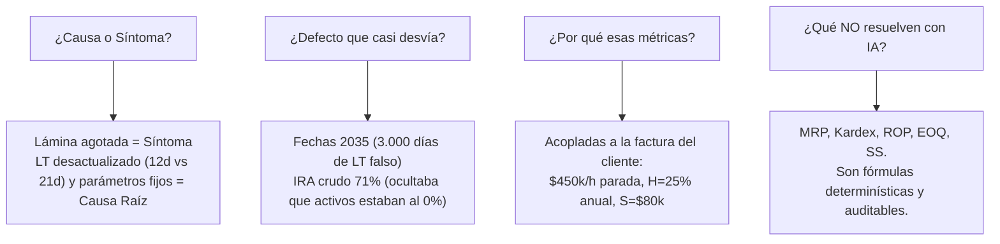

# 🎤 Guía Estratégica de Preparación para la Exposición y Sustentación — Entrega E1

> **Proyecto:** Optimización de la Gestión de Inventarios y Reposición — E2 SAS  
> **Universidad de Medellín — Facultad de Ingenierías — Ingeniería Industrial**  
> **Asignatura:** Producción 4.0 / Énfasis 2  
> **Objetivo:** Guía integral de oratoria, estructura de presentación, datos de impacto y defensa ante el jurado evaluador para obtener **5.0/5.0**.

---

## 📌 1. Estructura y Distribución del Tiempo (Pitch de 12 a 15 Minutos)

Para lograr una presentación ejecutiva impecable que impresione al docente y cumpla con todas las dimensiones de la rúbrica, sugerimos la siguiente estructura de 7 bloques:

```mermaid
gantt
    title Cronograma de la Exposición E1 (15 Minutos)
    dateFormat  m
    axisFormat %M m
    Contexto E2 SAS y Problema :a1, 0, 2m
    Modelo de Datos y Limpieza :a2, after a1, 3m
    Validación de las 4 Quejas con Datos :a3, after a2, 4m
    Línea Base y Costos de Ineficiencia :a4, after a3, 3m
    Especificación TO-BE (Ingeniería vs IA) :a5, after a4, 2m
    Preguntas de Sustentación y Cierre :a6, after a5, 1m
```

| Bloque / Diapositiva | Tiempo Sugerido | Mensaje Clave a Transmitir | Criterio de Rúbrica Asociado |
|---|:---:|---|---|
| **1. Portada y Contexto E2 SAS** | **1.5 min** | Quién es E2 SAS, qué produce (muebles metálicos) y cuál es su dilema: *se agota lo crítico y sobra lo que no se mueve*. | Valor y Comunicación (15%) |
| **2. Arquitectura de Datos y Limpieza** | **2.5 min** | Cómo convertimos 8 archivos crudos desordenados en un modelo relacional 3FN en PostgreSQL/Supabase con pipeline automatizado. | Diseño Sistémico (30%) |
| **3. Validación Forense de Quejas (1 y 2)** | **3.0 min** | Demostrar con números la queja de Lámina (LT 20.8d, OTIF 2.8%) y la Plata Muerta ($3.550M COP en 301 SKUs sin rotación). | Criterio de Proceso (30%) |
| **4. Validación Forense de Quejas (3 y 4)** | **3.0 min** | Demostrar el IRA del 0% en activos (162k unidades de compras sin asentar) y el desborde de 3.6x del stock máximo en archivadores. | Ejecución y Verificación (25%) |
| **5. Línea Base Cuantitativa ($ COP)** | **2.5 min** | Presentar el Scorecard Maestro: $887.5M/año en posesión de stock y $3.801M COP en riesgo de paradas ($450k/h). | Ejecución y Valor (40%) |
| **6. Especificación Preliminar TO-BE** | **1.5 min** | Qué es determinístico sin IA (MRP, ROP, EOQ, SS) y qué requiere IA (Pronóstico de demanda y Clustering ABC/XYZ). | Criterio de Proceso (30%) |
| **7. Conclusión y Cierre** | **1.0 min** | Frase de impacto: *"Tenemos el diagnóstico exacto y la línea base medida; ahora sabemos con precisión matemática dónde duele y cómo curarlo"*. | Valor y Comunicación (15%) |

---

## 🗣️ 2. Guion Paso a Paso (Qué decir y cómo argumentar en cada sección)

---

### 🔹 Bloque 1: Apertura y Contexto Empresarial (1.5 min)
* **Qué proyectar:** Logo de E2 SAS, catálogo de productos (escritorios, archivadores, estanterías) y las 4 quejas iniciales de Gerencia.
* **Guion sugerido:**
  > *"Buenas tardes, profesor y compañeros. E2 SAS es una manufacturera con más de una década fabricando mobiliario metálico para oficina. Su operación depende críticamente de insumos como láminas de acero, tuberías, correderas y pinturas.*
  >
  > *La Gerencia nos contrató porque viven una paradoja destructiva: **se les detiene la fábrica por falta de materiales críticos, pero al mismo tiempo tienen la bodega repleta de inventario que no se mueve**. Nuestro encargo no fue dar opiniones, sino realizar una auditoría forense con datos reales para descubrir la causa raíz de este descontrol y definir la Línea Base contra la cual mediremos la optimización en las fases E2 y E3."*

---

### 🔹 Bloque 2: Ingeniería de Datos, Modelo 3FN y Limpieza (2.5 min)
* **Qué proyectar:** Diagrama Entidad-Relación (ERD) en Supabase y tabla resumen de la Bitácora de Limpieza.
* **Guion sugerido:**
  > *"Recibimos 8 archivos crudos desintegrados y con severas imperfecciones operativas. En lugar de hacer limpiezas manuales destructivas, desarrollamos un pipeline automatizado en Python ([`clean_pipeline.py`](clean_pipeline.py)) y estructuramos la base de datos en PostgreSQL en la nube mediante Supabase.*
  >
  > *Tres decisiones de ingeniería clave en este proceso:*
  > 1. *Normalizamos el modelo a **Tercera Forma Normal (3FN)** creando la entidad canónica `maestro_productos` para desacoplar el catálogo de muebles del BOM y del Plan de Producción.*
  > 2. *Tratamos rigurosamente defectos críticos: corregimos 15 fechas con mes 13 (`2026-13-05` a `2026-05-13` por traslación de formato), 22 órdenes de compra con año de recepción anómalo `2035`, y convertimos 94 conteos físicos negativos a valor absoluto por errores de digitación de signo.*
  > 3. *Validamos `inventario_inicial.csv` como la **'Tabla Madre'** e inmutable del sistema para reconstruir la trazabilidad completa del Kardex durante 21 meses."*

---

### 🔹 Bloque 3: Diagnóstico AS-IS — Validación de Quejas 1 y 2 (3.0 min)
* **Qué proyectar:** Gráfica de Lead Time Real vs ERP y Gráfica de Concentración de Plata Muerta ($3.550M COP).
* **Guion sugerido:**
  > *"Sometimos a prueba pericial las quejas de Gerencia y **las 4 resultaron 100% ciertas**:*
  >
  > * **Queja 1 (Desabastecimiento de Lámina):** La Gerencia se quejaba de que la lámina se agotaba y los pedidos tardaban. Al analizar los datos, descubrimos que el ERP tiene parametrizado un Lead Time de **12 días**, pero los proveedores tardan en promedio **21 días (+71% de retraso)**. El cumplimiento de fecha promesa (**OTIF**) es de un alarmante **2.8%**. Esto provocó que en **19 de los 21 meses evaluados se cayera el plan de manufactura**, acumulando 8.448 horas de riesgo de parada de planta.
  >
  > * **Queja 2 (Plata Muerta en Bodega):** La Gerencia afirmaba tener la bodega llena de cosas que no se mueven. La evidencia matemática fue contundente: **301 de los 420 SKUs (el 71.7% del catálogo) NO tuvieron ni una sola salida en 21 meses**. Hay **$3.550 millones de COP inmovilizados (el 54% del inventario inicial)**, lo que genera una pérdida financiera de **$887.5 millones COP anuales** solo por costo de posesión ($H=25\%$), con un tiempo de cobertura de **736 días (24.5 meses de stock)**."*

---

### 🔹 Bloque 4: Diagnóstico AS-IS — Validación de Quejas 3 y 4 (3.0 min)
* **Qué proyectar:** Matriz a 3 bandas (Kardex vs Físico vs Jefe) y Gráfica del mes pico de Archivadores con desborde de stock máximo.
* **Guion sugerido:**
  > *"Las siguientes dos quejas revelaron fallas estructurales profundas en el control de operaciones:*
  >
  > * **Queja 3 (Inexactitud del Sistema y Libreta del Jefe):** En los 119 insumos activos de fábrica, la Exactitud del Registro (**IRA**) es del **0.0%**. Existen **17 materiales fantasmas** por valor de **$2.029 millones COP** que el sistema reporta como disponibles pero físicamente no están en estantería.  
  > *¿Por qué ocurrió esto?* Descubrimos la causa raíz: **se recibieron 931.484 unidades en órdenes de compra físicas, pero solo se asentaron 769.342 en el Kardex del ERP**. Hay **162.142 unidades de compras no cargadas al sistema**, lo que obligó a producción a despachar a ciegas y al Jefe de Bodega a crear una libreta manual informal, la cual tampoco resolvió el problema (obtuvo apenas 0.83% de exactitud).
  >
  > * **Queja 4 (Picos de Archivadores y Desborde BOM):** En enero de 2026, la demanda de archivadores y estanterías se disparó en más del **+106%**, exigiendo hasta **1.787 unidades de insumos en un solo mes**. La causa raíz de que esto 'los cogiera por sorpresa' es que el ERP tiene fijado rígidamente un `stock_min = 100` y `stock_max = 500` para todos los materiales: **el consumo mensual pico supera en 3.6 veces el stock máximo permitido**, y el stock mínimo de 100 se evapora en menos de 2 días."*

---

### 🔹 Bloque 5: Línea Base Oficial y Costos en Juego (2.5 min)
* **Qué proyectar:** Scorecard Maestro de Línea Base con valores numéricos y en pesos ($ COP).
* **Guion sugerido:**
  > *"Con estos hallazgos estructuramos el **Scorecard Oficial de Línea Base**, monetizando las ineficiencias según los costos del encargo:*
  > - **$887.505.577 COP / año:** Costo de posesión de Plata Muerta ($H=25\%$).
  > - **$3.801.600.000 COP:** Costo en riesgo por paradas de planta acumuladas en lámina ($450.000 COP / hora).
  > - **$117.680.000 COP:** Gasto administrativo por pulverización de 1.471 órdenes de compra ($80.000 COP / OC).
  > - **OTIF del 6.08% global (2.8% en lámina)** e **IRA del 0% en activos**.
  >
  > *Esta es la línea base contra la cual demostraremos el ahorro financiero y la optimización en las próximas entregas."*

---

### 🔹 Bloque 6: Especificación Preliminar TO-BE (Ingeniería vs IA) (1.5 min)
* **Qué proyectar:** Diagrama conceptual de la Solución (Módulos Clásicos vs Módulos con IA).
* **Guion sugerido:**
  > *"Nuestra propuesta de solución para las fases E2 y E3 delimita con claridad qué requiere Inteligencia Artificial y qué NO:*
  > - **Sin IA (Ingeniería Determinística):** El balance de Kardex, la explosión Time-Phased de BOM (MRP), el cálculo de Puntos de Reorden ($ROP = d \cdot LT + SS$), el Lote Económico ($EOQ$) y el bloqueo de salidas negativas son álgebra determinística exacta. No se necesita IA para sumar, restar o aplicar fórmulas cerradas de inventario.
  > - **Con IA (Analítica Predictiva):** La IA se aplicará exclusivamente donde hay incertidumbre estocástica: **modelos de series de tiempo (SARIMA / Prophet / LightGBM) para predecir la demanda institucional de muebles** y **algoritmos de clustering para clasificación dinámica multivariada ABC-XYZ**."*

---

### 🔹 Bloque 7: Cierre y Apertura a Preguntas (1.0 min)
* **Guion sugerido:**
  > *"En conclusión: el problema de E2 SAS no es de percepción; es un colapso sistémico generado por parámetros ERP estáticos, compras a ciegas y descalibración del suministro. La información está hoy 100% limpia, la base de datos estructurada en Supabase y la Línea Base medida en dinero. Quedamos a su disposición para las preguntas. Muchas gracias."*

---

## 🛡️ 3. Banco de Defensa: Respuestas a Preguntas de Sustentación

El jurado evaluador de la Universidad de Medellín evaluará con rigor la capacidad del equipo para defender decisiones. Aquí están las respuestas preparadas:

### Pregunta 1: *"¿Cómo supieron que ese es el cuello de botella y no un síntoma?"*
* **Respuesta de Oro:**
  > *"Porque no nos quedamos en la queja del operario, sino que seguimos la trazabilidad de los datos hacia atrás. La falta de lámina en el taller de ensamble o las estibas vacías son **síntomas visibles**; la **causa raíz** fue comprobar que Compras emite las órdenes con una anticipación de 12 días cuando el proveedor tarda 21 días reales, sumado a que el catálogo tiene fijado un stock máximo de 500 unidades cuando un mes pico consume 1.787 unidades. El cuello de botella es la política de reposición estática, no la capacidad física de la fábrica."*

### Pregunta 2: *"¿Qué defecto de los datos casi los lleva a una conclusión equivocada?"*
* **Respuesta de Oro:**
  > *"Principalmente dos:*
  > 1. *Las **22 órdenes con fecha de recepción en el año 2035**: si las hubiéramos promediado directamente, el Lead Time histórico habría saltado a +3.000 días de forma ficticia. Detectamos que eran errores de digitación de año sobre compras de 2024/2025.*
  > 2. *El **IRA crudo del 71.67%**: si hubiéramos mirado la tabla global, habríamos creído que la bodega tenía un nivel de exactitud aceptable. Al cruzarlo con el Kardex activo, descubrimos que ese 71% correspondía a los 301 SKUs de plata muerta que nadie tocaba, mientras que en los 119 insumos que mueven la fábrica la exactitud era del **0.0%**."*

### Pregunta 3: *"¿Por qué eligieron esas métricas como línea base?"*
* **Respuesta de Oro:**
  > *"Porque están directamente vinculadas a la estructura de costos suministrada en el encargo del cliente:*
  > - *El **OTIF** y las horas de mora se monetizan con el costo de **$450.000 COP / hora por parada de planta**.*
  > - *El **DSI**, el **ITR** y los 301 SKUs sin rotación se monetizan con la **tasa de posesión del 25% anual ($H$)** sobre los $3.550M COP.*
  > - *La cantidad de órdenes emitidas (1.471) se mide contra el **costo de gestión de $80.000 COP / OC ($S$)**.*
  > - *El **IRA** mide la confiabilidad del dato para que la reposición automática pueda operar."*

### Pregunta 4: *"¿Qué parte del problema no piensan resolver con IA, y por qué?"*
* **Respuesta de Oro:**
  > *"No utilizaremos IA para el **cálculo del Kardex, la explosión de materiales del BOM (MRP), el punto de reorden determinístico (ROP), el lote económico de compra (EOQ) ni el inventario de seguridad por fórmula clásica**. La ingeniería industrial ya resolvió esos problemas con modelos exactos, transparentes y computacionalmente eficientes. La IA la reservamos estrictamente para la **predicción estocástica de demanda futura de muebles (series de tiempo)** y la **segmentación multivariada dinámica de materiales (clustering ABC/XYZ)**."*

---

## 🎯 4. Flashcards Ejecutivas (Cifras Clave para Memorizar)

| Cifra Clave | Significado en la Sustentación |
|---|---|
| **$3.550 Millones COP** | Capital inmovilizado en **Plata Muerta** (301 SKUs sin rotación, 54% del inventario). |
| **$887.5 Millones COP / año** | Costo anual que bota la empresa por mantener esa plata muerta ($H=25\%$). |
| **$3.801 Millones COP** | Costo financiero en riesgo por **8.448 horas turno de mora en láminas** ($450k/h). |
| **20.8 días vs 12.1 días** | Lead Time real de láminas vs. lo que dice falsamente el ERP (+71.5% de retraso). |
| **2.80%** | Cumplimiento **OTIF en láminas** (el 97.2% de los pedidos llega tarde, mora media de +9.8d). |
| **0.00%** | **Exactitud de Registro (IRA)** en los 119 insumos activos de producción. |
| **162.142 unidades** | Compras recibidas en muelle que **nunca se cargaron al Kardex del ERP** (Causa raíz de la Queja 3). |
| **3.6x veces** | Lo que el **consumo de un mes pico de archivadores supera el stock máximo del ERP** (1.787 vs 500 unids). |
| **0.495 veces/año / 736 días** | Rotación del inventario (ITR) y Días de Cobertura (DSI). Más de **24 meses de stock inerte**. |
| **18 productos / 440 SKUs** | Dimensión del catálogo maestro normalizado en **Tercera Forma Normal (3FN)** en Supabase. |
