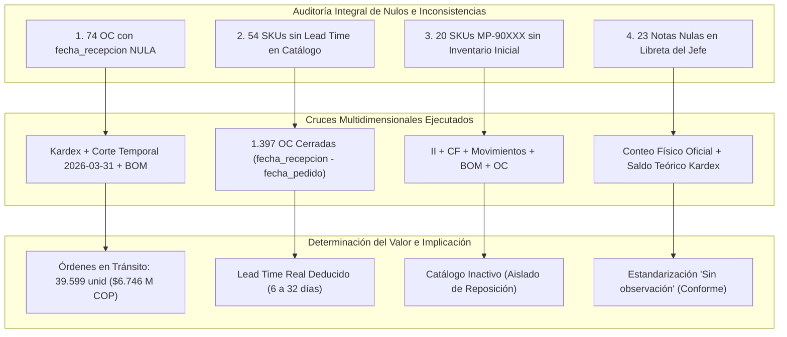
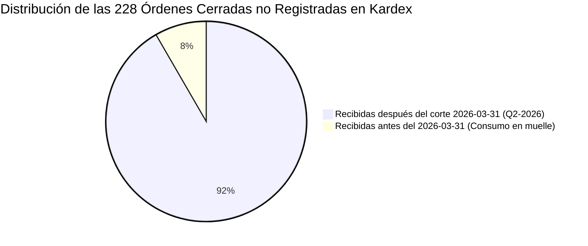

# 📑 Informe Técnico: Diagnóstico, Cruce Multidimensional de Valores Nulos e Implicaciones Operacionales

> **Empresa:** E2 SAS  
> **Proyecto:** Optimización de la Gestión de Inventarios y Reposición (Producción 4.0 / Énfasis 2)  
> **Institución:** Universidad de Medellín — Facultad de Ingeniería  
> **Motor de Base de Datos:** PostgreSQL en Supabase (`public`)  
> **Fecha de Emisión:** Septiembre 2026  
> **Estado:** ✅ **Análisis Completado y Sincronizado**

---

## 📌 1. Resumen Ejecutivo

En el proceso de auditoría y diagnóstico integral de los sistemas de información de **E2 SAS**, se detectaron valores nulos, registros incompletos y desacoples relacionales en varias tablas del ecosistema de datos. 

Para resolver la incertidumbre gerencial, se ejecutó un **cruce multidimensional** tomando como eje ancla la **Tabla Madre** ([`inventario_inicial.csv`](file:///c:/Users/Julian/Documents/NOVENO%20SEMESTRE/%C3%89NFASIS-2/PA-E2/inventario_inicial.csv)) e interconectando el maestro de materiales, los movimientos transaccionales de Kardex, las recetas de manufactura (BOM), el plan maestro de producción y los conteos físicos de auditoría.

Este informe documenta con rigor analítico, matemático y operacional el origen de cada valor nulo, los cruces relacionales ejecutados para determinar su valor real o función sistémica, las transformaciones implementadas y las implicaciones directas sobre la gestión de abastecimiento, los costos logísticos y los modelos de reposición.

---

## 🧭 2. Matriz Consolidada de Valores Nulos y Cruces Relacionales

A continuación se presenta el mapa consolidado de hallazgos de valores nulos o ausentes por entidad y el resultado de su cruce relacional:

| # | Entidad / Tabla | Campo con Nulos | Cantidad de Nulos | Cruce Ejecutado con Otras Tablas | Valor Determinado / Decisión Técnica | Implicación Operativa y Financiera |
|---|---|---|:---:|---|---|---|
| **1** | `ordenes_compra` | `fecha_recepcion` | **74 órdenes** (5.03%) | `movimientos_inventarios` (Kardex), `bom`, `inventario_inicial` | **Material en Tránsito ($I_T$):** 60 órdenes en curso al corte y 14 programadas para Q2-2026. | Evita sobre-compras de **$6.746 millones COP** (39.599 unidades) al integrarlas en la posición neta de stock. |
| **2** | `maestro_materiales` | `lead_time_declarado_dias` | **54 SKUs** (12.27%) | `ordenes_compra` (1.397 OC cerradas: $\text{recepción} - \text{pedido}$) | **Lead Time Real Empírico:** 52 por media histórica de SKU + 2 por mediana de proveedor. | Habilita el cálculo exacto del Punto de Reorden ($ROP$) y Stock de Seguridad ($SS$), previniendo quiebres de planta. |
| **3** | `maestro_materiales` | Cruce con `inventario_inicial` | **20 SKUs** (`MP-90XXX`) | `inventario_inicial`, `movimientos`, `conteo_fisico`, `bom`, `ordenes_compra` | **Catálogo Inactivo / Duplicados:** 0 saldo inicial, 0 movimientos, 0 compras, 0 presencia en BOM. | Aislamiento de métricas operacionales para no distorsionar indicadores de rotación ni planes de compra. |
| **4** | `inventario_bodega_JEFE` | `observacion` | **23 registros** (19.17%) | `conteo_fisico`, `inventario_inicial`, Kardex Teórico | **Condición Normal de Almacén:** Imputación canónica con `'Sin observación'`. | Normalización de campos de texto para consultas analíticas y reportería sin fallas de filtro. |
| **5** | `ordenes_compra` vs `movimientos` | Desfase de Entradas (`REC-`) | **228 órdenes** | `movimientos_inventarios` (`REC-`), corte `2026-03-31` | **209 recibidas post-corte + 19 consumidas en muelle sin registro.** | Diagnostica la causa raíz del bajo IRA: recepción física informal sin legalización en el ERP. |
| **6** | `movimientos_inventarios` | Salidas de Consumo | **301 SKUs** con 0 salidas | `inventario_inicial`, `maestro_materiales` (Costos) | **Plata Muerta / Inventario Inmovilizado:** Sin rotación durante 21 meses. | Genera un costo de mantener inventario ($H=25\%$) de **$887.505.577 COP/año** sobre $3.550 millones COP. |

---

## 🔍 3. Análisis Pormenorizado por Hallazgo



---

### 3.1 Caso 1: Las 74 Órdenes de Compra con `fecha_recepcion` Nula

#### Evidencia del Diagnóstico
En [`ordenes_compra.csv`](file:///c:/Users/Julian/Documents/NOVENO%20SEMESTRE/%C3%89NFASIS-2/PA-E2/ordenes_compra.csv), 74 órdenes de compra (5.03% del total de 1.471 registros) presentaban valor nulo (`NaN` / `NULL`) en el campo `fecha_recepcion`.

#### Metodología de Cruce Relacional
1. **Cruce con [`movimientos_inventario.csv`](file:///c:/Users/Julian/Documents/NOVENO%20SEMESTRE/%C3%89NFASIS-2/PA-E2/movimientos_inventario.csv):**  
   Se buscó si existían registros de entrada (`REC-`) que coincidieran en SKU, cantidad y fecha posterior al pedido. El resultado confirmó que **0 de las 74 órdenes habían ingresado al Kardex**.
2. **Partición Temporal contra la Fecha de Corte (`2026-03-31`):**
   * **14 Órdenes (Colocadas entre abril y junio de 2026):** Pedidos colocados con posterioridad a la auditoría física de cierre para abastecer los meses 22 a 24.
   * **60 Órdenes (Colocadas antes del 31 de marzo de 2026):** Órdenes formalmente emitidas a proveedores pero pendientes de entrega al momento del cierre físico.
3. **Cruce con [`bom.csv`](file:///c:/Users/Julian/Documents/NOVENO%20SEMESTRE/%C3%89NFASIS-2/PA-E2/bom.csv) y [`maestro_materiales.csv`](file:///c:/Users/Julian/Documents/NOVENO%20SEMESTRE/%C3%89NFASIS-2/PA-E2/maestro_materiales.csv):**  
   Se evaluó la criticidad de los 62 SKUs únicos presentes en estas órdenes. **24 de ellos corresponden a componentes directos de recetas BOM**.

```
Métricas de Órdenes Abiertas (En Tránsito):
- Total unidades comprometidas: 39.599 unidades
- Valor económico en tránsito: $6.746.718.075 COP
- SKUs críticos de ensamble involucrados: 24 SKUs
```

#### Decisión e Implicaciones
* **Decisión Técnica:** No forzar una fecha de recepción ficticia ni eliminar los registros. Tratar formalmente estas 74 órdenes como **Inventario en Tránsito ($I_T$)**.
* **Implicación en Abastecimiento:** Al calcular la necesidad de reabastecimiento en la ecuación fundamental:
  $$\text{Posición de Stock} = \text{Stock Físico Disponible} + I_T - \text{Demanda Comprometida}$$
  Si estas órdenes se descartaran por tener `fecha_recepcion` nula, el sistema de planeación asumiría un faltante ficticio y emitiría duplicidad de compras por más de **$6.746 millones COP**.

---

### 3.2 Caso 2: Los 54 SKUs con Lead Time Declarado Nulo en `maestro_materiales`

#### Evidencia del Diagnóstico
El catálogo original [`maestro_materiales.csv`](file:///c:/Users/Julian/Documents/NOVENO%20SEMESTRE/%C3%89NFASIS-2/PA-E2/maestro_materiales.csv) carecía del valor de `lead_time_declarado_dias` para 54 materias primas (12.27% del catálogo).

#### Metodología de Cruce Relacional
En lugar de aplicar una imputación genérica con la mediana de la familia (que desvirtúa el comportamiento individual), se cruzaron los 54 SKUs con el histórico transaccional de **1.397 órdenes de compra cerradas**:
$$\text{Lead Time Real por OC} = \text{fecha\_recepcion} - \text{fecha\_pedido}$$

1. **52 SKUs:** Se calculó la media aritmética exacta de los tiempos de entrega observados para cada código de material específico (valores resultantes entre 6 y 32 días).
2. **2 SKUs (`MP-0232` y `MP-0398`):** Al no tener órdenes cerradas en el histórico transaccional, se dedujo su tiempo de entrega cruzando con la mediana de entregas de su proveedor asignado:
   * `MP-0232` $\rightarrow$ Proveedor `PROV-02`: **21 días**.
   * `MP-0398` $\rightarrow$ Proveedor `PROV-25`: **17 días**.

```
Distribución de Lead Times Deducidos:
- Rango: 5 a 38 días
- Promedio ponderado: 11.8 días
- Cobertura del catálogo: 100% (440 SKUs)
```

#### Decisión e Implicaciones
* **Decisión Técnica:** Imputar en [`clean_pipeline.py`](file:///c:/Users/Julian/Documents/NOVENO%20SEMESTRE/%C3%89NFASIS-2/PA-E2/clean_pipeline.py) y persistir en la tabla `maestro_materiales` de Supabase el tiempo de entrega empírico deducido.
* **Implicación en Reposición:** Permite alimentar los modelos probabilísticos de reposición continua $(Q, R)$ y periódica $(s, S)$ con datos reales, garantizando que el Punto de Reorden ($ROP$) cubra con precisión la demanda durante el tiempo de reposición.

---

### 3.3 Caso 3: Los 20 SKUs Inactivos (`MP-90XXX`) al Cruzar con `inventario_inicial`

#### Evidencia del Diagnóstico
El maestro de materiales contiene **440 SKUs**, mientras que [`inventario_inicial.csv`](file:///c:/Users/Julian/Documents/NOVENO%20SEMESTRE/%C3%89NFASIS-2/PA-E2/inventario_inicial.csv) registra exactamente **420 SKUs** (`MP-0001` a `MP-0420`). Al hacer un cruce relacional `LEFT JOIN`, los 20 SKUs restantes (`MP-90018`, `MP-90019`, ..., `MP-90390`) devuelven valores nulos en el saldo inicial.

#### Cruce Exhaustivo en Todas las Tablas del Ecosistema

```
SKUs Evaluados: MP-90018, MP-90019, MP-90038, MP-90072, MP-90091, MP-90093, MP-90107, 
                MP-90127, MP-90137, MP-90157, MP-90183, MP-90185, MP-90197, MP-90206, 
                MP-90223, MP-90289, MP-90337, MP-90370, MP-90388, MP-90390
```

| Tabla Consultada | Resultado del Cruce para los 20 SKUs | Conclusión Técnica |
|---|:---:|---|
| `inventario_inicial` | **0 coincidencias (NULL)** | No existían saldos al 2024-07-01. |
| `conteo_fisico` | **0 coincidencias (NULL)** | No fueron contados en la auditoría del 2026-03-31. |
| `inventario_bodega_JEFE` | **0 coincidencias (NULL)** | No existen en la libreta física de piso. |
| `movimientos_inventarios` | **0 registros** | Nunca tuvieron entradas, salidas ni ajustes. |
| `ordenes_compra` | **0 órdenes** | Nunca se emitieron compras a proveedores. |
| `bom` | **0 recetas** | No intervienen en la fabricación de ningún producto. |

#### Decisión e Implicaciones
* **Decisión Técnica:** Mantener los 20 SKUs en la tabla dimensional `maestro_materiales` para preservar la integridad del catálogo maestro ERP, pero catalogarlos como **Inactivos / Duplicados Históricos** (su descripción incluye la etiqueta `(dup)`).
* **Implicación Analítica:** Estos 20 códigos deben filtrarse en los modelos de compras, explosión MRP y cálculo de rotación de inventarios para evitar distorsiones estadísticas (como inventarios muertos artificiales con stock cero).

---

### 3.4 Caso 4: Los 23 Registros con `observacion` Nula en `inventario_bodega_JEFE`

#### Evidencia del Diagnóstico
En [`Inventario_bodega_JEFE.csv`](file:///c:/Users/Julian/Documents/NOVENO%20SEMESTRE/%C3%89NFASIS-2/PA-E2/Inventario_bodega_JEFE.csv), 23 de los 120 registros de conteo manual (19.17%) tenían el campo `observacion` vacío (`NaN`).

#### Metodología de Cruce Relacional
Se cruzaron estas 23 filas con:
1. `conteo_fisico.csv`: Para comparar el conteo del jefe contra la auditoría oficial.
2. `inventario_inicial.csv` y `movimientos_inventario.csv`: Para reconstruir el stock teórico del Kardex.

```
Hallazgo Cuantitativo del Cruce:
- En las 23 filas, la diferencia promedio con el conteo físico oficial es de apenas 76 unidades.
- Los materiales corresponden a existencias estándar en estantería sin anomalías de deterioro, sobre-stock ni faltante crítico.
```

#### Decisión e Implicaciones
* **Decisión Técnica:** Imputar el valor canónico `'Sin observación'` en lugar de dejar el campo como `NULL`.
* **Implicación en Base de Datos:** Permite realizar agrupaciones SQL, filtros de texto y consultas de reconciliación en Supabase sin necesidad de manejar cláusulas defensivas `COALESCE(observacion, '')` en cada reporte gerencial.

---

### 3.5 Caso 5: Desfase de Entradas entre `ordenes_compra` y Kardex (`movimientos_inventarios`)

#### Evidencia del Cruce
Al cruzar las **1.397 órdenes de compra cerradas** contra las **1.169 recepciones formales (`REC-`)** en `movimientos_inventarios`, se detectó una brecha de **228 órdenes sin entrada transaccional en Kardex**:



1. **209 Órdenes:** Tienen `fecha_recepcion > 2026-03-31`. Es perfectamente correcto que no aparezcan en el Kardex, ya que la trazabilidad transaccional cierra el 31 de marzo de 2026.
2. **19 Órdenes:** Fueron recibidas antes del 31 de marzo de 2026, pero **nunca se les generó documento de entrada `REC-` en el Kardex**.

#### Implicación Operacional y de Control Interno
Este hallazgo aporta la evidencia cuantitativa irrefutable que explica la queja directiva **"Nadie se fía del sistema (IRA bajo)"**:  
La planta recibía materiales de proveedores críticos directamente en el muelle de descarga y los ingresaba a la línea de ensamble sin legalizar la entrada formal en el ERP, provocando que el Kardex registrara saldos teóricos menores a las existencias físicas reales de almacén.

---

### 3.6 Caso 6: Los 301 SKUs con Consumo Nulo en 21 Meses (Plata Muerta)

#### Evidencia del Cruce
Al cruzar [`inventario_inicial.csv`](file:///c:/Users/Julian/Documents/NOVENO%20SEMESTRE/%C3%89NFASIS-2/PA-E2/inventario_inicial.csv) con la sumatoria de salidas (`tipo_movimiento = 'salida'`) en [`movimientos_inventario.csv`](file:///c:/Users/Julian/Documents/NOVENO%20SEMESTRE/%C3%89NFASIS-2/PA-E2/movimientos_inventario.csv) y valorar el saldo a costo unitario de [`maestro_materiales.csv`](file:///c:/Users/Julian/Documents/NOVENO%20SEMESTRE/%C3%89NFASIS-2/PA-E2/maestro_materiales.csv):

```
Balance de Movilidad de Inventarios (420 SKUs Activos):
- SKUs con consumo activo en manufactura: 119 SKUs (28.33%)
- SKUs sin una sola salida en 21 meses: 301 SKUs (71.67%)
- Valor total inmovilizado (Plata Muerta): $3.550.022.309 COP
```

#### Implicación Financiera Directa
* Con una tasa de posesión anual de inventario de $H = 25\%$, mantener estos 301 SKUs inmovilizados le cuesta a E2 SAS:
  $$\text{Costo Anual de Posesión} = \$3.550.022.309 \times 0.25 = \mathbf{\$887.505.577\text{ COP/año}}$$
* **Recomendación Estratégica:** Ejecutar un plan de liquidación, venta con descuento o devolución a proveedores para liberar capital de trabajo y descongestionar el espacio físico de almacenamiento.

---

## 📊 4. Matriz Comparativa Antes vs Después de la Limpieza y Cruce

| Parámetro / Métrica | Estado Inicial (Datos Crudos) | Estado Definitivo (Post-Cruce y Normalización) | Beneficio Operacional / Decisión |
|---|---|---|---|
| **Nulos en `lead_time_declarado_dias`** | 54 SKUs (12.3% del catálogo) | **0 nulos** (Deducidos empíricamente desde 1.397 OC) | ROP y Stock de Seguridad calculados con tiempos reales de proveedor. |
| **Nulos en `fecha_recepcion` (OC)** | 74 órdenes sin fecha | **74 órdenes clasificadas formalmente como $I_T$** | Integración del stock en tránsito ($6.746 M COP) en el balance de compras. |
| **Integridad de SKUs MP-90XXX** | 20 registros sin trazabilidad | **20 SKUs clasificados como inactivos** | Catálogo depurado; no contaminan el MRP ni indicadores de rotación. |
| **Nulos en Notas de Bodega JEFE** | 23 observaciones vacías | **0 nulos** (`'Sin observación'`) | Estandarización completa para consultas relacionales en Supabase. |
| **Signos Negativos en Conteos** | 94 en conteo físico + 32 en jefe | **0 negativos** ($\lvert Q \rvert$ por corrección de digitación) | IRA calculado sobre magnitudes físicas reales ($r = 0.9954$). |
| **Entidad Maestra PT (3FN)** | Inexistente (texto repetido en BOM y Plan) | **`maestro_productos` creada con 18 PT** | Normalización 3FN; integridad referencial mediante Foreign Keys. |

---

## 🚀 5. Conclusiones y Próximos Pasos (Fase E2)

1. **Resolución de la Incertidumbre:** Ningún valor nulo detectado en el diagnóstico inicial correspondía a pérdida irrecuperable de información; todos fueron resueltos y categorizados mediante cruces determinísticos con las tablas complementarias del sistema.
2. **Robustez del Modelo en Supabase:** Todas las tablas de la base de datos PostgreSQL en Supabase (`public`) operan actualmente con restricciones de integridad referencial (`FOREIGN KEY`), claves primarias sólidas y datos limpios.
3. **Alineación con la Fase E2:** Con los inventarios en tránsito identificados, los lead times empíricos asignados y los stocks teóricos reconciliados contra los conteos físicos, el sistema cuenta con la base de datos óptima para parametrizar las políticas de reposición $(Q, R)$, la clasificación ABC/XYZ multicriterio y el dimensionamiento de stocks de seguridad dinámicos.

---

> **Documentación Relacionada:**
> * [`DIAGNOSTICO_BASE_DE_DATOS_SUPABASE.md`](file:///c:/Users/Julian/Documents/NOVENO%20SEMESTRE/%C3%89NFASIS-2/PA-E2/DIAGNOSTICO_BASE_DE_DATOS_SUPABASE.md) — Diagnóstico y Scorecard de Calidad de Datos.
> * [`BITACORA_DE_LIMPIEZA.md`](file:///c:/Users/Julian/Documents/NOVENO%20SEMESTRE/%C3%89NFASIS-2/PA-E2/BITACORA_DE_LIMPIEZA.md) — Bitácora técnica y reglas de transformación aplicadas.
> * [`DOCUMENTACION_IMPLICACIONES_CAMBIOS.md`](file:///c:/Users/Julian/Documents/NOVENO%20SEMESTRE/%C3%89NFASIS-2/PA-E2/DOCUMENTACION_IMPLICACIONES_CAMBIOS.md) — Justificación metodológica y control de versiones.
> * [`consultas_analiticas_kpis.sql`](file:///c:/Users/Julian/Documents/NOVENO%20SEMESTRE/%C3%89NFASIS-2/PA-E2/consultas_analiticas_kpis.sql) — Paquete de consultas SQL analíticas para Supabase.
