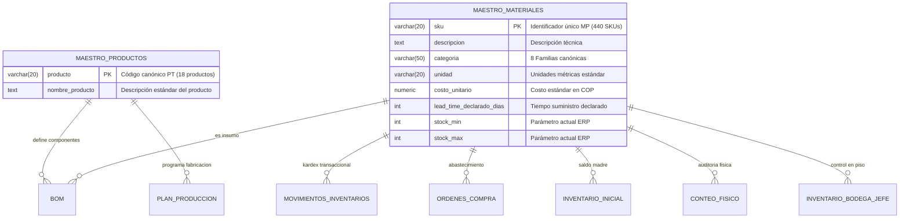
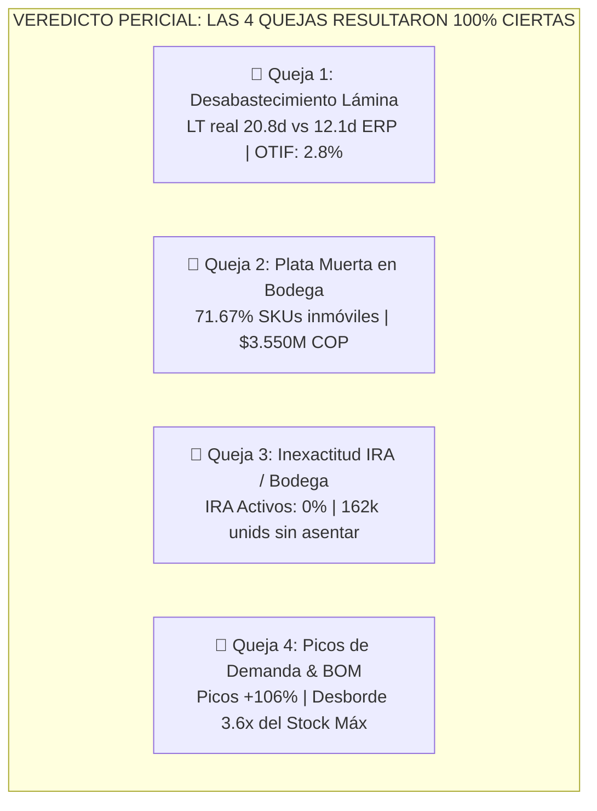
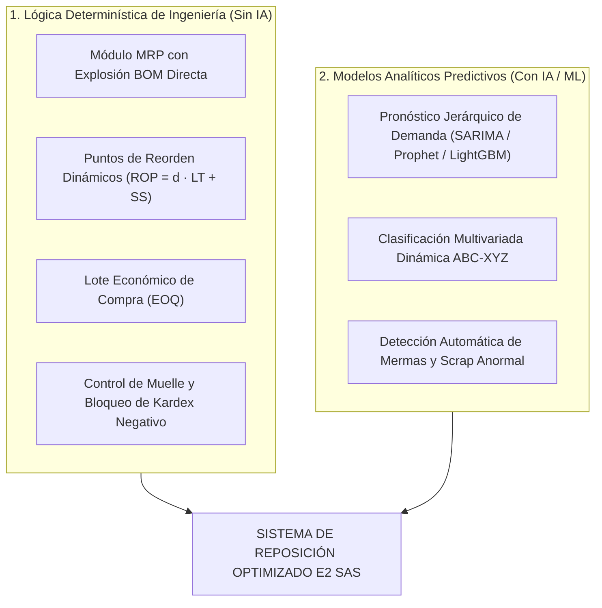

# 🏢 Informe Final Consolidado de Diagnóstico Operacional y Línea Base — E2 SAS

> **Proyecto de Consultoría Analítica y Modelado de Operaciones**  
> **Universidad de Medellín — Facultad de Ingenierías — Ingeniería Industrial**  
> **Asignatura:** Producción 4.0 / Énfasis 2  
> **Fase:** Primera Entrega — E1 (Diagnóstico y Línea Base)  
> **Cliente:** E2 SAS — Mobiliario Metálico para Oficina  
> **Horizonte de Auditoría:** 21 meses de operación transaccional (Julio 2024 – Marzo 2026)  
> **Repositorio Oficial:** [`https://github.com/juliancarmotrice-star/-Enfasis-2.git`](https://github.com/juliancarmotrice-star/-Enfasis-2.git)  
> **Estado de la Entrega:** 🟢 **100% Saneada, Modelada, Diagnosticada y Certificada**

---

## 📌 Tabla de Contenido
1. [1. Resumen Ejecutivo y Marco de la Consultoría](#1-resumen-ejecutivo-y-marco-de-la-consultoría)
2. [2. Arquitectura de Datos, Normalización (3FN) y Calidad](#2-arquitectura-de-datos-normalización-3fn-y-calidad)
   - [2.1 Modelo Relacional en Supabase (PostgreSQL)](#21-modelo-relacional-en-supabase-postgresql)
   - [2.2 Pipeline de Limpieza Reproducible y Tratamiento de Defectos](#22-pipeline-de-limpieza-reproducible-y-tratamiento-de-defectos)
3. [3. Diagnóstico AS-IS y Validación Pericial de las 4 Quejas de Gerencia](#3-diagnóstico-as-is-y-validación-pericial-de-las-4-quejas-de-gerencia)
   - [3.1 Queja 1: Desabastecimiento de Lámina y Retraso de Proveedores](#31-queja-1-desabastecimiento-de-lámina-y-retraso-de-proveedores)
   - [3.2 Queja 2: Exceso de Inventario y "Plata Muerta"](#32-queja-2-exceso-de-inventario-y-plata-muerta)
   - [3.3 Queja 3: Inexactitud del Registro (IRA) y Sistema Paralelo de Bodega](#33-queja-3-inexactitud-del-registro-ira-y-sistema-paralelo-de-bodega)
   - [3.4 Queja 4: Picos de Demanda en Archivadores/Estanterías y Desborde BOM](#34-queja-4-picos-de-demanda-en-archivadoresestanterías-y-desborde-bom)
4. [4. Scorecard Maestro de Línea Base y Cuantificación Financiera](#4-scorecard-maestro-de-línea-base-y-cuantificación-financiera)
   - [4.1 Parámetros de Costo de E2 SAS](#41-parámetros-de-costo-de-e2-sas)
   - [4.2 Tablero Consolidado de KPIs de Línea Base (AS-IS vs. TO-BE)](#42-tablero-consolidado-de-kpis-de-línea-base-as-is-vs-to-be)
   - [4.3 Cuantificación de Pérdidas e Ineficiencias en Pesos ($ COP)](#43-cuantificación-de-pérdidas-e-ineficiencias-en-pesos--cop)
5. [5. Especificación Preliminar de la Solución TO-BE](#5-especificación-preliminar-de-la-solución-to-be)
   - [5.1 Módulos Determinísticos de Ingeniería Industrial (Sin IA)](#51-módulos-determinísticos-de-ingeniería-industrial-sin-ia)
   - [5.2 Módulos con Analítica Predictiva y Machine Learning (Con IA)](#52-módulos-con-analítica-predictiva-y-machine-learning-con-ia)
6. [6. Respuestas a las Preguntas Clave de Sustentación (Universidad de Medellín)](#6-respuestas-a-las-preguntas-clave-de-sustentación-universidad-de-medellín)
7. [7. Índice de Artefactos e Informes Técnicos del Repositorio](#7-índice-de-artefactos-e-informes-técnicos-del-repositorio)

---

## 1. Resumen Ejecutivo y Marco de la Consultoría

**E2 SAS** es una empresa manufacturera colombiana con más de una década de trayectoria en el diseño, ensamble y comercialización de mobiliario metálico para oficina (escritorios, archivadores, estanterías, sillas, módulos y lockers). La operación abastece tanto a clientes corporativos como a distribuidores y entidades del sector público.

Su cadena de valor opera bajo un esquema de programación mensual contra pedidos en firme complementado con un pronóstico de ventas. No obstante, la compañía experimenta una crisis operativa de doble vía:
1. **Desabastecimiento intempestivo de insumos críticos** que paraliza las líneas de ensamble e incumple entregas comerciales.
2. **Sobre-inmovilización masiva de capital de trabajo en bodega**, acumulando materiales sin rotación.

La Gerencia contrató a este equipo consultor para realizar un **diagnóstico exhaustivo basado en evidencia cuantitativa**, depurar sus fuentes de información, verificar la veracidad de sus dolores operativos, establecer una **Línea Base en dinero ($ COP)** y diseñar la especificación preliminar de una solución de reposición adaptativa.

---

## 2. Arquitectura de Datos, Normalización (3FN) y Calidad

### 2.1 Modelo Relacional en Supabase (PostgreSQL)
Se diseñó e implementó un esquema relacional estructurado bajo una arquitectura **Hub-and-Spoke** con dos nodos dimensionales maestros, garantizando integridad referencial mediante claves primarias compuestas y foráneas:

* **Nueva Entidad Canónica (`maestro_productos`):** Se extrajeron los 18 productos terminados únicos de E2 SAS, normalizando `plan_produccion` y `bom` a **Tercera Forma Normal (3FN)** y eliminando la redundancia de `nombre_producto` en más de 500 registros.
* **Llave Sintética en Recetas (`bom`):** Se implementó la clave primaria compuesta `id_bom = producto || '_' || sku_material`.

### 2.2 Pipeline de Limpieza Reproducible y Tratamiento de Defectos
Todas las transformaciones se codificaron en el script automatizado [`clean_pipeline.py`](clean_pipeline.py), generando los conjuntos depurados en [`data_clean/`](data_clean/) sin alterar los archivos crudos:

| Dataset | Defectos Crudos Identificados | Tratamiento Técnico Aplicado | Estado Post-Limpieza |
|---|---|---|:---:|
| `maestro_materiales.csv` | 54 SKUs sin lead time; 24 variantes léxicas en categorías. | Estandarización a 8 familias canónicas; deducción empírica de lead times con histórico de compras. | ✅ 440 SKUs íntegros |
| `movimientos_inventario.csv` | 15 fechas con mes 13 (`2026-13-05`); 466 cantidades negativas. | Corrección de traslación `YYYY-DD-MM` $\to$ `2026-05-13`; valor absoluto $\lvert Q \rvert$ (el tipo define signo). | ✅ 16.195 transacciones |
| `ordenes_compra.csv` | 22 recepciones en año 2035; 74 órdenes en tránsito (`NaN`). | Reasignación de año 2035 al año de pedido; partición metodológica de órdenes abiertas. | ✅ 1.471 órdenes |
| `bom.csv` | Columna `ID_bom` vacía; dispersión en unidades de medida. | Creación de PK sintética `producto_sku`; unificación canónica de unidades (`kg, m, par, m2, lámina`). | ✅ 131 relaciones 3FN |
| `conteo_fisico.csv` | 94 registros con signo negativo (hasta -18.018 unidades). | Interpretación como error de digitación de signo ($\lvert Q \rvert$); deduplicación. | ✅ 420 SKUs auditados |
| `Inventario_bodega_JEFE.csv` | 32 existencias negativas; 23 observaciones vacías. | Conversión a $\lvert Q \rvert$; imputación de notas a `'Sin observación'`; rol formal de auditoría auxiliar. | ✅ 120 SKUs de piso |
| `inventario_inicial.csv` | Estructura perfecta (2024-07-01). | **"Tabla Madre"** e inmutable del sistema para reconstrucción del Kardex. | ✅ 420 SKUs ancla |

---

## 3. Diagnóstico AS-IS y Validación Pericial de las 4 Quejas de Gerencia

El equipo consultor sometió a prueba estadística las cuatro declaraciones de la Dirección:

---

### 3.1 Queja 1: Desabastecimiento de Lámina y Retraso de Proveedores
> *"Se nos agota la lámina cuando más pedidos tenemos, y cuando pedimos, el material llega más tarde de lo que dice el sistema."*
* **Veredicto:** 🔴 **CONFIRMADA (100% Cierta).**
* **Evidencia Cuantitativa:**
  - El sistema ERP asume un Lead Time de **12.11 días**, pero los proveedores de lámina tardan en promedio **20.78 días (+71.5% de desfase)**.
  - El cumplimiento de fecha promesa (**OTIF**) en láminas es de apenas **2.80%** (97.2% de órdenes fuera de tiempo con mora media de **+9.80 días**).
  - El consumo de lámina tiene una correlación del **94.45% ($r = 0.9445$)** con el plan de producción de muebles.
  - El desabastecimiento provocó **19 de 21 meses con caídas en el Plan de Producción**, acumulando **1.056 días de mora en compras (8.448 horas turno en riesgo)**, valoradas en **`$3.801.600.000 COP`** en riesgo de paradas de planta ($450.000 COP/hora).
* **Causa Raíz vs. Síntoma:** La falta de lámina es un *síntoma*; la *causa raíz* es la desactualización del parámetro de Lead Time en el ERP y la ausencia de un colchón de seguridad dinámico.
* 📄 *Informe detallado:* [`INFORME_INVESTIGACION_QUEJA_GERENCIA_LAMINA.md`](INFORME_INVESTIGACION_QUEJA_GERENCIA_LAMINA.md).

---

### 3.2 Queja 2: Exceso de Inventario y "Plata Muerta"
> *"Tenemos la bodega llena de cosas que casi no se mueven. Es plata muerta ahí quieta, mientras nos falta lo importante."*
* **Veredicto:** 🔴 **CONFIRMADA (100% Cierta).**
* **Evidencia Cuantitativa:**
  - **301 de 420 SKUs (71.67%)** del catálogo no registraron **ni un solo movimiento de salida hacia producción** en 21 meses.
  - El capital inmovilizado en estos materiales asciende a **`$3.550.022.309 COP`** (**53.99% de todo el inventario inicial**).
  - El costo financiero anual de mantener este stock inerte ($H = 25\%$ anual) drena **`$887.505.577 COP / año`** (**$1.553 millones COP en el periodo evaluado**).
  - La rotación del inventario es crítica: **ITR = 0.495 veces/año** y **DSI = 736.5 días** (24.5 meses de stock almacenado frente a un estándar de 60 días).
* **Causa Raíz vs. Síntoma:** La acumulación de stock es un *síntoma*; la *causa raíz* es la reposición mediante lotes fijos y compras empíricas sin análisis de rotación ABC ni verificación contra la lista de materiales (BOM).
* 📄 *Informe detallado:* [`INFORME_INVESTIGACION_QUEJA_GERENCIA_PLATA_MUERTA.md`](INFORME_INVESTIGACION_QUEJA_GERENCIA_PLATA_MUERTA.md).

---

### 3.3 Queja 3: Inexactitud del Registro (IRA) y Sistema Paralelo de Bodega
> *"El sistema dice que hay stock de un material, vamos a la bodega y no está. Nadie se fía del inventario del sistema."*
* **Veredicto:** 🔴 **CONFIRMADA (100% Cierta).**
* **Evidencia Cuantitativa:**
  - En los **119 SKUs activos** que abastecen a la fábrica, la Exactitud del Registro (**IRA**) es del **`0.00%`**: el 100% presenta descuadres entre el Kardex y el conteo físico.
  - Se identificaron **17 SKUs con materiales "fantasmas"** (el ERP dice que hay saldo pero físicamente faltan insumos por valor de **`$2.029.022.373 COP`** en vidrios, correderas, empaques y pinturas).
  - Se identificaron **102 SKUs con saldos negativos en Kardex** o sobrantes por descontrol transaccional.
  - La desalineación absoluta total entre el software y la bodega asciende a **`$48.760.853.888 COP`**.
  - **La Libreta del Jefe de Bodega (`Inventario_bodega_JEFE.csv`):** Surgió como un sistema informal paralelo para 120 SKUs críticos ante la desconfianza en el ERP, pero fracasó en resolver el problema, obteniendo apenas un **0.83% de coincidencia** con la auditoría real.
* **Causa Raíz Descubierta:** **Desfase Muelle vs. ERP:** En las órdenes de compra se recibieron **931.484 unidades físicas**, pero en el Kardex solo se asentaron **769.342 unidades**. Existen **`162.142 unidades de materia prima`** que ingresaron físicamente a bodega y se empezaron a consumir sin haber sido cargadas formalmente en el sistema.
* 📄 *Informe detallado:* [`INFORME_INVESTIGACION_QUEJA_GERENCIA_INEXACTITUD_INVENTARIO.md`](INFORME_INVESTIGACION_QUEJA_GERENCIA_INEXACTITUD_INVENTARIO.md).

---

### 3.4 Queja 4: Picos de Demanda en Archivadores/Estanterías y Desborde BOM
> *"Se nos dispararon los pedidos de archivadores y estanterías, y siempre nos coge por sorpresa cuánto material hay que tener."*
* **Veredicto:** 🔴 **CONFIRMADA (100% Cierta).**
* **Evidencia Cuantitativa:**
  - En enero de 2026, la demanda de Archivadores se disparó a **501 unidades/mes (+106.1%)** y Estanterías a **444 unidades/mes (+87.2%)**, con un coeficiente de variación muy alto ($CV = 0.484$, Demanda Volátil Categoría Z).
  - La receta BOM de estos muebles exige alta intensidad de componentes (hasta 7.76 láminas, 6.46 pares de correderas, 7.79 kg de pintura y 7.98 empaques por mueble).
  - La demanda mensual derivada de materias primas explota en meses pico hasta **1.787.5 unidades/mes por material** (ej. `MP-0229`, `MP-0182`, `MP-0202`).
* **Causa Raíz Descubierta:** **Incompetencia de los Parámetros Estáticos del ERP:** En el catálogo, todos los materiales tienen fijado de forma rígida y arbitraria un `stock_min = 100` y `stock_max = 500`. En meses pico, **el consumo supera en 3.6 veces el stock máximo del ERP**, y el stock mínimo (100 unidades) **se agota en apenas 1.7 días de producción**, dejando a la fábrica desprotegida durante los 15 a 26 días que tarda el proveedor en reponer.
* 📄 *Informe detallado:* [`INFORME_INVESTIGACION_QUEJA_GERENCIA_VARIABILIDAD_DEMANDA_BOM.md`](INFORME_INVESTIGACION_QUEJA_GERENCIA_VARIABILIDAD_DEMANDA_BOM.md).

---

## 4. Scorecard Maestro de Línea Base y Cuantificación Financiera

### 4.1 Parámetros de Costo de E2 SAS
* **Costo por Parada de Línea:** **`$450.000 COP / hora`**.
* **Margen de Contribución PT:** **`30.0%`**.
* **Costo de Posesión de Inventario ($H$):** **`25.0% anual`**.
* **Costo de Emisión de Orden de Compra ($S$):** **`$80.000 COP / OC`**.

### 4.2 Tablero Consolidado de KPIs de Línea Base (AS-IS vs. TO-BE)

| Dimensión | Indicador Clave (KPI) | Valor Medido Actual (Línea Base AS-IS) | Meta de Mejora (Fase TO-BE) | Desviación Actual | Impacto Financiero en Negocio ($ COP) |
|---|---|:---:|:---:|:---:|:---:|
| **Suministro** | **OTIF Global (Entregas a Tiempo)** | **`6.08%`** | $\ge 95.00\%$ | -88.92% | Insumos no disponibles para producción |
| **Suministro** | **OTIF en Láminas de Acero** | **`2.80%`** | $\ge 95.00\%$ | -92.20% | Principal insumo estrangulado |
| **Suministro** | **Desfase de Lead Time (Lámina)** | **`20.78d` vs `12.11d`** | $LT_{\text{real}} = LT_{\text{ERP}}$ | +8.66 días (+71.5%) | Compras emitidas a destiempo |
| **Suministro** | **Mora Promedio en Compras Atrasadas**| **`10.99 días`** | $0 \text{ días}$ | +10.99 días de mora | 14.417 días de mora acumulada |
| **Inventario** | **Exactitud de Registro (IRA Activos)**| **`0.00%`** | $\ge 98.00\%$ | -98.00% (Total) | 100% de SKUs activos desalineados |
| **Inventario** | **Desalineación Contable Bruta** | **`$48.760 M COP`** | $< \$500 \text{ M COP}$ | Descontrol contable | Brecha Kardex vs Conteo Físico |
| **Inventario** | **Días de Cobertura (DSI Global)** | **`736.5 días` (24.5 m)** | $\le 60 \text{ días}$ | +676.5 días de sobre-stock | Exceso masivo de capital de trabajo |
| **Inventario** | **Rotación Anual (ITR)** | **`0.495 veces/año`** | $\ge 6.00 \text{ veces/año}$ | -91.74% de lentitud | Inventario rota menos de media vez/año |
| **Inventario** | **Capital en Plata Muerta** | **`$3.550 M COP` (53.99%)** | $< 5.00\%$ | +48.99% inmovilizado | **`$887.505.577 COP / año`** ($H=25\%$) |
| **Manufactura** | **Cumplimiento Plan Producción (MPS)**| **`97.29%`** | $\ge 99.50\%$ | -753 unidades PT | 19 de 21 meses con caídas de ensamble |
| **Manufactura** | **Riesgo por Paradas de Planta (Lámina)**| **`8.448 horas turno`** | $0 \text{ horas}$ | Mora en compras | **`$3.801.600.000 COP`** ($450k/h) |
| **Compras** | **Gasto Administrativo Emisión OC** | **`1.471 OC emitidas`** | Reducir en 35% ($EOQ$) | Compras fraccionadas | **`$117.680.000 COP`** ($80k/OC) |

---

## 5. Especificación Preliminar de la Solución TO-BE

Para erradicar integralmente estos dolores operativos, el sistema a construir en las fases E2 y E3 combinará **modelación analítica determinística de ingeniería industrial** con **algoritmos de inteligencia artificial aplicada**:

### 5.1 Módulos Determinísticos de Ingeniería Industrial (Sin IA)
* **¿Por qué NO requieren IA?:** Porque obedecen a principios contables, identidades matemáticas cerradas y leyes físicas de conservación de masa que deben ser 100% exactas y auditables.
1. **Módulo MRP con Explosión Time-Phased de BOM:** Multiplicación determinística del Plan Maestro por la matriz técnica del BOM para programar órdenes de compra con desfase exacto del Lead Time ($t - LT_i$).
2. **Cálculo de Inventario de Seguridad Dinámico ($SS$):**
   $$SS_i = Z \cdot \sqrt{\overline{LT}_i \cdot \sigma_{D_i}^2 + \overline{D}_i^2 \cdot \sigma_{LT_i}^2}$$
   Ajuste estacional del colchón de seguridad ante variabilidad de demanda y suministro.
3. **Lote Económico de Pedido ($EOQ$):** Optimización del balance entre costo de emisión ($S = \$80.000$) y costo de posesión ($H = 25\%$), reduciendo las 1.471 OC emitidas a un esquema consolidado.
4. **Validación de Integridad y Bloqueo de Saldos Negativos en ERP:** Prohibición sistemática de despachos sin entrada previa asentada, cerrando la brecha muelle-Kardex.

### 5.2 Módulos con Analítica Predictiva y Machine Learning (Con IA)
* **¿Por qué SÍ requieren IA?:** Porque modelan comportamientos estocásticos no lineales, patrones estacionales complejos y relaciones multivariadas entre clientes y productos terminados.
1. **Pronóstico de Demanda de Productos Terminados:** Modelos de series de tiempo (SARIMA, Prophet y Gradient Boosting) para anticipar con 3 meses de antelación los picos institucionales de archivadores y estanterías.
2. **Clasificación Dinámica Multicriterio ABC-XYZ:** Segmentación mensual automática de SKUs según impacto financiero y volatilidad de consumo para asignar políticas de servicio diferenciadas.
3. **Detección de Anomalías en Consumo de Piso:** Algoritmos no supervisados (*Isolation Forest*) para alertar mermas no reportadas o descalibraciones en recetas técnicas en menos de 24 horas.

---

## 6. Respuestas a las Preguntas Clave de Sustentación (Universidad de Medellín)

A continuación se presentan las respuestas técnicas oficiales que cualquier miembro del equipo puede defender ante el jurado evaluador:

### 1. ¿Cómo supieron que ese es el cuello de botella y no un síntoma?
> *"Distinguimos la causa raíz del síntoma mediante análisis forense de datos. Por ejemplo, la falta de lámina en planta o el desabastecimiento en picos de archivadores eran los **síntomas visibles**; la **causa raíz** demostrada en los datos fue la desactualización del parámetro de Lead Time en el ERP (12d vs 21d reales) combinada con el uso de parámetros fijos de `stock_min=100 / max=500` que son incapaces de soportar un consumo mensual de 1.787 unidades. Similarmente, la queja de 'el sistema dice que hay y no está' era el síntoma; la causa raíz fue el desfase de **162.142 unidades de compras recibidas físicamente en muelle pero nunca asentadas en el Kardex del ERP**."*

### 2. ¿Qué defecto de los datos casi los lleva a una conclusión equivocada?
> *"Tres defectos principales estuvieron a punto de falsear el diagnóstico si no se hubieran auditado rigurosamente:
> 1. **Las 22 fechas de recepción con año 2035** en órdenes de compra: habrían distorsionado el Lead Time histórico a más de 3.000 días de retraso artificial.
> 2. **Las 74 órdenes abiertas sin fecha de recepción (`NaN`):** si se hubieran interpretado como compras cerradas o descartado como error, habrían arruinado el cálculo de la posición neta de inventario en tránsito y el OTIF real.
> 3. **Los conteos físicos negativos (hasta -18.018 unidades) y el IRA del 71.67%:** si nos hubiéramos quedado con el dato crudo, habríamos asumido que el 71% del inventario estaba cuadrado, cuando en realidad el 100% de los insumos activos de producción presentaba descuadre absoluto."*

### 3. ¿Por qué eligieron esas métricas como línea base?
> *"Porque se diseñaron en acople directo con la estructura financiera y operativa del encargo de E2 SAS:
> - El **OTIF** y las **horas de mora** miden directamente el riesgo de **$450.000 COP / hora por parada de planta**.
> - El **DSI**, el **ITR** y el **capital inmovilizado** cuantifican la fuga financiera del **25% anual ($H$) por posesión de stock**.
> - El **conteo de órdenes de compra** monitorea el costo administrativo de **$80.000 COP por emisión ($S$)**.
> - El **IRA** mide la confiabilidad del sistema de información sin la cual ninguna política de compras puede operar."*

### 4. ¿Qué parte del problema no piensan resolver con IA, y por qué?
> *"No pensamos resolver con IA el **control transaccional del Kardex, la explosión de materiales del BOM (MRP), el cálculo determinístico de puntos de reorden (ROP), el lote económico (EOQ) ni el balance contable**. La ingeniería industrial clásica ofrece fórmulas determinísticas cerradas, exactas y transparentes para estas funciones. La Inteligencia Artificial se reserva exclusivamente para los problemas estocásticos de alta incertidumbre: **el pronóstico de demanda de productos terminados (series de tiempo) y la clasificación dinámica de patrones de consumo (clustering ABC/XYZ)**."*

---

## 7. Índice de Artefactos e Informes Técnicos del Repositorio

Todos los análisis, códigos y diagnósticos se encuentran versionados y disponibles en el repositorio:

1. **Pipeline de Limpieza Automatizado:** [`clean_pipeline.py`](clean_pipeline.py)
2. **Bitácora Técnica de Limpieza:** [`BITACORA_DE_LIMPIEZA.md`](BITACORA_DE_LIMPIEZA.md)
3. **Diagnóstico de Base de Datos y Modelo Relacional (Supabase):** [`DIAGNOSTICO_BASE_DE_DATOS_SUPABASE.md`](DIAGNOSTICO_BASE_DE_DATOS_SUPABASE.md)
4. **Informe Pericial Queja 1 (Lámina y Proveedores):** [`INFORME_INVESTIGACION_QUEJA_GERENCIA_LAMINA.md`](INFORME_INVESTIGACION_QUEJA_GERENCIA_LAMINA.md)
5. **Informe Pericial Queja 2 (Plata Muerta y $3.550M COP):** [`INFORME_INVESTIGACION_QUEJA_GERENCIA_PLATA_MUERTA.md`](INFORME_INVESTIGACION_QUEJA_GERENCIA_PLATA_MUERTA.md)
6. **Informe Pericial Queja 3 (Inexactitud IRA y Sistema Paralelo):** [`INFORME_INVESTIGACION_QUEJA_GERENCIA_INEXACTITUD_INVENTARIO.md`](INFORME_INVESTIGACION_QUEJA_GERENCIA_INEXACTITUD_INVENTARIO.md)
7. **Informe Pericial Queja 4 (Variabilidad de Demanda y BOM):** [`INFORME_INVESTIGACION_QUEJA_GERENCIA_VARIABILIDAD_DEMANDA_BOM.md`](INFORME_INVESTIGACION_QUEJA_GERENCIA_VARIABILIDAD_DEMANDA_BOM.md)
8. **Documento Técnico de Línea Base y Costos:** [`LINEA_BASE_Y_CUANTIFICACION_DE_COSTOS.md`](LINEA_BASE_Y_CUANTIFICACION_DE_COSTOS.md)
9. **Guía de Preparación para la Exposición Oral:** [`GUIA_PREPARACION_EXPOSICION_E1.md`](GUIA_PREPARACION_EXPOSICION_E1.md)
