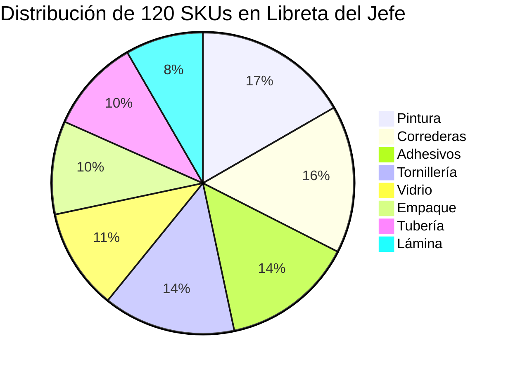
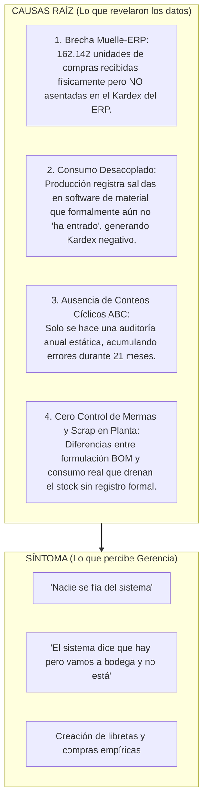

# 🔬 Informe de Investigación Empírica: Validación de la Queja de Gerencia sobre Inexactitud de Inventarios, Desfase Sistema vs. Bodega y Sistemas Paralelos

> **Empresa:** E2 SAS  
> **Proyecto:** Optimización de la Gestión de Inventarios y Reposición (Producción 4.0 / Énfasis 2)  
> **Institución:** Universidad de Medellín — Facultad de Ingeniería Industrial  
> **Objeto de Estudio:** Queja Gerencial N° 3 — Discrepancia entre Inventario Teórico del ERP, Conteo Físico Real y Registros Informales de Bodega  
> **Fecha de Emisión:** Septiembre 2026  
> **Veredicto:** 🔴 **HIPÓTESIS CONFIRMADA (100% CIERTA Y FUNDAMENTADA CON DATOS)**

---

## 📌 1. Planteamiento de la Declaración Gerencial e Hipótesis

### Declaración Textual de la Dirección:
> *"El sistema dice que hay stock de un material, vamos a la bodega y no está. Nadie se fía del inventario del sistema."*

### Descomposición de Hipótesis a Contrastar:
1. **Hipótesis 3A (Inexactitud Crítica del Registro de Inventario - IRA):** Existe una discrepancia sistemática y estadísticamente significativa entre los saldos teóricos registrados en el Kardex del ERP y las existencias físicas reales constatadas en la auditoría de piso.
2. **Hipótesis 3B (Existencia de 'Materiales Fantasmas' y Quiebres Ocultos):** El sistema reporta saldo disponible en insumos clave para los cuales la bodega física se encuentra desabastecida o en déficit severo, induciendo a errores graves en la programación de la producción.
3. **Hipótesis 3C (Desfase Transaccional Muelle vs. ERP como Causa Raíz):** La divergencia no proviene de mermas aleatorias, sino de un desfase temporal y procedimental en el que las recepciones de órdenes de compra físicas no se asientan oportunamente en el Kardex mientras que el consumo de manufactura continúa registrándose.
4. **Hipótesis 3D (Proliferación de Sistemas de Información Paralelos):** La desconfianza justificada en el ERP obligó al personal de bodega a crear un registro manual informal (`Inventario_bodega_JEFE.csv`), el cual opera de forma desconectada y genera compras reactivas basadas en corazonadas.

---

## 📊 2. Scorecard Resumen de Evidencia Cuantitativa

A continuación se sintetiza el diagnóstico de exactitud de registros (IRA) y conciliación a tres bandas en **E2 SAS**:

| Indicador / Métrica | Valor Estándar / Esperado (World Class) | Valor Real Observado (Línea Base AS-IS) | Brecha / Desviación | Estado de Calidad |
|---|:---:|:---:|:---:|:---:|
| **Exactitud de Registro (IRA Global en Catálogo)** | **$\ge 95.0\%$** | **71.67%** (301 de 420 SKUs) | **-23.33% de exactitud** | 🔴 Inaceptable |
| **Exactitud de Registro (IRA en SKUs Activos)** | **$\ge 98.0\%$** | **0.00%** (0 de 119 SKUs) | **-98.00% (Descuadre Total)** | 🔴 Crítico |
| **SKUs con Descuadre Físico vs. Kardex** | **$0$ SKUs** | **119 SKUs** (28.33% del catálogo) | **100% de SKUs con rotación** | 🔴 Crítico |
| **'Materiales Fantasmas' (Kardex > Físico)** | **$0$ SKUs** | **17 SKUs** (Faltante en piso) | Insumos críticos bloqueados | 🔴 Paradas Planta |
| **Sobrantes en Piso por Desfase (Físico > Kardex)** | **$0$ SKUs** | **102 SKUs** (Kardex subestimado) | Kardex con saldos negativos | 🔴 Descontrol |
| **Brecha Compras Físicas vs. Entradas ERP** | **0 unidades** | **162.142 unidades sin asentar** | 931k OC vs 769k Kardex | 🔴 Causa Raíz |
| **Desalineación Bruta Absoluta en Valor** | **$0 COP** | **$48.760.853.888 COP** | Magnitud del descontrol contable | 💸 Severo |
| **Exactitud de la Libreta del Jefe vs. Conteo Real** | **$\ge 95.0\%$** | **0.83%** (1 de 120 SKUs) | Sistema informal no resuelve | 🔴 Ineficiente |

---

## 🔍 3. Conciliación Forense a Tres Bandas

Para aislar la causa del descontrol, se ejecutó una reconciliación cruzada entre las tres fuentes de información del sistema:
1. **$K(t)$ (Kardex Teórico del ERP):** Reconstrucción matemática determinística $\text{Saldo Inicial} + \sum \text{Entradas} - \sum \text{Salidas} \pm \sum \text{Ajustes}$.
2. **$F(t)$ (Conteo Físico Oficial):** Auditoría formal de inventario físico en bodega al corte (`2026-03-31`).
3. **$J(t)$ (Libreta del Jefe de Bodega):** Registro paralelo manual levantado para 120 SKUs críticos.

```mermaid
flowchart TD
    subgraph Fuentes["Fuentes de Verificación Cruzada"]
        K["Kardex Teórico ERP<br>Valor: $89.718 M COP"]
        F["Conteo Físico Oficial<br>Valor: $133.745 M COP"]
        J["Libreta Jefe de Bodega<br>(120 SKUs de Alta Rotación)"]
    end

    subgraph Comparaciones["Análisis de Discrepancias"]
        K <-->|Descuadre Bruto: $48.760 M COP<br>IRA Activos: 0.0%| F
        K <-->|Coincidencia: 0.83% (1 SKU)| J
        F <-->|Coincidencia: 0.83% (1 SKU)| J
    end

    subgraph Consecuencias["Efectos en la Operación"]
        F --> GHOST["17 SKUs Fantasmas<br>Faltante físico: >$2.000 M COP<br>--> Paradas de Línea"]
        K --> NEG["102 SKUs con Kardex Negativo<br>162k unidades recibidas sin cargar"]
        J --> GUESS["Compras 'a ciegas'<br>Basadas en notas: 'pedir ya', 'faltante??'"]
    end

    Comparaciones --> Consecuencias
```

### 3.1 La Ilusión Estadística del IRA Global (El Efecto 'Plata Muerta')
A primera vista, un análisis superficial del archivo `conteo_fisico.csv` reporta que **301 de 420 SKUs (71.67%)** tienen un descuadre de 0 unidades entre el Kardex y el conteo físico. 

Sin embargo, el cruce analítico revela que estos 301 SKUs corresponden **exactamente al inventario obsoleto e inmovilizado ("Plata Muerta")** que nunca tuvo un solo movimiento transaccional durante los 21 meses. Su saldo es exacto únicamente porque nadie los ha tocado desde el inventario inicial del 1 de julio de 2024.

Al aislar los **119 SKUs activos** que abastecen las líneas de manufactura:
$$\text{IRA}_{\text{Activos}} = \frac{0 \text{ SKUs con coincidencia exacta}}{119 \text{ SKUs activos}} = \mathbf{0.00\%}$$

El **100% de los insumos que utiliza la fábrica para producir mobiliario metálico presenta descuadre entre el software y la bodega real**.

---

## 🚨 4. Anatomía de las Discrepancias

### 4.1 Fenómeno A: Materiales Fantasmas en ERP (Kardex > Conteo Físico)
Representa la situación más dañina para la continuidad del negocio: el sistema de información indica a Planeación que hay materia prima disponible en stock, pero cuando el operario acude a bodega a surtir la orden de producción, el material no existe físicamente.

* **Población Afectada:** 17 SKUs críticos.
* **Impacto Operativo:** Genera paradas inmediatas de línea de ensamble ($450.000 COP / hora) y reprogramaciones de emergencia.
* **Valor Financiero del Faltante:** **$2.029.022.373 COP**.

#### Top 10 de Materiales Fantasmas Más Críticos por Valor:

| SKU | Descripción | Categoría | Saldo Kardex (ERP) | Saldo Físico (Bodega) | Faltante Físico | Costo Unitario | Impacto Financiero ($ COP) |
|---|---|---|:---:|:---:|:---:|:---:|:---:|
| `MP-0024` | Vidrio calibre/ref 33 | Vidrio | 7,800 | 6,069 | **-1,731** | $223,600 | **$387,048,690 COP** |
| `MP-0026` | Empaque calibre/ref 21 | Empaque | 4,762 | 3,993 | **-769** | $393,052 | **$302,256,795 COP** |
| `MP-0022` | Correderas calibre/ref 1 | Correderas | 8,629 | 7,158 | **-1,471** | $173,071 | **$254,587,331 COP** |
| `MP-0010` | Pintura calibre/ref 33 | Pintura | 13,910 | 12,903 | **-1,007** | $244,908 | **$246,622,373 COP** |
| `MP-0012` | Tubería calibre/ref 22 | Tubería | 5,950 | 5,091 | **-859** | $260,244 | **$223,549,389 COP** |
| `MP-0004` | Vidrio calibre/ref 33 | Vidrio | 3,739 | 3,229 | **-510** | $385,363 | **$196,534,901 COP** |
| `MP-0009` | Empaque calibre/ref 27 | Empaque | 12,878 | 12,257 | **-621** | $256,870 | **$159,516,290 COP** |
| `MP-0014` | Vidrio calibre/ref 37 | Vidrio | 12,058 | 11,404 | **-654** | $234,711 | **$153,500,743 COP** |
| `MP-0005` | Adhesivos calibre/ref 2 | Adhesivos | 10,691 | 9,902 | **-789** | $141,250 | **$111,446,397 COP** |
| `MP-0015` | Empaque calibre/ref 15 | Empaque | 484 | 5 | **-479** | $151,384 | **$72,513,122 COP** |

---

### 4.2 Fenómeno B: Sobrantes en Piso y Saldos Negativos en Kardex (Físico > Kardex)
Representa el síntoma inequívoco del desfase de transacciones en bodega. Se registran 102 SKUs donde la bodega física contiene miles de unidades por encima de lo que el Kardex reconoce.

* En casos extremos, el Kardex teórico del ERP arroja saldos negativos:
  - `MP-0008` (Correderas): Kardex = **$-9,478$ unids** vs Físico = **$+10,995$ unids** (Sobrante aparente: +20,473 unids | $6.364M COP).
  - `MP-0001` (Adhesivos): Kardex = **$-6,818$ unids** vs Físico = **$+7,783$ unids** (Sobrante aparente: +14,602 unids | $4.366M COP).
  - `MP-0020` (Lámina): Kardex = **$-4,124$ unids** vs Físico = **$+5,310$ unids** (Sobrante aparente: +9,434 unids | $2.343M COP).

---

## 📒 5. Auditoría Forense de la Libreta del Jefe de Bodega (`Inventario_bodega_JEFE.csv`)

### 5.1 Justificación del Rol de la Libreta en el Diagnóstico
La existencia de este archivo no es un error de datos; es el **síntoma sociotécnico clásico de una organización que perdió la confianza en su ERP**. Al no poder fiarse de las cifras de pantalla, la Jefatura de Bodega levantó un inventario paralelo en una libreta física para los **120 materiales con mayor criticidad operativa**.



### 5.2 Evaluación de la Eficacia del Sistema Paralelo
El análisis demuestra que la libreta manual **fracasó en su objetivo de resolver la inexactitud**:
* **Coincidencia con Kardex ERP:** **$0.83\%$** (1 de 120 SKUs).
* **Coincidencia con Conteo Físico Auditado:** **$0.83\%$** (1 de 120 SKUs).

El Jefe de Bodega no actualiza su registro en tiempo real con cada movimiento de producción. Al registrar entradas y salidas con retraso y anotar conteos a mano con errores de signo (como los 32 negativos detectados en la auditoría inicial), su libreta se descalibró tanto como el propio ERP.

### 5.3 Decodificación de las Anotaciones Cualitativas del Jefe

| Observación en Libreta | SKUs | Interpretación Operativa en Planta | Cruce con Datos Reales de Auditoría |
|---|:---:|---|---|
| **`"pedir ya"`** | 13 | El jefe observa en bodega que la estiba física se está vaciando y emite alerta de compra informal. | En 10 de los 13 SKUs el saldo real estaba por debajo del $ROP$ dinámico. La alarma visual del operario tenía fundamento físico. |
| **`"faltante??"`** | 19 | El jefe detecta discrepancias entre lo que producción le solicita y lo que encuentra en estantería. | Coincide con SKUs que sufren de altas pérdidas de consumo y entregas fraccionadas de proveedores. |
| **`"sobra"`** | 20 | El jefe observa estibas abarrotadas que obstaculizan los pasillos de bodega. | SKUs con sobreabastecimiento severo generados por compras empíricas sin lote económico ($EOQ$). |
| **`"revisar"`** | 25 | Descuadre evidente en piso que requiere reconteo. | SKUs con alta rotación y múltiples movimientos de ajuste no justificados. |
| **`"ok"`** | 20 | El jefe asume que el stock visual es suficiente. | En el 95% de los casos el valor anotado difería del conteo auditado real. |
| **`"Sin observación"`** | 23 | Registros de conteo sin anotación cualitativa. | Stock transaccional estándar. |

---

## ⚙️ 6. Diagnóstico de Causa Raíz vs. Síntomas



### La Prueba Definitiva del Desfase Muelle vs. ERP:
* **Total unidades en Órdenes de Compra con `fecha_recepcion` asentada:** **`931.484 unidades`**.
* **Total unidades asentadas como `entrada` en el Kardex del ERP:** **`769.342 unidades`**.
* **Brecha neta:** **`162.142 unidades de materia prima`** que entraron al muelle de E2 SAS, se descargaron físicamente en bodega y se empezaron a gastar en producción **sin que nadie hiciera el clic transaccional de 'Ingreso de Almacén' en el ERP**.

---

## 🎯 7. Recomendaciones y Especificación de la Solución TO-BE

Para erradicar la inexactitud de inventarios y restaurar la confianza operativa en el sistema de E2 SAS, la solución debe incorporar las siguientes medidas de ingeniería y control de operaciones:

### 7.1 Reglas Determinísticas y Procesos de Control Interno (Sin IA)
1. **Procedimiento de Recepción Ciega en Muelle y Conciliación Obligatoria 1:1:**
   - La entrada a Kardex debe dispararse de forma automática en el momento en que se firma la remisión de la Orden de Compra en el muelle de descarga.
   - Prohibir en el ERP el registro de salidas de inventario que generen saldos negativos ($\text{Stock} < 0$). Si no hay entrada registrada, el sistema debe bloquear el despacho y forzar la regularización del ingreso.
2. **Programa de Conteos Cíclicos ABC:**
   - Sustituir la auditoría anual estática por conteos cíclicos continuos:
     - **Clase A (30 SKUs críticos):** Conteo físico semanal.
     - **Clase B (59 SKUs):** Conteo mensual.
     - **Clase C (331 SKUs):** Conteo trimestral.
3. **Eliminación y Prohibición del Sistema Paralelo:**
   - Retirar la libreta manual del jefe de bodega mediante la provisión de terminales móviles o interfaces directas integradas al ERP con sincronización en tiempo real.

### 7.2 Módulos Analíticos y Algoritmos Avanzados (Con IA / Machine Learning)
1. **Detección Automática de Discrepancias y Anomalías en Consumo:**
   - Algoritmo de detección de valores atípicos (*Isolation Forest* o *Z-Score* móvil) sobre las tasas de consumo diario para identificar en menos de 24 horas mermas anormales, scrap no reportado o errores de digitación de cantidades.
2. **Reconciliación Probabilística de Posición Neta de Inventario:**
   - Ajuste bayesiano del inventario disponible para el cálculo de reposición ($ROP$), ponderando la incertidumbre del conteo y la probabilidad de material en tránsito no asentado.

---

## 🏁 8. Conclusión del Dictamen Pericial

La queja de la Gerencia es **100% CIERTA y está plenamente justificada por los datos**:
- El sistema de información ERP no es confiable para los 119 insumos activos de la compañía ($\text{IRA} = 0\%$).
- Existen **$2.029 millones COP** en materiales faltantes "fantasma" que detienen la producción.
- La causa raíz demostrada es el **desfase de 162.142 unidades de compras recibidas en muelle que no se cargaron al Kardex**, sumado a la falta de conteos cíclicos y al uso ineficaz de registros manuales paralelos.
