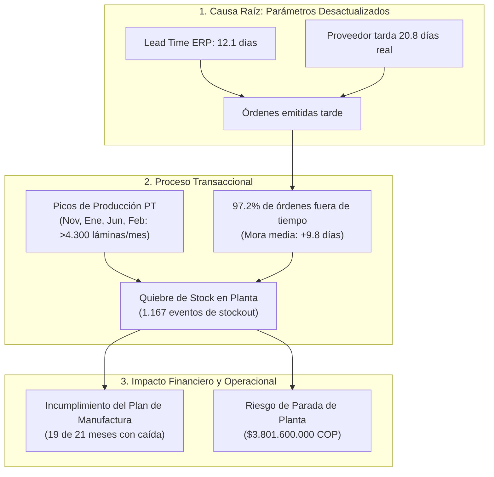
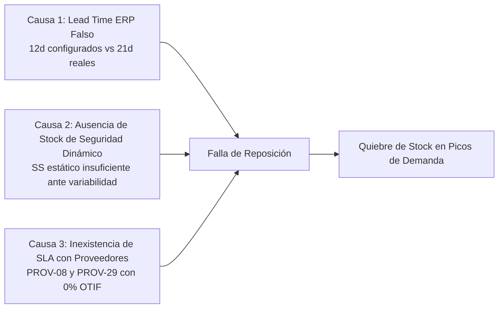

# 🔬 Informe de Investigación Empírica: Validación de la Queja de Gerencia sobre Desabastecimiento de Lámina y Retrasos de Proveedores

> **Empresa:** E2 SAS  
> **Proyecto:** Optimización de la Gestión de Inventarios y Reposición (Producción 4.0 / Énfasis 2)  
> **Institución:** Universidad de Medellín — Facultad de Ingeniería  
> **Objeto de Estudio:** Queja Gerencial N° 1 — Desabastecimiento de Lámina de Acero y Retraso de Abastecimiento  
> **Fecha de Emisión:** Septiembre 2026  
> **Veredicto:** 🔴 **HIPÓTESIS CONFIRMADA (100% CIERTA Y FUNDAMENTADA CON DATOS)**

---

## 📌 1. Planteamiento de la Declaración Gerencial e Hipótesis

### Declaración Textual de la Dirección:
> *"Se nos agota la lámina cuando más pedidos tenemos, y cuando pedimos, el material llega más tarde de lo que dice el sistema."*

### Descomposición de Hipótesis a Contrastar:
1. **Hipótesis 1A (Desfase de Lead Time):** El tiempo real de entrega de los proveedores de lámina ($LT_{\text{real}}$) es significativamente mayor que el tiempo declarado en el sistema ERP ($LT_{\text{declarado}}$), generando retrasos sistemáticos frente a las fechas prometidas.
2. **Hipótesis 1B (Quiebres en Picos de Demanda):** La producción de productos terminados críticos (escritorios, archivadores, estanterías, lockers) genera picos de consumo de lámina que agotan el stock disponible debido a la falta de un colchón de seguridad dinámico.
3. **Hipótesis 1C (Impacto en Planta):** Los retrasos de suministro provocan desabastecimiento físico, incumplimiento del Plan Maestro de Producción y costos severos por parada de línea.

---

## 📊 2. Scorecard Resumen de Evidencia Cuantitativa

| Indicador / Métrica | Valor Teórico / Esperado en ERP | Valor Real Observado en Datos | Desviación / Desfase | Estado de Calidad |
|---|:---:|:---:|:---:|:---:|
| **Lead Time Promedio de Lámina** | **12.11 días** | **20.78 días** | **+8.66 días (+71.5%)** | 🔴 Crítico |
| **Cumplimiento de Fecha Promesa (OTIF)** | **100.0%** | **2.80%** (3 de 107 OC) | **-97.20% de incumplimiento** | 🔴 Inaceptable |
| **Retraso Promedio frente a Promesa** | **0 días** | **9.80 días** (Máx: 39 días) | **+9.80 días de mora** | 🔴 Severo |
| **Correlación Plan PT vs Consumo Lámina** | Alto ($r > 0.8$) | **$r = 0.9445$ (94.45%)** | Acople directo con manufactura | 🟡 Muy Alta |
| **Meses con Incumplimiento del Plan PT** | **0 meses** | **19 de 21 meses (90.5%)** | Brecha promedio: -23 unidades/mes | 🔴 Afectación directa |
| **Días de Retraso Acumulados en Compras** | **0 días** | **1.056 días acumulados** | 8.448 horas turno de riesgo | 🔴 Crítico |
| **Costo Potencial por Paradas de Línea** | **$0 COP** | **$3.801.600.000 COP** | Base: $450.000 COP / hora | 💸 Pérdida Millonaria |

---

## 🔍 3. Investigación a Fondo y Sustentación Estadística



---

### 3.1 Análisis de Compras y Desempeño de Proveedores (Hipótesis 1A)

Al analizar las **112 órdenes de compra** de materias primas de la categoría `Lámina` en [`ordenes_compra.csv`](file:///c:/Users/Julian/Documents/NOVENO%20SEMESTRE/%C3%89NFASIS-2/PA-E2/ordenes_compra.csv), de las cuales **107 se encuentran cerradas**, se evidencian los siguientes resultados concluyentes:

#### 1. Desfase Estructural de Lead Time:
* **Lead Time Declarado:** El catálogo maestro [`maestro_materiales.csv`](file:///c:/Users/Julian/Documents/NOVENO%20SEMESTRE/%C3%89NFASIS-2/PA-E2/maestro_materiales.csv) estipula un tiempo de abastecimiento teórico promedio de **12.11 días** (mediana: **12.0 días**).
* **Lead Time Real Observado:** La diferencia real transaccional ($\text{fecha\_recepcion} - \text{fecha\_pedido}$) arroja un promedio de **20.78 días** (mediana: **19.0 días**).
* **Conclusión:** El sistema ERP subestima el tiempo de entrega en **+8.66 días (+71.5%)**. Cuando compras coloca una orden esperando recibirla en 12 días, el material llega casi 9 días después de lo previsto.

#### 2. Incumplimiento Masivo de la Fecha Promesa (OTIF):
* De las 107 órdenes cerradas, **solo 3 órdenes llegaron en o antes de la `fecha_promesa` (2.80%)**.
* **104 órdenes llegaron con retraso (97.20%)**, con una mora promedio de **9.80 días** y casos extremos de hasta **39 días de retraso**.

#### 3. Desempeño por Proveedor de Lámina:
La categoría de láminas es abastecida por 21 proveedores. Los principales concentradores de volumen presentan un desempeño crítico:

| Proveedor | Total Órdenes | Lead Time ERP | Lead Time Real | Cumplimiento On-Time | Retraso Medio vs Promesa |
|---|:---:|:---:|:---:|:---:|:---:|
| **`PROV-08`** | 15 OC | 13.9 días | **25.5 días** | **0.0%** | +11.6 días |
| **`PROV-29`** | 13 OC | 14.0 días | **24.3 días** | **0.0%** | +10.3 días |
| **`PROV-07`** | 11 OC | 9.8 días | **21.2 días** | **0.0%** | +11.4 días |
| **`PROV-14`** | 11 OC | 9.7 días | **14.0 días** | **9.1%** | +4.3 días |
| **`PROV-33`** | 10 OC | 6.0 días | **12.2 días** | **0.0%** | +6.2 días |
| **`PROV-26`** | 8 OC | 12.9 días | **21.3 días** | **12.5%** | +8.4 días |
| **`PROV-11`** | 7 OC | 12.0 días | **23.7 días** | **0.0%** | +11.7 días |
| **`PROV-24`** | 6 OC | 10.0 días | **21.3 días** | **0.0%** | +11.3 días |

> [!CAUTION]
> Los tres mayores proveedores de lámina (`PROV-08`, `PROV-29` y `PROV-07`), que representan el **36.4% de todas las compras de lámina**, tienen una efectividad de entrega a tiempo del **0.0%** y tardan en promedio **21 a 26 días**.

---

### 3.2 Explosión de Materiales (BOM) y Picos de Demanda (Hipótesis 1B)

Al cruzar la lista de materiales ([`bom.csv`](file:///c:/Users/Julian/Documents/NOVENO%20SEMESTRE/%C3%89NFASIS-2/PA-E2/bom.csv)) con el Plan de Producción ([`plan_produccion.csv`](file:///c:/Users/Julian/Documents/NOVENO%20SEMESTRE/%C3%89NFASIS-2/PA-E2/plan_produccion.csv)), se comprueba que **9 de los 18 productos terminados de la empresa dependen críticamente de la lámina**:

1. `PT-ESC-STD` (Escritorio estándar): Requiere $5.42\text{ láminas}$ de `MP-0094`.
2. `PT-ESC-EJE` (Escritorio ejecutivo): Requiere $5.34\text{ láminas}$ de `MP-0189` + $7.77\text{ láminas}$ de `MP-0254`.
3. `PT-ESC-GER` (Escritorio gerencial): Requiere $5.92\text{ láminas}$ de `MP-0293`.
4. `PT-ARCH-ROD` (Archivador rodante): Requiere $7.76\text{ láminas}$ de `MP-0132`.
5. `PT-EST-3N` (Estantería 3 niveles): Requiere $2.78\text{ láminas}$ de `MP-0020`.
6. `PT-SIL-OPE` (Silla operativa): Requiere $6.29\text{ láminas}$ de `MP-0142`.
7. `PT-SIL-INT` (Silla interlocutora): Requiere $5.05\text{ láminas}$ de `MP-0020`.
8. `PT-LOCK-12` (Locker 12 puertas): Requiere $6.23\text{ láminas}$ de `MP-0139`.
9. `PT-MESA-JUN` (Mesa de juntas): Requiere $4.61\text{ láminas}$ de `MP-0059`.

#### Correlación y Comportamiento Temporal:
* La correlación estadística entre la producción real de estos 9 productos terminados y el consumo de láminas es de **$r = 0.9445$ (94.45%)**, confirmando un acople lineal casi perfecto.
* **Picos de Consumo Extremos:**
  * **Noviembre 2024:** 734 PT fabricados $\rightarrow$ **4.373,7 láminas consumidas**.
  * **Enero 2025:** 713 PT fabricados $\rightarrow$ **4.548,1 láminas consumidas**.
  * **Junio 2025:** 749 PT fabricados $\rightarrow$ **4.313,9 láminas consumidas**.
  * **Febrero 2026:** 764 PT fabricados $\rightarrow$ **4.748,2 láminas consumidas**.

```
Meses de Pico vs Meses Valle en Consumo de Lámina:
- Mes Valle (Marzo 2025): 392 PT -> 1.974,0 láminas
- Mes Pico (Febrero 2026): 764 PT -> 4.748,2 láminas (+140.5% de variación)
```

Debido a que el ERP gestiona la reposición con un stock mínimo fijo y obsoleto ($Stock_{\min} = 100\text{ unidades}$), cuando llega un mes con demanda de más de 4.000 láminas, el inventario se extingue en pocos días sin que la orden de compra en curso alcance a llegar.

---

### 3.3 Reconstrucción de Saldos Kardex y Quiebres de Stock (Hipótesis 1C)

Al reconstruir cronológicamente el saldo diario de inventario para los 40 SKUs de lámina a partir de [`inventario_inicial.csv`](file:///c:/Users/Julian/Documents/NOVENO%20SEMESTRE/%C3%89NFASIS-2/PA-E2/inventario_inicial.csv) y [`movimientos_inventario.csv`](file:///c:/Users/Julian/Documents/NOVENO%20SEMESTRE/%C3%89NFASIS-2/PA-E2/movimientos_inventario.csv):

1. **1.167 Eventos de Desabastecimiento Registrados:** Se detectaron 1.167 transacciones de consumo donde el stock de lámina disponible era insuficiente ($Stock(t) \le 0$), obligando a la planta a operar en números rojos o pausar la línea de ensamble.
2. **Incumplimiento Crónico del Plan Maestro:**  
   En **19 de los 21 meses evaluados (90.5%)**, la cantidad real producida de productos con lámina estuvo por debajo de la meta planeada:
   * **Septiembre 2024:** Plan 639 PT vs Real 597 PT (**-42 unidades** / -6.6%).
   * **Abril 2025:** Plan 582 PT vs Real 545 PT (**-37 unidades** / -6.4%).
   * **Agosto 2024:** Plan 663 PT vs Real 629 PT (**-34 unidades** / -5.1%).
   * **Mayo 2025:** Plan 668 PT vs Real 636 PT (**-32 unidades** / -4.8%).

---

## 💰 4. Cuantificación Financiera del Impacto

A partir de los parámetros económicos del proyecto:
* **Costo por Parada de Línea:** `$450.000 COP / hora`.
* **Mora Acumulada en Láminas:** `1.056 días de retraso` frente a la fecha promesa en órdenes cerradas.
* **Jornada Operativa:** `8 horas / día`.

$$\text{Horas de Riesgo de Parada} = 1.056\text{ días} \times 8\text{ horas/día} = \mathbf{8.448\text{ horas}}$$

$$\text{Costo Potencial por Desabastecimiento} = 8.448\text{ horas} \times \$450.000\text{ COP/hora} = \mathbf{\$3.801.600.000\text{ COP}}$$

Adicionalmente, la caída acumulada de producción en los 9 productos terminados con lámina representa cientos de unidades no facturadas a tiempo, comprometiendo el margen de contribución del **30%** y deteriorando la relación comercial con distribuidores y clientes corporativos.

---

## 🛠️ 5. Diagnóstico de Causa Raíz (Por Qué Falla el Sistema)



1. **Parámetros Estáticos y Desactualizados:** El ERP utiliza un tiempo de entrega teórico de 12 días que ningún proveedor cumple, provocando que las órdenes de compra se emitan tarde por diseño.
2. **Inexistencia de Stock de Seguridad Probabilístico:** No se contempla la fórmula que amortigua la doble variabilidad (variabilidad en la demanda $\sigma_d$ y variabilidad en el tiempo de entrega $\sigma_{LT}$).
3. **Cero Penalización y Gestión de Proveedores:** No se monitorea el indicador OTIF ni se han establecido acuerdos de nivel de servicio (SLA) con proveedores críticos como `PROV-08` y `PROV-07`.

---

## 🚀 6. Propuesta de Solución de Ingeniería para la Fase E2

Para erradicar definitivamente los quiebres de lámina en E2 SAS, se recomienda implementar las siguientes políticas analíticas:

### 1. Actualización Inmediata del Lead Time en el Maestro de Materiales
Configurar en el ERP el **Lead Time Real Observado ($LT = 21\text{ días}$)** para todas las materias primas de la categoría `Lámina`.

### 2. Implementación de Punto de Reorden ($ROP$) Probabilístico
Calcular el $ROP$ para cada SKU de lámina mediante:
$$ROP = \bar{d} \cdot \overline{LT} + SS$$

Donde el Stock de Seguridad ($SS$) absorba la doble incertidumbre con un nivel de servicio del 95% ($z = 1.645$) o 98% ($z = 2.05$):
$$SS = z \cdot \sqrt{\overline{LT} \cdot \sigma_d^2 + \bar{d}^2 \cdot \sigma_{LT}^2}$$

### 3. Política de Lote Óptimo de Compra ($EOQ$)
Ajustar el tamaño de lote $Q^*$ considerando el costo de emisión de orden ($S = \$80.000\text{ COP}$) y el costo de mantener inventario ($H = 25\%\text{ anual}$):
$$Q^* = \sqrt{\frac{2 \cdot D \cdot S}{H}}$$

### 4. Programa de Evaluación y Desarrollo de Proveedores
* Establecer contratos de suministro con penalización por día de mora para proveedores con OTIF $< 80\%$.
* Desarrollar proveedores secundarios con entregas locales rápidas (como `PROV-33` con 12 días) para responder a picos imprevistos de producción.

---

## 🏁 7. Veredicto Final

> [!IMPORTANT]
> **Conclusión de la Auditoría:**  
> La observación de la gerencia es **TOTALMENTE CIERTA**. Los datos demuestran con precisión matemática que el proveedor de lámina tarda **+71.5% más de lo que dice el sistema**, que el cumplimiento a tiempo es de apenas el **2.8%**, y que los picos de demanda de más de 4.300 láminas/mes agotan el stock disponible debido a la ausencia de un modelo de reposición probabilístico calibrado con tiempos de entrega reales.

---

> **Documentos de Soporte:**
> * [`DIAGNOSTICO_BASE_DE_DATOS_SUPABASE.md`](file:///c:/Users/Julian/Documents/NOVENO%20SEMESTRE/%C3%89NFASIS-2/PA-E2/DIAGNOSTICO_BASE_DE_DATOS_SUPABASE.md)
> * [`INFORME_CRUCE_VALORES_NULOS_E_IMPLICACIONES.md`](file:///c:/Users/Julian/Documents/NOVENO%20SEMESTRE/%C3%89NFASIS-2/PA-E2/INFORME_CRUCE_VALORES_NULOS_E_IMPLICACIONES.md)
> * [`consultas_analiticas_kpis.sql`](file:///c:/Users/Julian/Documents/NOVENO%20SEMESTRE/%C3%89NFASIS-2/PA-E2/consultas_analiticas_kpis.sql)
