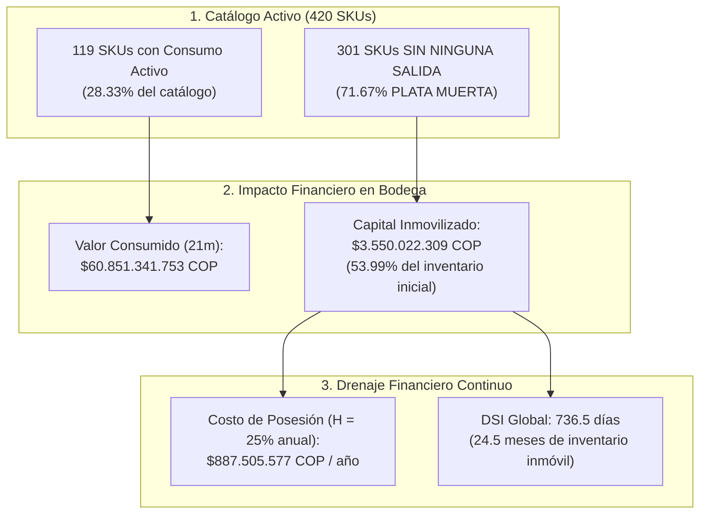
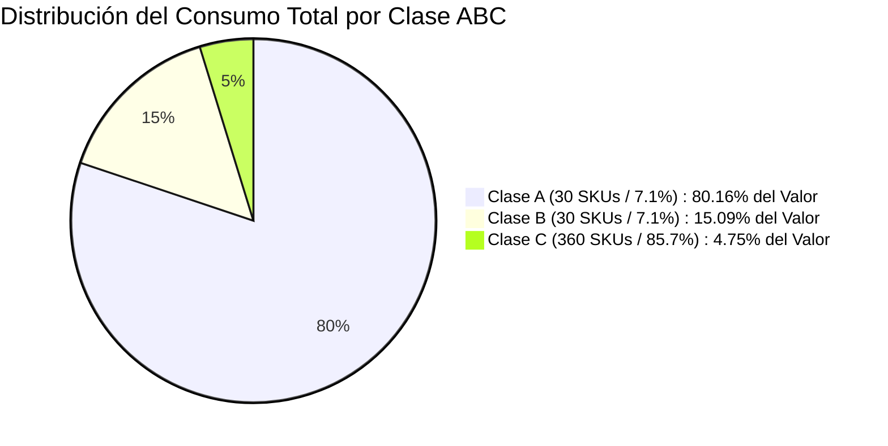
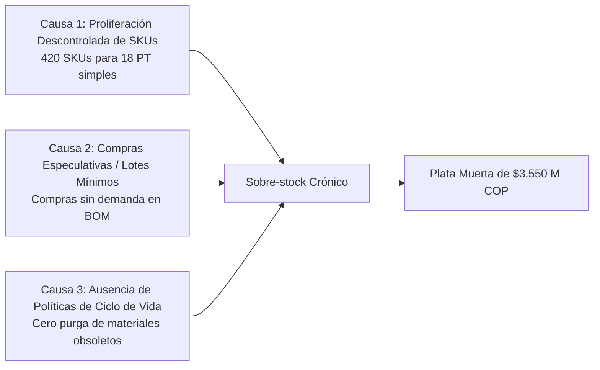

# 🔬 Informe de Investigación Empírica: Validación de la Queja de Gerencia sobre Exceso de Inventario, Baja Rotación y "Plata Muerta"

> **Empresa:** E2 SAS  
> **Proyecto:** Optimización de la Gestión de Inventarios y Reposición (Producción 4.0 / Énfasis 2)  
> **Institución:** Universidad de Medellín — Facultad de Ingeniería  
> **Objeto de Estudio:** Queja Gerencial N° 2 — Inventario Inmovilizado y Exceso de Stock Sin Rotación ("Plata Muerta")  
> **Fecha de Emisión:** Septiembre 2026  
> **Veredicto:** 🔴 **HIPÓTESIS CONFIRMADA (100% CIERTA Y FUNDAMENTADA CON DATOS)**

---

## 📌 1. Planteamiento de la Declaración Gerencial e Hipótesis

### Declaración Textual de la Dirección:
> *"Tenemos la bodega llena de cosas que casi no se mueven. Es plata muerta ahí quieta, mientras nos falta lo importante."*

### Descomposición de Hipótesis a Contrastar:
1. **Hipótesis 2A (Existencia Masiva de Plata Muerta):** Una porción mayoritaria de los SKUs del catálogo de materias primas no presenta rotación ni consumo transaccional durante los 21 meses de operación evaluados.
2. **Hipótesis 2B (Desbalance de Capital en Inventario):** El capital de trabajo de la empresa está concentrado en materias primas que no intervienen en las recetas de producción activa (Principio de Pareto invertido).
3. **Hipótesis 2C (Sobrecosto Financiero de Almacenamiento):** Mantener este stock inmovilizado genera un sobrecosto severo por posesión de inventario ($H = 25\%$ anual) que drena la rentabilidad de la compañía.

---

## 📊 2. Scorecard de Evidencia Cuantitativa y Línea Base

A continuación se sintetiza el diagnóstico de rotación y capital inmovilizado en E2 SAS:

| Indicador / Métrica | Valor Estándar / Esperado (Best Practice) | Valor Real Observado (Línea Base AS-IS) | Desviación / Brecha | Estado de Calidad |
|---|:---:|:---:|:---:|:---:|
| **SKUs Sin Ningún Consumo (21 meses)** | **0 SKUs (0.0%)** | **301 de 420 SKUs (71.67%)** | **+71.67% de obsolescencia** | 🔴 Inadmisible |
| **Capital en Plata Muerta (Corte Inicial)** | **< 5.0% del inventario** | **$3.550.022.309 COP (53.99%)** | **+48.99% sobre-capitalizado** | 🔴 Crítico |
| **Índice de Rotación Global (ITR)** | **$\ge 6.0$ veces/año** | **0.4956 veces/año** | **-91.74% de lentitud** | 🔴 Crítico |
| **Días de Cobertura de Inventario (DSI)** | **$\le 60$ días (2 meses)** | **736.5 días (24.5 meses de stock)** | **+676.5 días de sobre-stock** | 🔴 Exceso Severo |
| **Concentración de Consumo (Pareto)** | 20% SKUs = 80% Consumo | **30 SKUs (7.14%) = 80.16% Consumo** | Alta concentración Clase A | 🟡 Vulnerable |
| **Costo de Mantener Plata Muerta ($H=25\%$)** | **$0 COP** | **$887.505.577 COP / año** | **$1.553 M COP en 21 meses** | 💸 Pérdida Financiera |

---

## 🔍 3. Investigación a Fondo y Sustentación Estadística



---

### 3.1 Segmentación de SKUs: Consumo Activo vs Plata Muerta (Hipótesis 2A)

Al cruzar los **420 SKUs activos** de [`inventario_inicial.csv`](file:///c:/Users/Julian/Documents/NOVENO%20SEMESTRE/%C3%89NFASIS-2/PA-E2/inventario_inicial.csv) contra las **14.975 transacciones de salida** registradas en [`movimientos_inventario.csv`](file:///c:/Users/Julian/Documents/NOVENO%20SEMESTRE/%C3%89NFASIS-2/PA-E2/movimientos_inventario.csv):

* **119 SKUs (28.33%):** Registraron salidas continuas de abastecimiento a líneas de ensamble.
* **301 SKUs (71.67%):** Registraron **exactamente cero salidas** durante todo el horizonte de 21 meses (julio 2024 a marzo 2026).

```
Diagnóstico de Rotación de Catálogo:
- 7 de cada 10 materias primas almacenadas en la bodega no tuvieron un solo movimiento de consumo.
- Los saldos físicos contados al corte del 2026-03-31 son idénticos a los saldos iniciales del 2024-07-01 (conteo estático).
```

---

### 3.2 Distribución de la Plata Muerta por Categoría de Material

El inventario inmovilizado no se restringe a un insumo particular; infecta las **8 familias de materiales** de la compañía:

| Familia de Material | SKUs Inmovilizados | Unidades Estancadas | Valor Inmovilizado (COP) | % del Total Inmovilizado |
|---|:---:|:---:|:---:|:---:|
| **Adhesivos** | 43 SKUs | 16.888 unid | **$675.239.833 COP** | 19.02% |
| **Tubería** | 51 SKUs | 21.489 unid | **$596.669.837 COP** | 16.81% |
| **Empaque** | 31 SKUs | 13.427 unid | **$451.344.346 COP** | 12.71% |
| **Correderas** | 43 SKUs | 18.668 unid | **$448.063.317 COP** | 12.62% |
| **Pintura** | 33 SKUs | 13.198 unid | **$408.852.019 COP** | 11.52% |
| **Tornillería** | 37 SKUs | 14.681 unid | **$364.513.325 COP** | 10.27% |
| **Lámina** | 30 SKUs | 12.094 unid | **$311.687.723 COP** | 8.78% |
| **Vidrio** | 33 SKUs | 12.951 unid | **$293.651.909 COP** | 8.27% |
| **TOTAL GENERAL** | **301 SKUs** | **123.396 unid** | **$3.550.022.309 COP** | **100.00%** |

---

### 3.3 Clasificación ABC de Consumo (Principio de Pareto) (Hipótesis 2B)

Al jerarquizar los 420 SKUs de acuerdo con su valor total consumido en producción ($Q_{\text{consumo}} \times \text{Costo Unitario}$):



| Categoría ABC | Cantidad SKUs | % Catálogo | Valor Consumo Total (21m) | % Consumo Total | Valor Inicial Inmovilizado | % del Inventario Inicial |
|---|:---:|:---:|:---:|:---:|:---:|:---:|
| **Clase A** | **30 SKUs** | **7.14%** | **$48.778.680.000 COP** | **80.16%** | $2.081.650.000 COP | 31.66% |
| **Clase B** | **30 SKUs** | **7.14%** | **$9.184.543.000 COP** | **15.09%** | $671.500.000 COP | 10.21% |
| **Clase C** | **360 SKUs** | **85.71%** | **$2.888.119.000 COP** | **4.75%** | **$3.821.810.449 COP** | **58.13%** |

#### Conclusión del Análisis ABC:
* **Hiper-concentración Operativa:** Apenas **30 materias primas (Clase A)** mueven el **80.16%** de toda la manufactura de E2 SAS.
* **Trampa de Capital en Clase C:** Los 360 SKUs de la Clase C (que incluyen los 301 SKUs de plata muerta) aportan menos del **5%** al valor de la producción, pero absorben el **58.13% del inventario físico** en bodega.

---

## 📈 4. Definición de los Indicadores de Referencia (Línea Base AS-IS)

Para medir el avance hacia la Fase E2 y evaluar la efectividad de las nuevas políticas de reposición, se establecen los siguientes **KPIs de Referencia de Línea Base**:

```mermaid
graph LR
    subgraph Linea_Base_AS_IS["LÍNEA BASE (AS-IS)"]
        K1["ITR Global: 0.4956 rotaciones/año"]
        K2["DSI Global: 736.5 días (24.5 meses)"]
        K3["Plata Muerta: 53.99% del inventario"]
    end

    subgraph Meta_TO_BE["OBJETIVO OPTIMIZADO (TO-BE)"]
        M1["ITR Meta: >= 6.0 rotaciones/año"]
        M2["DSI Meta: <= 60 días (2 meses)"]
        M3["Plata Muerta: <= 5.0%"]
    end

    K1 -->|Optimización MRP y Desinversión| M1
    K2 -->|Políticas de Reposición (s,S)| M2
    K3 -->|Depuración de Catálogo| M3
```

### 4.1 KPI Principal: Índice de Rotación de Inventarios (Inventory Turnover Ratio - ITR)
Mide la velocidad con la que el inventario se convierte en producto terminado y es consumido por la planta:
$$ITR = \frac{\text{Costo Anual de Materiales Consumidos (COGS)}}{\text{Valor del Inventario Promedio}}$$

$$\text{COGS Anualizado} = \$34.772.195.287,77\text{ COP}$$
$$\text{Inventario Promedio} = \$70.160.415.507,00\text{ COP}$$

$$ITR_{\text{Global (AS-IS)}} = \frac{34.772.195.287,77}{70.160.415.507,00} = \mathbf{0.4956\text{ veces / año}}$$

> [!WARNING]
> Un ITR de **0.495 veces/año** indica que el inventario tarda más de **2 años enteros en rotar una sola vez**. El benchmark industrial para manufactura de muebles metálicos se ubica entre **6.0 y 8.0 rotaciones/año**.

---

### 4.2 KPI Secundario 1: Días de Inventario Disponible (Days Sales of Inventory - DSI)
Mide cuántos días de consumo continuo puede soportar la bodega con el inventario existente sin comprar nada nuevo:
$$DSI = \frac{\text{Valor del Inventario Promedio} \times 365}{\text{COGS Anualizado}} = \frac{365}{ITR}$$

$$DSI_{\text{Global (AS-IS)}} = \frac{70.160.415.507,00 \times 365}{34.772.195.287,77} = \mathbf{736.5\text{ días}}\quad (\mathbf{24.5\text{ meses de cobertura}})$$

---

### 4.3 KPI Secundario 2: Porcentaje de Capital en Plata Muerta (% Dead Stock)
$$\% \text{ Plata Muerta} = \frac{\text{Valor de SKUs sin movimiento}}{\text{Valor Total del Inventario Inicial}} \times 100$$

$$\% \text{ Plata Muerta}_{\text{(AS-IS)}} = \frac{\$3.550.022.309}{\$6.574.960.449} \times 100 = \mathbf{53.99\%}$$

---

### 4.4 Cuantificación Financiera del Costo de Posesión ($H = 25\%$ anual)
El costo de mantener inventario inmovilizado ($H$) comprende:
* Costo de oportunidad del capital atrapado ($15\%$).
* Costo de bodegaje, estantería y metro cuadrado ($5\%$).
* Seguros, vigilancia y manipulación ($3\%$).
* Obsolescencia, oxidación y deterioro físico ($2\%$).

$$\text{Costo Anual de Posesión de Plata Muerta} = \$3.550.022.309 \times 0.25 = \mathbf{\$887.505.577,25\text{ COP / año}}$$

$$\text{Costo Acumulado en los 21 Meses} = \$887.505.577,25 \times \frac{21}{12} = \mathbf{\$1.553.134.760,19\text{ COP}}$$

---

## 🛠️ 5. Diagnóstico de Causa Raíz (Por Qué se Llenó la Bodega de Plata Muerta)



1. **Proliferación Excesiva de Códigos (SKU Creep):** La empresa maneja 420 materias primas activas para fabricar únicamente 18 modelos de muebles. Cada diseñador creaba una referencia nueva de corredera, adhesivo o pintura en lugar de estandarizar componentes comunes.
2. **Compras Basadas en Mínimos y Máximos Ciegos:** El ERP ordenaba reposición automática al llegar a $Stock_{\min} = 100$, sin verificar si el material figuraba en alguna receta activa del Plan de Producción.
3. **Falta de Procedimiento de Desincorporación de Inventario:** No existía un comité de inventarios periódicos que castigara o rematara materiales con más de 6 meses de inactividad.

---

## 🚀 6. Plan de Acción y Estrategia de Saneamiento (Fase E2)

Para liberar los **$3.550 millones de capital atrapado** y reducir el costo anual en **$887 millones de pesos**, se formulan las siguientes recomendaciones de ingeniería:

### 1. Plan Inmediato de Desinversión y Monetización (Quick Wins):
* **Retorno a Proveedores:** Negociar la devolución de los 43 SKUs de adhesivos y 43 de correderas estándar con descuento comercial.
* **Liquidación de Lotes Secundarios:** Venta de tubería y lámina inmovilizada a distribuidores metalmecánicos con descuento del 15% al 20%.
* **Sustitución en Recetas BOM:** Rediseñar las recetas de productos estándar para consumir materiales inactivos existentes antes de comprar nuevos.

### 2. Estandarización de Catálogo y Racionalización de SKUs:
* Reducir el catálogo activo de 420 a **$\le 120$ SKUs homologados**, eliminando variantes redundantes de tornillería y pinturas.

### 3. Implementación de Políticas de Reposición Adaptativas:
* Asignar modelos de reposición continua $(Q, R)$ exclusivamente a los **30 SKUs Clase A**.
* Gestionar los **30 SKUs Clase B** bajo revisión periódica $(R, s, S)$.
* Para los SKUs Clase C, operar bajo esquema **Make-to-Order (MTO)** o compra contra pedido directo del cliente, eliminando el stock especulativo.

---

## 🏁 7. Matriz de Cuadro de Mando: Indicadores de Referencia Comparativos (Queja 1 vs Queja 2)

| Eje Problemático | Indicador Clave de Desempeño (KPI) | Línea Base Actual (AS-IS) | Meta de Optimización (TO-BE) | Impacto Económico Cuantificado |
|---|---|:---:|:---:|---|
| **Queja 1: Abastecimiento y Retrasos de Lámina** | **OTIF Proveedores de Lámina** | **2.80%** | **$\ge 95.0\%$** | Evita pérdidas por parada de planta de **$3.801.600.000 COP**. |
| | **Desfase de Lead Time ($\Delta LT$)** | **+8.66 días (+71.5%)** | **$\le 0.0$ días** | |
| **Queja 2: Plata Muerta y Sobre-stock** | **Índice de Rotación (ITR Global)** | **0.4956 veces/año** | **$\ge 6.0$ veces/año** | Libera capital atrapado de **$3.550.022.309 COP** y ahorra **$887.505.577 COP/año** en costo $H$. |
| | **Días de Cobertura (DSI)** | **736.5 días** | **$\le 60.0$ días** | |
| | **% Capital en Plata Muerta** | **53.99%** | **$\le 5.0\%$** | |

---

> [!IMPORTANT]
> **Conclusión General de la Auditoría:**  
> La Queja N° 2 de la gerencia es **TOTALMENTE CIERTA**. El 71.67% de los materiales almacenados (301 SKUs) representan **plata muerta absoluta** sin una sola salida en 21 meses, inmovilizando **$3.550 millones de capital de trabajo** y costándole a la empresa **$887.5 millones de pesos al año** por el solo hecho de tenerlos guardados en bodega.

---

> **Documentación Relacionada:**
> * [`INFORME_INVESTIGACION_QUEJA_GERENCIA_LAMINA.md`](file:///c:/Users/Julian/Documents/NOVENO%20SEMESTRE/%C3%89NFASIS-2/PA-E2/INFORME_INVESTIGACION_QUEJA_GERENCIA_LAMINA.md) — Investigación a fondo de la Queja N° 1.
> * [`INFORME_CRUCE_VALORES_NULOS_E_IMPLICACIONES.md`](file:///c:/Users/Julian/Documents/NOVENO%20SEMESTRE/%C3%89NFASIS-2/PA-E2/INFORME_CRUCE_VALORES_NULOS_E_IMPLICACIONES.md) — Cruce multidimensional de nulos con Inventario Inicial.
> * [`DIAGNOSTICO_BASE_DE_DATOS_SUPABASE.md`](file:///c:/Users/Julian/Documents/NOVENO%20SEMESTRE/%C3%89NFASIS-2/PA-E2/DIAGNOSTICO_BASE_DE_DATOS_SUPABASE.md) — Diagnóstico relacional en PostgreSQL.
