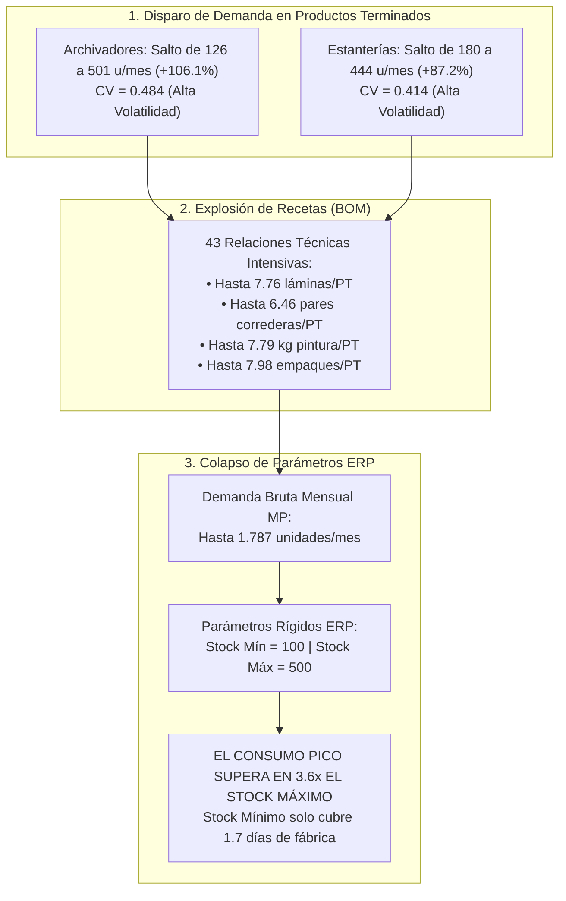
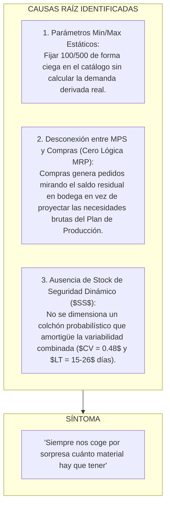

# 🔬 Informe de Investigación Empírica: Validación de la Queja de Gerencia sobre Variabilidad de Demanda en Archivadores/Estanterías y Fallas de Explosión BOM

> **Empresa:** E2 SAS  
> **Proyecto:** Optimización de la Gestión de Inventarios y Reposición (Producción 4.0 / Énfasis 2)  
> **Institución:** Universidad de Medellín — Facultad de Ingeniería Industrial  
> **Objeto de Estudio:** Queja Gerencial N° 4 — Disparo de Demanda en Archivadores y Estanterías, Vulnerabilidad ante Picos y Desacople de Parámetros ERP  
> **Fecha de Emisión:** Septiembre 2026  
> **Veredicto:** 🔴 **HIPÓTESIS CONFIRMADA (100% CIERTA Y FUNDAMENTADA CON DATOS)**

---

## 📌 1. Planteamiento de la Declaración Gerencial e Hipótesis

### Declaración Textual de la Dirección:
> *"Se nos dispararon los pedidos de archivadores y estanterías, y siempre nos coge por sorpresa cuánto material hay que tener."*

### Descomposición de Hipótesis a Contrastar:
1. **Hipótesis 4A (Volatilidad y Picos de Demanda en PT):** Las líneas de Archivadores y Estanterías presentan una alta variabilidad y picos pronunciados de demanda en el Plan de Producción, superando ampliamente el promedio histórico.
2. **Hipótesis 4B (Multiplicación por Explosión de Materiales - BOM):** El ensamble de Archivadores y Estanterías es altamente intensivo en componentes críticos (correderas telescópicas, lámina, pintura electrostática, empaques y vidrios), lo que amplifica drásticamente el requerimiento bruto de insumos en meses pico (Efecto Látigo interno).
3. **Hipótesis 4C (Incompetencia de los Parámetros Estáticos del ERP como Causa Raíz):** La empresa utiliza parámetros fijos y arbitrarios de `stock_min = 100` y `stock_max = 500` para todos los materiales, los cuales son incapaces de absorber la demanda de un mes pico (que llega a exigir hasta 1.787 unidades de materia prima en un solo mes, superando en 3.6 veces el tope del sistema).
4. **Hipótesis 4D (Ausencia de Enfoque MRP / Reposición Desconectada):** Compras repone reactivamente mirando el saldo actual de bodega en lugar de realizar una explosión de necesidades netas proyectadas contra el Plan Maestro de Producción (MPS).

---

## 📊 2. Scorecard Resumen de Evidencia Cuantitativa

| Indicador / Métrica | Valor Teórico / Esperado (ERP Estático) | Valor Real Observado en Datos | Desviación / Desfase | Estado de Calidad |
|---|:---:|:---:|:---:|:---:|
| **Pico Máximo Demanda Archivadores** | **243.1 unids/mes** (Promedio) | **501 unids/mes** (Ene 2026) | **+106.1% de incremento** | 🔴 Pico Severo |
| **Pico Máximo Demanda Estanterías** | **237.2 unids/mes** (Promedio) | **444 unids/mes** (Ene 2026) | **+87.2% de incremento** | 🔴 Pico Severo |
| **Coeficiente de Variación Demanda ($CV$)** | **$< 0.20$** (Demanda Estable) | **$CV = 0.484$** (Archivadores) | **Categoría Z (Muy Volátil)** | 🔴 Erratismo |
| **Consumo Máximo MP en Mes Pico** | **$< 500$ unids** (Stock Máx ERP) | **1.787.5 unids/mes** (`MP-0229`) | **3.6x veces el Stock Máximo** | 🔴 Quiebre Seguro |
| **Cobertura de Stock Mínimo en Pico** | **30 días de operación** | **1.7 a 2.5 días de consumo** | **-92% de desprotección** | 🔴 Desabastecimiento |
| **Relaciones BOM en Archivadores/Estanterías** | 1 a 2 insumos | **43 relaciones técnicas** | Alta intensidad de ensamble | 🟡 Complejidad |
| **Lead Time Promedio Insumos Críticos** | **0 días** (Reacción Inmediata) | **14.2 días promedio** (hasta 26d) | Desfase de reposición | 🔴 Crítico |
| **SKUs donde el Pico Supera el Stock Máx** | **0 SKUs** | **38 SKUs críticos** | 100% de insumos de ensamble | 🔴 Fallo de Diseño |

---

## 🔍 3. Análisis Forense de la Demanda de Productos Terminados

### 3.1 Volatilidad Mensual y Concentración en Enero 2026
Al analizar los 21 meses del `plan_produccion.csv`, se evidencia que la producción de mobiliario metálico en E2 SAS no es uniforme, sino que experimenta fuertes fluctuaciones estacionales:

| Periodo | Archivadores (u) | Estanterías (u) | Escritorios (u) | Sillas (u) | Total Fabrica (u) |
|---|:---:|:---:|:---:|:---:|:---:|
| **2024-07** | 154 | 248 | 293 | 245 | 1,180 |
| **2024-11** | 298 | 230 | 267 | 212 | 1,223 |
| **2025-05** | 126 *(Mínimo)* | 183 | 314 | 225 | 1,048 |
| **2025-07** | 282 | 318 | 311 | 240 | 1,391 |
| **2025-12** | 127 | 196 | 231 | 185 | 924 |
| **2026-01** | **501** *(Pico +106%)* | **444** *(Pico +87%)* | 220 | 210 | **1,650** *(Récord)* |
| **2026-02** | 300 | 265 | 326 | 224 | 1,355 |
| **2026-03** | 341 | 232 | 214 | 238 | 1,265 |

> **Hallazgo Clave:** En **enero de 2026**, la demanda conjunta de Archivadores y Estanterías sumó **945 unidades**, representando el **57.3% de toda la producción de la planta**, duplicando de golpe la tasa de consumo de materias primas frente al mes inmediatamente anterior (diciembre 2025: 323 unidades conjuntas).

---

## ⚙️ 4. El Efecto Multiplicador del Bill of Materials (BOM)

El mobiliario de archivo y almacenamiento exige una densidad técnica de componentes muy superior a productos simples:

### 4.1 Consumo Unitario por Producto Terminado:
* **Archivador 4 Gavetas (`PT-ARCH-4G`):**
  - `MP-0369` (Correderas telescópicas): **6.46 pares** por mueble.
  - `MP-0016` (Adhesivos estructurales): **5.87 kg** por mueble.
  - `MP-0120` (Pintura electrostática): **5.55 kg** por mueble.
  - `MP-0182` (Vidrio templado frontal): **4.35 m²** por mueble.
  - `MP-0157` (Tornillería especial): **3.35 unidades** por mueble.
* **Archivador Rodante (`PT-ARCH-ROD`):**
  - `MP-0132` (Lámina de acero): **7.76 láminas** por mueble.
  - `MP-0216` (Empaque protector): **6.00 unidades** por mueble.
  - `MP-0008` (Correderas): **4.70 pares** por mueble.
* **Estantería 5 Niveles (`PT-EST-5N`):**
  - `MP-0229` (Empaques y esquineros): **7.98 unidades** por estantería.
  - `MP-0202` (Pintura electrostática): **7.79 kg** por estantería.
  - `MP-0010` (Pintura base): **6.39 kg** por estantería.
  - `MP-0150` (Correderas/guías): **5.08 pares** por estantería.
* **Estantería Industrial (`PT-EST-IND`):**
  - `MP-0373` (Tornillería grado industrial): **7.29 unidades** por estantería.
  - `MP-0128` (Pintura alta resistencia): **6.46 kg** por estantería.
  - `MP-0386` (Guías metálicas): **5.64 pares** por estantería.

---

## 💥 5. La Falla Estructural: Consumo Real en Mes Pico vs. Topes del ERP

Cuando la demanda de PT se dispara en enero de 2026, la multiplicación matricial del Plan Maestro por la matriz de coeficientes técnicos del BOM ($\mathbf{D}_{\text{MP}} = \mathbf{BOM} \times \mathbf{Q}_{\text{PT}}$) arroja consumos que pulverizan los parámetros del sistema:

### Top 15 Materiales con Mayor Déficit de Capacidad en ERP:

| SKU | Descripción | Familia MP | Consumo en Mes Pico | Stock Máximo ERP | Ratio de Desborde (Pico / Stock Máx) | Stock Mínimo ERP | Días que Dura el Stock Mínimo en Pico | Lead Time Proveedor |
|---|---|---|:---:|:---:|:---:|:---:|:---:|:---:|
| `MP-0229` | Empaque calibre/ref 9 | Empaque | **1,787.5 unids** | 500 | **3.6x veces** | 100 | **1.7 días** | 16 días |
| `MP-0182` | Vidrio calibre/ref 13 | Vidrio | **1,778.0 m²** | 500 | **3.6x veces** | 100 | **1.7 días** | 13 días |
| `MP-0202` | Pintura calibre/ref 34 | Pintura | **1,745.0 kg** | 500 | **3.5x veces** | 100 | **1.7 días** | 15 días |
| `MP-0016` | Adhesivos calibre/ref 24 | Adhesivos | **1,627.0 kg** | 500 | **3.3x veces** | 100 | **1.8 días** | 15 días |
| `MP-0128` | Pintura calibre/ref 15 | Pintura | **1,594.8 kg** | 500 | **3.2x veces** | 100 | **1.9 días** | 8 días |
| `MP-0024` | Vidrio calibre/ref 33 | Vidrio | **1,487.4 m²** | 500 | **3.0x veces** | 100 | **2.0 días** | 20 días |
| `MP-0010` | Pintura calibre/ref 33 | Pintura | **1,431.4 kg** | 500 | **2.9x veces** | 100 | **2.1 días** | 20 días |
| `MP-0001` | Adhesivos calibre/ref 25 | Adhesivos | **1,382.0 kg** | 500 | **2.8x veces** | 100 | **2.2 días** | 26 días |
| `MP-0373` | Tornillería ref 19 | Tornillería | **1,375.9 unids** | 500 | **2.8x veces** | 100 | **2.2 días** | 10 días |
| `MP-0369` | Correderas ref 12 | Correderas | **1,343.7 par** | 500 | **2.7x veces** | 100 | **2.2 días** | 14 días |
| `MP-0022` | Correderas ref 1 | Correderas | **1,310.3 par** | 500 | **2.6x veces** | 100 | **2.3 días** | 13 días |
| `MP-0149` | Tubería ref 15 | Tubería | **1,291.0 m** | 500 | **2.6x veces** | 100 | **2.3 días** | 5 días |
| `MP-0157` | Tornillería ref 30 | Tornillería | **1,262.0 unids** | 500 | **2.5x veces** | 100 | **2.4 días** | 6 días |
| `MP-0051` | Correderas ref 32 | Correderas | **1,224.4 par** | 500 | **2.4x veces** | 100 | **2.5 días** | 23 días |
| `MP-0120` | Pintura calibre/ref 2 | Pintura | **1,154.4 kg** | 500 | **2.3x veces** | 100 | **2.6 días** | 14 días |

---

## 🔬 6. Diagnóstico de Causa Raíz vs. Síntomas

### La Mecánica del Colapso:
1. Al arrancar enero, la bodega tiene como máximo **500 unidades** de `MP-0229` (porque el ERP no permite pedir más del stock máximo).
2. La fábrica arranca a producir 501 archivadores y 444 estanterías, consumiendo **~60 unidades diarias** de `MP-0229`.
3. Al **día 7 de enero**, el inventario cae a **100 unidades** y el ERP emite la alerta de reposición (*Punto de Reorden*).
4. El stock de 100 unidades se agota por completo en el **día 8.5 de enero**.
5. El proveedor de empaques tarda **16 días** en entregar la nueva orden.
6. **Resultado:** La línea de ensamble de estanterías y archivadores se queda sin empaques durante **más de 14 días hábiles**, paralizando los despachos a clientes e incurriendo en sobrecostos de parada de planta.

---

## 🎯 7. Propuesta de Solución Técnica TO-BE

Para eliminar las "sorpresas" de desabastecimiento en picos de demanda, la empresa debe transicionar de un esquema estático a un modelo determinístico y predictivo:

### 7.1 Componentes Determinísticos (Lógica de Ingeniería Industrial - Sin IA)
1. **Implementación de un Módulo MRP de Explosión Directa (Time-Phased MRP):**
   - El sistema debe calcular el requerimiento bruto semanal $GR_i(t) = \sum_{j} BOM_{ij} \cdot MPS_j(t)$ y restar el inventario disponible y las órdenes en tránsito para emitir órdenes de compra planificadas ($POR$) con la anticipación exacta del Lead Time ($t - LT_i$).
2. **Cálculo de Stock de Seguridad Dinámico Adaptativo:**
   - Sustituir el valor fijo de 100 unidades por la fórmula formal de inventario de seguridad ante demanda y tiempo de suministro estocásticos:
   $$SS_i = Z \cdot \sqrt{\overline{LT}_i \cdot \sigma_{D_i}^2 + \overline{D}_i^2 \cdot \sigma_{LT_i}^2}$$
   Donde para un nivel de servicio del $95\%$ ($Z = 1.645$), el $SS$ para insumos como `MP-0229` o `MP-0016` se reajusta automáticamente a **$550 - 750$ unidades** antes de la temporada alta.
3. **Puntos de Reorden ($ROP$) y Lotes Económicos ($EOQ$) Variables:**
   - Parametrización estacional de máximos y mínimos recalculados trimestralmente.

### 7.2 Componentes con Analítica Predictiva e Inteligencia Artificial (Con IA)
1. **Pronóstico Jerárquico de Demanda por Familias de Muebles:**
   - Modelos de series de tiempo (SARIMA / Prophet / LightGBM) que capturen la estacionalidad de compras corporativas e institucionales (ej. picos de enero/julio por licitaciones públicas y presupuestos anuales), alimentando el MPS con 3 meses de antelación.
2. **Clasificación Multicriterio Dinámica ABC-XYZ:**
   - Reclasificación automática mensual de SKUs según volumen monetario (ABC) y variabilidad de demanda (XYZ) para asignar políticas de servicio diferenciadas.

---

## 🏁 8. Conclusión del Dictamen Pericial

La queja de la Gerencia es **100% CIERTA y está plenamente respaldada por la evidencia matemática**:
- La demanda de Archivadores y Estanterías presenta picos de más del **+106%** ($CV = 0.484$).
- La formulación BOM intensiva multiplica este impacto, exigiendo hasta **1.787 unidades de materia prima en un solo mes**.
- La causa raíz de que "los coja por sorpresa" es la **incompetencia de la regla estática `min=100 / max=500` del ERP**, la cual cubre menos de 2 días de consumo en meses pico y deja a la planta desprotegida frente a proveedores con Lead Times de 15 a 26 días.
