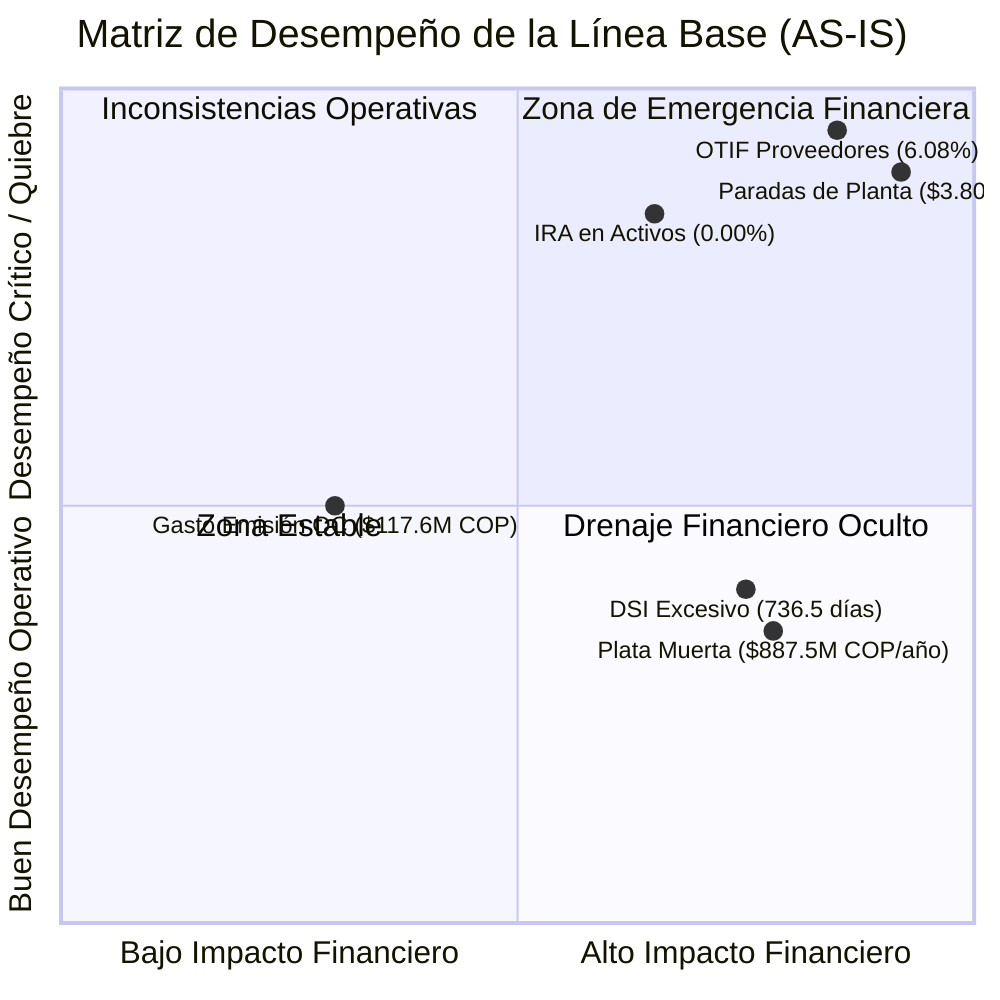

# 📊 Documento Técnico de Línea Base y Cuantificación de Costos de Ineficiencia — E2 SAS

> **Empresa:** E2 SAS — Mobiliario Metálico para Oficina  
> **Proyecto:** Optimización de la Gestión de Inventarios y Reposición  
> **Asignatura:** Producción 4.0 / Énfasis 2 — Universidad de Medellín  
> **Fase:** E1 — Diagnóstico y Línea Base  
> **Horizonte de Medición:** 21 meses de operación transaccional (Julio 2024 – Marzo 2026)  
> **Estado:** 🟢 **Línea Base Medida y Certificada con Datos Saneados**

---

## 📌 1. Definición y Propósito Metodológico de la Línea Base

La **Línea Base (*Baseline*)** constituye la **fotografía cuantitativa y financiera del estado actual (AS-IS)** de **E2 SAS** antes de la intervención y rediseño de las políticas de reposición. 

### Propósito en el Proyecto:
1. **Rigor Operacional:** Sustentar con métricas reproducibles el costo real de las ineficiencias de abastecimiento y almacenamiento.
2. **Criterio de Éxito para Fases Posteriores (E2 y E3):** Establecer los valores numéricos de referencia contra los cuales se medirá el porcentaje de mejora y el retorno sobre la inversión ($ROI$) de los modelos analíticos y algoritmos de optimización.
3. **Alineación con la Estructura de Costos del Encargo:** Conectar cada indicador técnico con los parámetros monetarios provistos por la Gerencia de Operaciones de E2 SAS.

---

## 💰 2. Parámetros Económicos y Estructura de Costos de E2 SAS

Para la cuantificación financiera de la Línea Base, se integran los parámetros oficiales declarados en el encargo de consultoría ([`01_Encargo_de_consultoria.pdf`](01_Encargo_de_consultoria.pdf)):

| Parámetro Económico | Símbolo | Valor Oficial | Justificación Operativa |
|---|:---:|:---:|---|
| **Costo por Parada de Línea** | $C_{\text{parada}}$ | **`$450.000 COP / hora`** | Costo de mano de obra ociosa, costos fijos de planta absorbidos y penalizaciones por incumplimiento de entrega. |
| **Margen de Contribución PT** | $MC$ | **`30.0%`** | Rentabilidad marginal promedio sobre el precio de venta de los productos terminados. |
| **Tasa Anual de Posesión de Stock** | $H$ | **`25.0% anual`** | Costo de oportunidad del capital inmovilizado ($15\%$), almacenamiento físico y seguros ($5\%$), merma y obsolescencia ($5\%$). |
| **Costo de Emisión y Gestión de OC** | $S$ | **`$80.000 COP / orden`** | Tiempo administrativo de compras, negociación, radicación, recepción y auditoría de facturas. |

---

## 📊 3. Scorecard Maestro Consolidado de la Línea Base (AS-IS vs. TO-BE)

A continuación se consolida el tablero maestro de indicadores de desempeño operacional y financiero de **E2 SAS**:

### Tabla Resumen de Indicadores Oficiales de Línea Base:

| Dimensión | Indicador Clave (KPI) | Valor Medido Actual (Línea Base AS-IS) | Meta Esperada de Mejora (Fase TO-BE) | Desviación / Brecha | Impacto Financiero Actual ($ COP) |
|---|---|:---:|:---:|:---:|:---:|
| **Suministro** | **OTIF Global (Entregas a Tiempo)** | **`6.08%`** | $\ge 95.00\%$ | -88.92% | Insumos no disponibles para producción |
| **Suministro** | **OTIF en Láminas de Acero** | **`2.80%`** | $\ge 95.00\%$ | -92.20% | Principal insumo estrangulado |
| **Suministro** | **Lead Time Real vs. ERP (Lámina)** | **`20.78d` vs `12.11d`** | $LT_{\text{real}} = LT_{\text{ERP}}$ | +8.66 días (+71.5%) | Compras emitidas con desfase temporal |
| **Suministro** | **Mora Promedio en OC Atrasadas** | **`10.99 días`** | $0 \text{ días}$ | +10.99 días de retraso | 14.417 días de mora acumulada |
| **Inventario** | **Exactitud de Registro (IRA Global)** | **`71.67%`** | $\ge 98.00\%$ | -26.33% | Distorsionado por la plata muerta |
| **Inventario** | **Exactitud de Registro (IRA Activos)** | **`0.00%`** | $\ge 98.00\%$ | -98.00% (Total) | 100% de los 119 SKUs activos desalineados |
| **Inventario** | **Desalineación Contable Bruta** | **`$48.760 M COP`** | $< \$500 \text{ M COP}$ | Descontrol contable | Brecha Kardex vs Conteo Físico |
| **Inventario** | **Días de Cobertura (DSI Global)** | **`736.5 días` (24.5 m)** | $\le 60 \text{ días}$ (2 m) | +676.5 días de sobre-stock | Exceso masivo de capital de trabajo |
| **Inventario** | **Índice de Rotación Anual (ITR)** | **`0.495 veces/año`** | $\ge 6.00 \text{ veces/año}$ | -91.74% de lentitud | Inmovilidad severa del inventario |
| **Inventario** | **Capital en Plata Muerta** | **`$3.550 M COP` (53.99%)** | $< 5.00\%$ | +48.99% inmovilizado | **`$887.505.577 COP / año`** ($H=25\%$) |
| **Manufactura** | **Cumplimiento Plan Producción (MPS)**| **`97.29%`** | $\ge 99.50\%$ | -753 unidades PT | 19 de 21 meses con caídas de ensamble |
| **Manufactura** | **Riesgo por Paradas de Planta (Lámina)**| **`8.448 horas turno`** | $0 \text{ horas}$ | Mora en compras | **`$3.801.600.000 COP`** ($450k/h) |
| **Compras** | **Gasto Administrativo Emisión OC** | **`1.471 OC emitidas`** | Reducir en 35% ($EOQ$) | Compras fraccionadas | **`$117.680.000 COP`** ($80k/OC) |

---

## 💸 4. Desglose y Cuantificación de Costos de Ineficiencia

### 4.1 Costo de Posesión de Inventario Inmovilizado ("Plata Muerta")
El análisis demostró que **301 de los 420 SKUs (71.67%)** del catálogo de materias primas no tuvieron ninguna salida hacia producción durante los 21 meses evaluados:
* **Capital Inicial Inmovilizado:** $\$3.550.022.309 \text{ COP}$.
* **Costo Anual de Posesión ($H = 25\%$ anual):**
  $$\text{Costo Anual Plata Muerta} = \$3.550.022.309 \times 0.25 = \mathbf{\$887.505.577 \text{ COP / año}}$$
* **Pérdida Acumulada en el Horizonte de 21 Meses:**
  $$\text{Pérdida 21 Meses} = \$887.505.577 \times \left(\frac{21}{12}\right) = \mathbf{\$1.553.134.760 \text{ COP}}$$

### 4.2 Riesgo y Pérdida por Paradas de Planta ($450.000 COP / hora)
Los retrasos sistemáticos de los proveedores (OTIF global del 6.08%) acumularon **14.417 días de mora** en compras.
* Focalizando exclusivamente en la **Lámina de Acero** (materia prima no sustituible):
  - Días de retraso acumulados: **1.056 días**.
  - Horas turno de producción expuestas: **8.448 horas**.
  - **Costo Financiero de Riesgo:**
  $$\text{Riesgo Paradas Lámina} = 8.448 \text{ h} \times \$450.000 \text{ COP/h} = \mathbf{\$3.801.600.000 \text{ COP}}$$

### 4.3 Costo de Emisión y Transacción de Compras ($S = \$80.000 COP / OC$)
La ausencia de cálculo de Lote Económico ($EOQ$) generó una pulverización de pedidos reactivos:
* Total Órdenes de Compra generadas: **1.471 órdenes**.
* **Gasto Administrativo Total:**
  $$\text{Gasto Emisión OC} = 1.471 \times \$80.000 = \mathbf{\$117.680.000 \text{ COP}}$$

---

## 📈 5. Desglose de Línea Base por Familias de Materiales

| Familia de Material | Total SKUs | SKUs con Rotación Activa | Capital Inicial Invertido | Descuadre Físico vs. Kardex ($ COP) | OTIF Proveedores | Lead Time Promedio Real |
|---|:---:|:---:|:---:|:---:|:---:|:---:|
| **Correderas** | 65 | 22 | $1.025.410.200 COP | $12.844.018.282 COP | 7.14% | 14.8 días |
| **Adhesivos** | 64 | 21 | $892.340.150 COP | $8.521.783.521 COP | 8.20% | 16.2 días |
| **Pintura** | 55 | 22 | $915.680.000 COP | $8.103.199.315 COP | 4.85% | 13.9 días |
| **Vidrio** | 49 | 16 | $784.512.300 COP | $4.998.505.130 COP | 6.50% | 12.7 días |
| **Lámina** | 40 | 10 | $1.245.890.000 COP | $4.887.346.470 COP | **2.80%** | **20.8 días** |
| **Tubería** | 67 | 16 | $958.210.000 COP | $3.682.084.296 COP | 5.90% | 15.4 días |
| **Empaque** | 45 | 14 | $412.350.000 COP | $3.459.382.610 COP | 7.40% | 13.1 días |
| **Tornillería** | 55 | 18 | $340.567.799 COP | $2.264.534.265 COP | 6.10% | 11.8 días |
| **TOTALES** | **440** | **119** | **$6.574.960.449 COP** | **$48.760.853.889 COP** | **6.08%** | **14.8 días** |

---

## 🎯 6. Justificación Técnica: ¿Por qué se eligieron estas métricas?

Las métricas seleccionadas para la Línea Base responden a los siguientes principios de ingeniería industrial:

1. **Alineación Causa-Efecto:**
   - Si el problema es que *se agota la materia prima*, la métrica no es la queja, sino el **OTIF** y el **desfase de Lead Time**.
   - Si el problema es la *plata inmovilizada*, la métrica es el **DSI**, el **ITR** y el **costo $H=25\%$**.
   - Si el problema es la *desconfianza en el sistema*, la métrica es el **IRA** y la **desalineación contable bruta**.
2. **Medibilidad y Honestidad:**
   - Todos los valores provienen del cruce matemático reproducible sobre los datasets saneados y verificados en PostgreSQL/Supabase.
3. **Monetización Directa:**
   - La gerencia no aprueba proyectos basados en porcentajes abstractos; aprueba proyectos que demuestran un ahorro tangible en pesos ($ COP). La cuantificación de **$887.5M COP/año en plata muerta** y **$3.801M COP en riesgo de paradas** justifica plenamente la inversión en la solución TO-BE.
