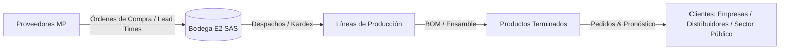
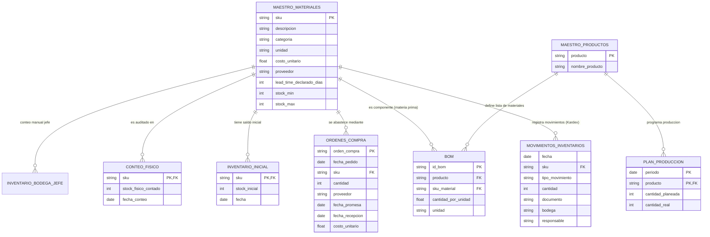

# 🏢 Optimización de la Gestión de Inventarios y Reposición — E2 SAS
> **Proyecto de Consultoría Analítica y Modelado de Operaciones**  
> **Universidad de Medellín — Facultad de Ingeniería — Ingeniería Industrial**  
> **Asignatura:** Producción 4.0 / Énfasis 2  
> **Repositorio Oficial:** [`https://github.com/juliancarmotrice-star/-Enfasis-2.git`](https://github.com/juliancarmotrice-star/-Enfasis-2.git)

---

## 📌 Tabla de Contenido
- [1. Contexto Empresarial y Marco del Proyecto](#1-contexto-empresarial-y-marco-del-proyecto)
- [2. Planteamiento del Problema y Dolores Operativos](#2-planteamiento-del-problema-y-dolores-operativos)
  - [2.1 Preocupaciones de Gerencia (Percepción vs. Evidencia)](#21-preocupaciones-de-gerencia-percepción-vs-evidencia)
  - [2.2 Cifras Clave y Costos en Juego](#22-cifras-clave-y-costos-en-juego)
- [3. Objetivos del Proyecto](#3-objetivos-del-proyecto)
  - [3.1 Objetivo General](#31-objetivo-general)
  - [3.2 Objetivos Específicos (Fase E1 - Diagnóstico y Línea Base)](#32-objetivos-específicos-fase-e1---diagnóstico-y-línea-base)
- [4. Catálogo y Diccionario de Datos](#4-catálogo-y-diccionario-de-datos)
  - [4.1 Fuentes de Información del Sistema](#41-fuentes-de-información-del-sistema)
  - [4.2 Retos de Integración y Calidad de Datos](#42-retos-de-integración-y-calidad-de-datos)
- [5. Arquitectura y Modelo Relacional Conceptual](#5-arquitectura-y-modelo-relacional-conceptual)
- [6. Alcance y Entregables de la Fase E1](#6-alcance-y-entregables-de-la-fase-e1)
- [7. Criterios de Evaluación y Rúbrica](#7-criterios-de-evaluación-y-rúbrica)
  - [7.1 Rúbrica de Calificación](#71-rúbrica-de-calificación)
  - [7.2 Preguntas Clave de Sustentación](#72-preguntas-clave-de-sustentación)
- [8. Estructura Sugerida del Repositorio](#8-estructura-sugerida-del-repositorio)
- [9. Instrucciones de Uso y Configuración](#9-instrucciones-de-uso-y-configuración)

---

## 1. Contexto Empresarial y Marco del Proyecto

**E2 SAS** es una empresa manufacturera con más de una década de trayectoria especializada en el diseño y fabricación de mobiliario metálico para oficina (escritorios, archivadores, estanterías, sillas y módulos de oficina), atendiendo al sector corporativo, distribuidores y entidades del sector público.

Su modelo productivo opera bajo programación mensual contra pedidos en firme complementado con un pronóstico de ventas. La cadena de suministro y manufactura es altamente sensible a la disponibilidad de materias primas críticas (láminas y tuberías de acero, pintura electrostática, tornillería, correderas, vidrio y empaques).

Actualmente, las decisiones de abastecimiento y reposición se coordinan entre el área de Compras y la Jefatura de Bodega mediante parámetros estáticos de máximos y mínimos configurados en el ERP, lo que ha generado desalineaciones críticas entre la demanda real y los inventarios disponibles.



---

## 2. Planteamiento del Problema y Dolores Operativos

La operación de E2 SAS experimenta una doble problemática habitual en operaciones de manufactura pero crítica para su rentabilidad: **quiebres de stock en insumos clave simultáneos con exceso de inventario inmovilizado ("plata muerta")**.

### 2.1 Preocupaciones de Gerencia (Percepción vs. Evidencia)

La consultoría debe someter a prueba rigurosa con datos las siguientes hipótesis y dolores manifestados por la dirección:

| # | Declaración de la Gerencia | Hipótesis a Verificar con Datos |
|---|----------------------------|---------------------------------|
| **1** | *"Se nos agota la lámina cuando más pedidos tenemos, y cuando pedimos, el material llega más tarde de lo que dice el sistema."* | Discrepancia entre Lead Time Teórico/Declarado vs. Lead Time Real de compras, y correlación con picos de demanda. |
| **2** | *"Tenemos la bodega llena de cosas que casi no se mueven. Es plata muerta ahí quieta, mientras nos falta lo importante."* | Existencia de SKUs con baja rotación (análisis ABC/XYZ), sobreabastecimiento y cálculo de costo financiero de almacenamiento. |
| **3** | *"El sistema dice que hay stock de un material, vamos a la bodega y no está. Nadie se fía del inventario del sistema."* | Inexactitud de registros de inventario (IRA): diferencias entre Kardex teórico, conteo físico y registro del jefe de bodega. |
| **4** | *"Se nos dispararon los pedidos de archivadores y estanterías, y siempre nos coge por sorpresa cuánto material hay que tener."* | Variabilidad/volatilidad de la demanda de productos terminados y explosión de materiales (BOM) sin colchón de seguridad adaptativo. |

### 2.2 Cifras Clave y Costos en Juego

Para la cuantificación del impacto económico y el diseño de la línea base, se establecen los siguientes parámetros de negocio:

* **Costo por parada de línea:** **`$450.000 COP / hora`** por desabastecimiento de insumos.
* **Margen de contribución promedio:** **`30%`** sobre el precio de venta de producto terminado.
* **Costo de mantenimiento de inventario ($H$):** **`25% anual`** del valor del inventario (costo de capital inmovilizado, bodegaje, seguros, deterioro y obsolescencia).
* **Costo de emisión y gestión de OC ($S$):** **`$80.000 COP`** por cada orden de compra generada.

---

## 3. Objetivos del Proyecto

### 3.1 Objetivo General
Diseñar, estructurar e implementar una solución analítica integral para el diagnóstico, normalización y optimización de la gestión de inventarios y políticas de reposición de E2 SAS, minimizando costos logísticos totales y eliminando las paradas de planta.

### 3.2 Objetivos Específicos (Fase E1 - Diagnóstico y Línea Base)
1. **Consolidar y depurar la información:** Diseñar un modelo de datos relacional limpio y normalizado que integre las fuentes heterogéneas de la empresa.
2. **Auditar la calidad de los datos:** Elaborar una bitácora técnica de limpieza documentando inconsistencias, duplicados, valores atípicos y su tratamiento.
3. **Diagnosticar el estado actual (AS-IS):** Identificar cuellos de botella con sustento estadístico y validar las cuatro quejas gerenciales.
4. **Calcular la Línea Base:** Cuantificar el costo actual de la ineficiencia operacional y establecer indicadores clave de desempeño (KPIs).
5. **Formular la especificación preliminar:** Delimitar los requerimientos funcionales de la solución, distinguiendo la lógica analítica determinística de las oportunidades de aplicación con Inteligencia Artificial.

---

## 4. Catálogo y Diccionario de Datos

El repositorio integra los 8 conjuntos de datos crudos extraídos de los sistemas de E2 SAS, los cuales presentan inconsistencias intencionadas propias de entornos operacionales reales:

### 4.1 Fuentes de Información del Sistema

```
📦 Datos del Proyecto
 ┣ 📄 maestro_materiales.csv     # Catálogo ERP: SKU, descripción, categoría, unidad, costo, proveedor, lead time declarado, stock min/max
 ┣ 📄 movimientos_inventario.csv # Kardex transaccional: Fecha, SKU, tipo movimiento (entrada/salida/ajuste), cantidad, doc, bodega, responsable
 ┣ 📄 ordenes_compra.csv         # Historial de compras: OC, fechas (pedido, promesa, recepción), SKU, cantidad, proveedor, costo
 ┣ 📄 bom.csv                    # Lista de materiales (Bill of Materials): Código producto, componente, cantidad unitaria
 ┣ 📄 plan_produccion.csv        # Plan mensual vs. ejecución: Periodo, producto terminado, cantidad planeada vs. real
 ┣ 📄 inventario_inicial.csv     # Saldo inicial de corte por SKU para reconstrucción del histórico
 ┣ 📄 conteo_fisico.csv          # Resultado de auditoría física en bodega por SKU
 ┗ 📄 Inventario_bodega_JEFE.csv # Registro informal paralelo mantenido por el jefe de bodega
```

### 4.2 Retos de Integración y Calidad de Datos
* **Discrepancias de Nomenclatura:** Variaciones en nombres de categorías, unidades de medida y SKUs.
* **Integridad Referencial:** Transacciones con SKUs no existentes en el maestro o proveedores con identificadores dispares.
* **Exactitud de Inventarios:** Reconciliación cruzada entre Saldo Inicial + $\sum$ Movimientos Kardex vs. Conteo Físico vs. Archivo Manual del Jefe.
* **Tiempos de Entrega (Lead Time):** Variación entre `lead_time_declarado_dias` y `fecha_recepcion - fecha_pedido`.

---

## 5. Arquitectura y Modelo Relacional Conceptual

Para estructurar analíticamente el proyecto, las fuentes de datos se integran bajo el siguiente esquema relacional:



---

## 6. Alcance y Entregables de la Fase E1

De acuerdo con el documento normativo [`03_Evaluacion_E1.pdf`](03_Evaluacion_E1.pdf), el equipo debe consolidar en el repositorio los siguientes componentes:

1. **Modelo de Datos Normalizado:** Esquema relacional estructurado y poblado tras la limpieza.
2. **Bitácora de Limpieza de Datos:** Documento técnico [`BITACORA_DE_LIMPIEZA.md`](BITACORA_DE_LIMPIEZA.md) que detalla cada defecto encontrado (nulos, valores imposibles, duplicados, inconsistencias) y la regla de transformación aplicada.
3. **Diagnóstico del AS-IS:** Análisis cuantitativo de cuellos de botella operacionales (diferenciando causas raíz de síntomas).
4. **Verificación de Quejas del Cliente:** Validación estadística de cada una de las 4 percepciones de gerencia.
5. **Línea Base Cuantitativa:** Medición de KPIs actuales y dimensionamiento en pesos ($ COP) del costo de ineficiencia.
6. **Especificación Preliminar de la Solución:** Definición del alcance técnico del sistema de reposición, separando reglas determinísticas de componentes basados en IA.

---

## 7. Criterios de Evaluación y Rúbrica

### 7.1 Rúbrica de Calificación (Universidad de Medellín)

| Dimensión | Ponderación | Criterio de Evaluación |
|:---|:---:|:---|
| **Criterio de Proceso** | **30%** | ¿Identificaron los cuellos reales? ¿Distinguen causa de síntoma? ¿Verificaron las quejas con datos? |
| **Diseño Sistémico** | **30%** | ¿El modelo de datos es correcto (entidades, claves, normalización)? ¿La limpieza es rigurosa y documentada? |
| **Ejecución y Verificación** | **25%** | ¿Cada hallazgo tiene evidencia cuantitativa? ¿La línea base es medible y honesta? |
| **Valor y Comunicación** | **15%** | ¿El diagnóstico se entiende con claridad ejecutiva? ¿Cuantifican el costo del problema en términos de negocio ($)? |

> **Nota:** *No se evalúa cuántos cuellos se encontraron, sino el rigor metodológico del hallazgo. Un cuello bien probado vale más que cuatro afirmados sin sustento.*

### 7.2 Preguntas Clave de Sustentación
Cualquier integrante del equipo debe estar en capacidad de responder:
1. *¿Cómo supieron que ese es el cuello de botella y no un síntoma?*
2. *¿Qué defecto de los datos casi los lleva a una conclusión equivocada?*
3. *¿Por qué eligieron esas métricas como línea base?*
4. *¿Qué parte del problema no piensan resolver con IA, y por qué?*

---

## 8. Estructura Sugerida del Repositorio

```
📂 PA-E2/
 ┣ 📂 docs/                     # Documentación de consultoría y guías académicas
 ┃ ┣ 📄 00_LEEME.pdf
 ┃ ┣ 📄 01_Encargo_de_consultoria.pdf
 ┃ ┣ 📄 02_Diccionario_de_datos.pdf
 ┃ ┗ 📄 03_Evaluacion_E1.pdf
 ┣ 📂 data/
 ┃ ┣ 📂 raw/                    # Archivos CSV crudos suministrados por E2 SAS
 ┃ ┗ 📂 processed/              # Tablas limpias, normalizadas y exportadas
 ┣ 📂 notebooks/                # Notebooks Jupyter para EDA, limpieza y diagnóstico
 ┃ ┣ 📓 01_eda_calidad_datos.ipynb
 ┃ ┣ 📓 02_modelo_relacional_limpieza.ipynb
 ┃ ┗ 📓 03_diagnostico_asis_kpis.ipynb
 ┣ 📂 src/                      # Módulos reutilizables en Python
 ┃ ┣ 🐍 data_loader.py
 ┃ ┣ 🐍 cleaning_pipeline.py
 ┃ ┗ 🐍 metrics.py
 ┣ 📂 reports/                  # Informes ejecutivos y visualizaciones generadas
 ┣ 📄 .gitignore                # Reglas de exclusión para Git
 ┗ 📄 README.md                 # Documento principal del marco del proyecto
```

---

## 9. Instrucciones de Uso y Configuración

### 9.1 Clonar el Repositorio
```bash
git clone https://github.com/juliancarmotrice-star/-Enfasis-2.git
cd -Enfasis-2
```

### 9.2 Configuración del Entorno Virtual (Python)
```bash
# Crear entorno virtual
python -m venv venv

# Activar entorno (Windows PowerShell)
.\venv\Scripts\Activate.ps1

# Instalar dependencias esenciales
pip install pandas numpy matplotlib seaborn openpyxl jupyter
```

---
**E2 SAS · Dirección de Operaciones**  
*"Construimos el espacio donde otros trabajan."*
