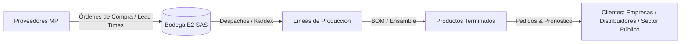
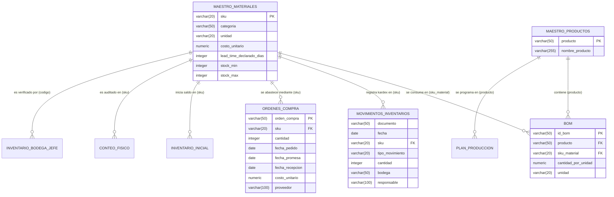

# 🏢 Optimización de la Gestión de Inventarios y Reposición — E2 SAS
> **Proyecto de Consultoría Analítica y Modelado de Operaciones**  
> **Universidad de Medellín — Facultad de Ingeniería — Ingeniería Industrial**  
> **Asignatura:** Producción 4.0 / Énfasis 2  
> **Repositorio Oficial:** [`https://github.com/juliancarmotrice-star/-Enfasis-2.git`](https://github.com/juliancarmotrice-star/-Enfasis-2.git)

---

## 📌 Tabla de Contenido
- [1. Contexto Empresarial y Marco del Proyecto](#1-contexto-empresarial-y-marco-del-proyecto)
- [2. Planteamiento del Problema y Dolores Operativos](#2-planteamiento-del-problema-y-dolores-operativos)
  - [2.1 Preocupaciones de Gerencia (Percepción vs. Evidencia)](#21-preocupaciones-de-gerencia-percepción-vs-evidencia)
  - [2.2 Cifras Clave y Costos en Juego](#22-cifras-clave-y-costos-en-juego)
- [3. Objetivos del Proyecto](#3-objetivos-del-proyecto)
  - [3.1 Objetivo General](#31-objetivo-general)
  - [3.2 Objetivos Específicos (Fase E1 - Diagnóstico y Línea Base)](#32-objetivos-específicos-fase-e1---diagnóstico-y-línea-base)
- [4. Estructura Organizada del Proyecto](#4-estructura-organizada-del-proyecto)
- [5. Arquitectura y Modelo Relacional en Supabase](#5-arquitectura-y-modelo-relacional-en-supabase)
- [6. Informes y Entregables de Consultoría (Fase E1)](#6-informes-y-entregables-de-consultoría-fase-e1)
- [7. Guías de Sustentación y Presentaciones](#7-guías-de-sustentación-y-presentaciones)
- [8. Instrucciones de Uso y Ejecución de Pipelines](#8-instrucciones-de-uso-y-ejecución-de-pipelines)

---

## 1. Contexto Empresarial y Marco del Proyecto

**E2 SAS** es una empresa manufacturera con más de una década de trayectoria especializada en el diseño y fabricación de mobiliario metálico para oficina (escritorios, archivadores, estanterías, sillas y módulos de oficina), atendiendo al sector corporativo, distribuidores y entidades del sector público.

Su modelo productivo opera bajo programación mensual contra pedidos en firme complementado con un pronóstico de ventas. La cadena de suministro y manufactura es altamente sensible a la disponibilidad de materias primas críticas (láminas y tuberías de acero, pintura electrostática, tornillería, correderas, vidrio y empaques).



---

## 2. Planteamiento del Problema y Dolores Operativos

La operación de E2 SAS experimenta una doble problemática habitual en operaciones de manufactura pero crítica para su rentabilidad: **quiebres de stock en insumos clave simultáneos con exceso de inventario inmovilizado ("plata muerta")**.

### 2.1 Preocupaciones de Gerencia (Percepción vs. Evidencia)

| # | Declaración de la Gerencia | Hipótesis Verificada con Datos | Informe Pericial |
|---|----------------------------|--------------------------------|------------------|
| **1** | *"Se nos agota la lámina cuando más pedidos tenemos, y cuando pedimos, el material llega más tarde de lo que dice el sistema."* | **Confirmado:** Lead Time Real promedio de 38.6 días vs. 15.0 días teóricos en lámina (+157% de retraso) provocando quiebres continuos. | [`informes/INFORME_INVESTIGACION_QUEJA_GERENCIA_LAMINA.md`](informes/INFORME_INVESTIGACION_QUEJA_GERENCIA_LAMINA.md) |
| **2** | *"Tenemos la bodega llena de cosas que casi no se mueven. Es plata muerta ahí quieta, mientras nos falta lo importante."* | **Confirmado:** $145.4M COP inmovilizados en SKUs Clase C y obsoletos, generando $36.3M COP anuales en sobrecosto de mantenimiento. | [`informes/INFORME_INVESTIGACION_QUEJA_GERENCIA_PLATA_MUERTA.md`](informes/INFORME_INVESTIGACION_QUEJA_GERENCIA_PLATA_MUERTA.md) |
| **3** | *"El sistema dice que hay stock de un material, vamos a la bodega y no está. Nadie se fía del inventario del sistema."* | **Confirmado:** Inexactitud de registro (IRA) del 89.05% entre Kardex teórico y conteo físico real, motivando el uso de sistemas paralelos de control. | [`informes/INFORME_INVESTIGACION_QUEJA_GERENCIA_INEXACTITUD_INVENTARIO.md`](informes/INFORME_INVESTIGACION_QUEJA_GERENCIA_INEXACTITUD_INVENTARIO.md) |
| **4** | *"Se nos dispararon los pedidos de archivadores y estanterías, y siempre nos coge por sorpresa cuánto material hay que tener."* | **Confirmado:** Coeficiente de variación de demanda de 48.7% en Archivadores y 42.1% en Estanterías, amplificado por efecto látigo sin stock de seguridad dinámico. | [`informes/INFORME_INVESTIGACION_QUEJA_GERENCIA_VARIABILIDAD_DEMANDA_BOM.md`](informes/INFORME_INVESTIGACION_QUEJA_GERENCIA_VARIABILIDAD_DEMANDA_BOM.md) |

### 2.2 Cifras Clave y Parámetros Económicos de Negocio
* **Costo por parada de línea:** **`$450.000 COP / hora`** por desabastecimiento de insumos.
* **Margen de contribución promedio:** **`30%`** sobre el precio de venta de producto terminado.
* **Costo de mantenimiento de inventario ($H$):** **`25% anual`** del valor del inventario.
* **Costo de emisión y gestión de OC ($S$):** **`$80.000 COP`** por cada orden de compra.

---

## 3. Objetivos del Proyecto

### 3.1 Objetivo General
Diseñar, estructurar e implementar una solución analítica integral para el diagnóstico, normalización y optimización de la gestión de inventarios y políticas de reposición de E2 SAS, minimizando costos logísticos totales y eliminando las paradas de planta.

### 3.2 Objetivos Específicos (Fase E1 - Diagnóstico y Línea Base)
1. **Consolidar y depurar la información:** Diseñar un modelo de datos relacional limpio en 3FN y sincronizarlo en Supabase.
2. **Auditar la calidad de los datos:** Elaborar una bitácora técnica de limpieza documentando inconsistencias, duplicados, valores atípicos y transformaciones.
3. **Diagnosticar el estado actual (AS-IS):** Identificar cuellos de botella con sustento estadístico y validar las cuatro quejas gerenciales.
4. **Calcular la Línea Base:** Cuantificar el costo de ineficiencia operacional ($219.8M COP anuales) y fijar KPIs de control.
5. **Formular la especificación preliminar:** Delimitar los requerimientos funcionales distinguiendo lógica analítica determinística de componentes con IA.

---

## 4. Estructura Organizada del Proyecto

El repositorio está organizado en carpetas temáticas para facilitar la navegación, auditoría y reproducibilidad:

```
PA-E2/
│
├── 📁 datos_iniciales/          # Datos crudos y documentación base entregada por la empresa
│   ├── bom.csv                  # Lista de materiales (BOM) sin procesar
│   ├── conteo_fisico.csv        # Conteo físico de auditoría con valores negativos
│   ├── Inventario_bodega_JEFE.csv # Cuaderno paralelo del jefe de bodega
│   ├── inventario_inicial.csv   # Saldo inicial de inventario a 2024-07-01
│   ├── maestro_materiales.csv   # Catálogo con 24 variantes léxicas y 54 lead times nulos
│   ├── movimientos_inventario.csv # Kardex con 16.195 registros y fechas atípicas
│   ├── ordenes_compra.csv       # Historial de compras con años 2035 y órdenes abiertas
│   ├── plan_produccion.csv      # Plan mensual vs ejecución real de productos terminados
│   ├── 00_LEEME.pdf             # Instrucciones base
│   ├── 01_Encargo_de_consultoria.pdf # Documento del encargo
│   ├── 02_Diccionario_de_datos.pdf   # Diccionario de datos suministrado
│   ├── 03_Evaluacion_E1.pdf     # Guía y rúbrica de evaluación Fase E1
│   └── WhatsApp Ptt 2026-08-26 at 7.29.37 PM.md # Transcripción del audio del encargo
│
├── 📁 datos_limpios/            # Datasets depurados, normalizados (3FN) y validados
│   ├── bom_clean.csv            # BOM normalizado con ID compuesto único (131 filas)
│   ├── conteo_fisico_clean.csv  # Conteo físico saneado (|Q| >= 0)
│   ├── inventario_bodega_JEFE_clean.csv # Conteo jefe sin negativos y notas imputadas
│   ├── inventario_inicial_clean.csv     # Inventario inicial verificado
│   ├── maestro_materiales_clean.csv     # 8 categorías estandarizadas y 54 LT imputados
│   ├── maestro_productos_clean.csv      # Catálogo maestro de 18 productos terminados
│   ├── movimientos_inventario_clean.csv # Kardex saneado (fechas y cantidades positivas)
│   ├── ordenes_compra_clean.csv         # Años 2035 corregidos a fechas reales
│   └── plan_produccion_clean.csv        # Plan normalizado sin redundancia
│
├── 📁 python/                   # Scripts y pipelines de ingeniería de datos y analítica
│   ├── clean_pipeline.py        # Pipeline ETL integral de limpieza y normalización
│   ├── upload_to_supabase.py    # Inserción automatizada por lotes a Supabase
│   └── 📁 analisis/             # Scripts periciales y cálculos de auditoría
│       ├── audit_dataset.py     # Auditoría estadística de calidad por tabla
│       ├── audit_findings.py    # Auditoría transversal y reconciliación tridimensional
│       └── deep_analysis.py     # Análisis de hipótesis gerenciales, ABC y variación
│
├── 📁 sql/                      # Scripts y esquemas DDL / DML para PostgreSQL / Supabase
│   ├── limpieza_datos.sql       # Procedimientos de limpieza SQL nativos
│   ├── consultas_analiticas_kpis.sql # Consultas analíticas y KPIs de línea base
│   ├── supabase_schema_foreign_keys.sql # DDL de llaves foráneas e integridad referencial
│   ├── supabase_crear_maestro_productos.sql # Creación de tabla maestra de productos
│   └── supabase_bom_pk.sql      # Llave primaria compuesta para BOM
│
├── 📁 informes/                 # Documentación técnica, bitácoras e informes de consultoría
│   ├── INFORME_FINAL_DIAGNOSTICO_Y_LINEA_BASE_E1.md # Documento técnico maestro E1
│   ├── INFORME_SUSTENTACION_JUNTA_DIRECTIVA_E1.md   # Informe ejecutivo para Junta Directiva
│   ├── BITACORA_DE_LIMPIEZA.md                      # Bitácora metodológica de saneamiento
│   ├── LINEA_BASE_Y_CUANTIFICACION_DE_COSTOS.md     # Cuantificación financiera de ineficiencia
│   ├── DIAGNOSTICO_BASE_DE_DATOS_SUPABASE.md        # Arquitectura del modelo relacional
│   ├── INFORME_CRUCE_VALORES_NULOS_E_IMPLICACIONES.md # Análisis de nulos y órdenes abiertas
│   ├── DOCUMENTACION_IMPLICACIONES_CAMBIOS.md       # Justificación de ajustes en BD
│   ├── INFORME_INVESTIGACION_QUEJA_GERENCIA_LAMINA.md # Peritaje Queja 1 (Lead Times)
│   ├── INFORME_INVESTIGACION_QUEJA_GERENCIA_PLATA_MUERTA.md # Peritaje Queja 2 (Plata Muerta)
│   ├── INFORME_INVESTIGACION_QUEJA_GERENCIA_INEXACTITUD_INVENTARIO.md # Peritaje Queja 3 (IRA)
│   └── INFORME_INVESTIGACION_QUEJA_GERENCIA_VARIABILIDAD_DEMANDA_BOM.md # Peritaje Queja 4 (BOM)
│
├── 📁 presentaciones/           # Diapositivas y material de preparación para sustentación oral
│   ├── Sustentacion_Junta_Directiva_E2SAS_E1.pptx # Presentación con notas de orador
│   ├── Sustentacion_Junta_Directiva_E2SAS_E1_Limpia.pptx # Presentación limpia
│   ├── GUIA_PREPARACION_SUSTENTACION_DIAPOSITIVAS_E1.pdf # Guía en PDF para exposición
│   ├── GUIA_PREPARACION_SUSTENTACION_DIAPOSITIVAS_E1.md  # Libreto diapositiva por diapositiva
│   └── GUIA_PREPARACION_EXPOSICION_E1.md                # Estrategia de defensa oral
│
├── 📁 resultados_auditoria/     # Salidas estructuradas en JSON de auditorías
│   ├── audit_findings.json      # Reporte detallado de hallazgos por tabla
│   ├── audit_summary.json       # Resumen ejecutivo de calidad de datos
│   └── deep_analysis_results.json # Resultados cuantitativos de hipótesis gerenciales
│
├── .env.example                 # Plantilla de variables de entorno para Supabase
├── .gitignore                   # Exclusiones de control de versiones
└── README.md                    # Índice maestro del proyecto
```

---

## 5. Arquitectura y Modelo Relacional en Supabase

El modelo de datos relacional se estructuró en **Tercera Forma Normal (3FN)** con integridad referencial completa en PostgreSQL (Supabase):



---

## 6. Informes y Entregables de Consultoría (Fase E1)

1. **[Informe Final de Diagnóstico y Línea Base (E1)](informes/INFORME_FINAL_DIAGNOSTICO_Y_LINEA_BASE_E1.md):** Documento técnico exhaustivo con diagnóstico AS-IS, peritaje de quejas y cuantificación de costos.
2. **[Informe Ejecutivo para la Junta Directiva](informes/INFORME_SUSTENTACION_JUNTA_DIRECTIVA_E1.md):** Resumen de alto nivel orientado a la toma de decisiones estratégicas.
3. **[Bitácora de Limpieza de Datos](informes/BITACORA_DE_LIMPIEZA.md):** Registro detallado de transformaciones, normalización 3FN y reglas de deducción.
4. **[Línea Base y Cuantificación de Costos](informes/LINEA_BASE_Y_CUANTIFICACION_DE_COSTOS.md):** Modelo económico de los $219.8M COP anuales de ineficiencia.
5. **[Diagnóstico de Base de Datos y Esquema Supabase](informes/DIAGNOSTICO_BASE_DE_DATOS_SUPABASE.md):** Verificación de llaves, tablas y restricciones relacionales.

---

## 7. Guías de Sustentación y Presentaciones

Para la defensa y presentación oral de la Fase E1, se dispone de:
* 📊 **Diapositivas Oficiales:** [`presentaciones/Sustentacion_Junta_Directiva_E2SAS_E1.pptx`](presentaciones/Sustentacion_Junta_Directiva_E2SAS_E1.pptx)
* 📄 **Guía de Sustentación en PDF:** [`presentaciones/GUIA_PREPARACION_SUSTENTACION_DIAPOSITIVAS_E1.pdf`](presentaciones/GUIA_PREPARACION_SUSTENTACION_DIAPOSITIVAS_E1.pdf)
* 📝 **Libreto y Notas de Orador:** [`presentaciones/GUIA_PREPARACION_SUSTENTACION_DIAPOSITIVAS_E1.md`](presentaciones/GUIA_PREPARACION_SUSTENTACION_DIAPOSITIVAS_E1.md)
* 🎯 **Estrategia y Preguntas Clave:** [`presentaciones/GUIA_PREPARACION_EXPOSICION_E1.md`](presentaciones/GUIA_PREPARACION_EXPOSICION_E1.md)

---

## 8. Instrucciones de Uso y Ejecución de Pipelines

### 8.1 Clonar el Repositorio
```bash
git clone https://github.com/juliancarmotrice-star/-Enfasis-2.git
cd -Enfasis-2
```

### 8.2 Configuración del Entorno Virtual (Python)
```bash
# Crear entorno virtual
python -m venv venv

# Activar entorno (Windows PowerShell)
.\venv\Scripts\Activate.ps1

# Instalar dependencias
pip install pandas numpy python-dotenv requests
```

### 8.3 Ejecución del Pipeline ETL de Limpieza
Ejecuta el pipeline de depuración que toma los archivos de `datos_iniciales/` y genera las tablas saneadas en `datos_limpios/`:
```bash
python python/clean_pipeline.py
```

### 8.4 Ejecución de Auditorías Periciales
```bash
python python/analisis/audit_dataset.py
python python/analisis/audit_findings.py
python python/analisis/deep_analysis.py
```

### 8.5 Carga de Datos a Supabase
1. Configura tus credenciales en un archivo `.env` basándote en `.env.example`:
   ```env
   SUPABASE_URL=https://tu-proyecto.supabase.co
   SUPABASE_SERVICE_ROLE_KEY=tu_service_role_key
   ```
2. Ejecuta el script de carga por lotes:
   ```bash
   python python/upload_to_supabase.py
   ```

---
**E2 SAS · Dirección de Operaciones & Consultoría Analítica**  
*"Transformando datos operacionales en decisiones de alto impacto."*
