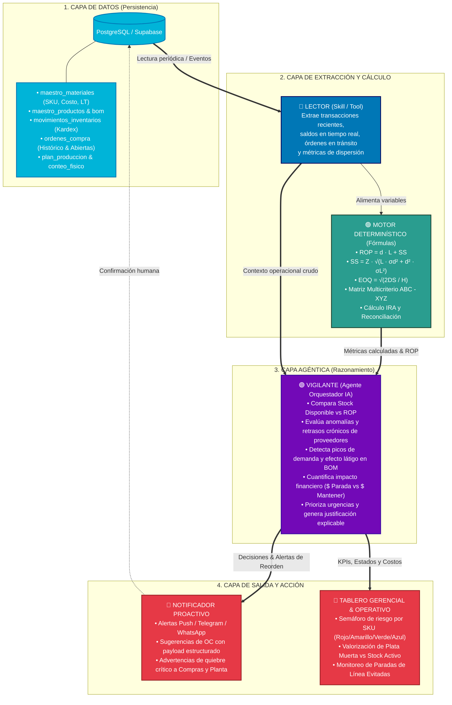
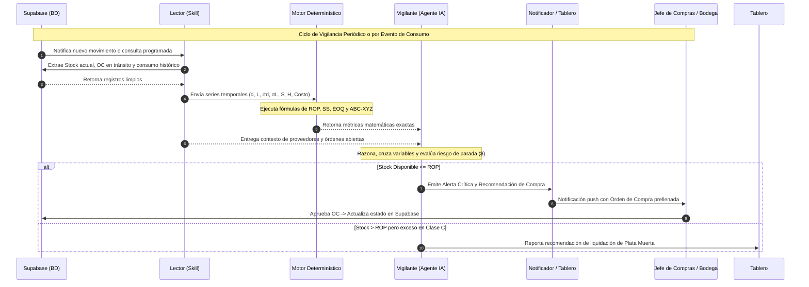

# 🏛️ Arquitectura del Sistema de Optimización y Reposición de Inventarios — E2 SAS
> **Documento Técnico de Diseño de Arquitectura del Sistema (Producción 4.0 / Énfasis 2)**  
> **Universidad de Medellín — Facultad de Ingeniería — Ingeniería Industrial**  
> **Empresa:** E2 SAS (Manufactura de Mobiliario Metálico de Oficina)  
> **Línea Base & Solución:** Fase E1 - Diagnóstico y Especificación Técnica

---

## 📌 1. Visión General y Filosofía de Diseño

El sistema de reposición inteligente para **E2 SAS** se fundamenta en un principio rector de la ingeniería de software aplicada a la cadena de suministro:

> **"El cálculo del reorden es una FÓRMULA MATEMÁTICA DETERMINÍSTICA, no Inteligencia Artificial. La Inteligencia Artificial se utiliza para LEER, VIGILAR, CONTEXTUALIZAR y ORQUESTAR la toma de decisiones."**

Esta separación garantiza:
1. **Precisión y Confiabilidad:** Ningún modelo de lenguaje o caja negra calcula números aleatorios o aproxima fórmulas de inventarios; las políticas de $ROP, EOQ, SS$ y $ABC-XYZ$ se calculan con exactitud analítica formal.
2. **Explicabilidad y Criterio de Negocio:** El agente inteligente actúa como un consultor y vigilante 24/7 que interpreta los resultados, detecta anomalías multivariables (retrasos en lámina, picos en archivadores, discrepancias de bodega), prioriza por impacto en pesos ($ COP) y formula recomendaciones comprensibles para el equipo humano.
3. **Robustez Operacional:** Permite desacoplar la capa de almacenamiento de datos de la lógica matemática y de los canales de entrega.

---

## 🗺️ 2. Diagrama de Arquitectura del Sistema

Mapa interactivo (temas claro/oscuro, capítulos guiados, exportación PNG/SVG): abrir [`diagrams/arquitectura-reposicion.html`](../diagrams/arquitectura-reposicion.html) en el navegador. La interfaz fija del visor queda en inglés; el contenido del diagrama está en español.

Fuente tipada: [`diagrams/arquitectura-reposicion.architecture.json`](../diagrams/arquitectura-reposicion.architecture.json).

Vista estática equivalente para GitHub:



---

## ⚙️ 3. Desglose Detallado por Capas y Componentes

### 3.1 Capa 1: Persistencia y Fuente de Datos (Supabase / PostgreSQL)
Es la fuente única de la verdad del sistema, estructurada en **Tercera Forma Normal (3FN)** con integridad referencial estricta:
* **`maestro_materiales`**: Catálogo normalizado de materias primas con costos unitarios reales, stock mínimo y máximo, lead times declarados y familias estandarizadas.
* **`maestro_productos` & `bom`**: Catálogo de productos terminados y listas de explosión de materiales con clave primaria compuesta única (`id_bom`).
* **`movimientos_inventarios`**: Kardex continuo de consumos diarios por puesto de trabajo, ingresos y transferencias de bodega.
* **`ordenes_compra`**: Registro de órdenes emitidas, fechas reales de recepción, retrasos y órdenes actualmente en tránsito / pendientes.
* **`plan_produccion`**: Programación mensual contra pedidos y pronóstico de ventas.
* **`conteo_fisico` & `inventario_bodega_JEFE`**: Registros de auditoría física para el cálculo del error de inventario ($IRA$).

---

### 3.2 Capa 2: Módulo Lector (Skill / Tools de Extracción)
* **Naturaleza:** Interfaz funcional de adquisición de datos (Skill / API Connectors).
* **Responsabilidades:**
  1. Conectarse a Supabase mediante clientes seguros (`supabase-js` / `psycopg2` / `REST API`).
  2. Consultar el estado actual del inventario:
     $$\text{Stock Disponible}_i = \text{Stock Físico}_i + \text{Pedidos en Tránsito}_i - \text{Compromisos Inmediatos de Producción}_i$$
  3. Extraer la serie temporal de consumo de cada insumo en los últimos $N$ periodos para computar la media $\bar{d}_i$ y la desviación estándar $\sigma_{d,i}$.
  4. Extraer el histórico real de entregas de cada proveedor para computar el Lead Time medio $\bar{L}_i$ y la desviación del tiempo de entrega $\sigma_{L,i}$.

---

### 3.3 Capa 3: Motor Determinístico de Modelado de Inventarios (Fórmulas Matemáticas)
* **Naturaleza:** Código Python / SQL determinístico puro (sin componentes estocásticos ni IA generativa).
* **Modelos y Fórmulas Implementadas:**

#### A. Punto de Reorden ($ROP$) con Incertidumbre Doble
Para insumos críticos con variabilidad tanto en el consumo diario como en el tiempo de entrega del proveedor (caso crítico: **Lámina de Acero**, donde el proveedor tarda $38.6$ días con alta varianza):
$$ROP_i = \bar{d}_i \cdot \bar{L}_i + SS_i$$
$$SS_i = Z \cdot \sqrt{\bar{L}_i \cdot \sigma_{d,i}^2 + \bar{d}_i^2 \cdot \sigma_{L,i}^2}$$
*Donde $Z = 1.96$ para un nivel de servicio del $97.5\%$ o $Z = 2.33$ para un $99\%$.*

#### B. Cantidad Económica de Pedido ($EOQ$)
Optimiza el costo total logístico balanceando el costo de emisión de órdenes ($S = \$80.000\text{ COP}$) frente al costo de mantenimiento de inventario ($H = 25\% \text{ anual}$):
$$EOQ_i = \sqrt{\frac{2 \cdot D_i \cdot S}{H_i}} = \sqrt{\frac{2 \cdot D_i \cdot 80.000}{0.25 \cdot \text{Costo Unitario}_i}}$$

#### C. Matriz Multicriterio de Segmentación ABC - XYZ
* **Eje ABC (Valor Monetario de Consumo):**
  * **Clase A (80% del valor):** Control diario estricto y revisión continua.
  * **Clase B (15% del valor):** Control periódico semanal.
  * **Clase C (5% del valor):** Control visual / dos cajones, evitando sobreabastecimiento ("Plata Muerta").
* **Eje XYZ (Predecibilidad y Variabilidad de Demanda):**
  * **Clase X ($CV \le 0.20$):** Demanda constante, reposición automática $EOQ$.
  * **Clase Y ($0.20 < CV \le 0.50$):** Demanda variable (ej. Archivadores y Estanterías), requiere colchón de seguridad dinámico ($SS$).
  * **Clase Z ($CV > 0.50$):** Demanda errática / esporádica, reposición bajo pedido estricto (Make-to-Order).

#### D. Indicador de Inexactitud de Registros ($IRA$)
$$IRA = \left( \frac{\text{Número de SKUs con Discrepancia } |Stock_{teórico} - Stock_{físico}| > 0}{\text{Total de SKUs Auditados}} \right) \times 100$$

---

### 3.4 Capa 4: Módulo Vigilante (Agente Inteligente / Orquestador de Decisiones)
* **Naturaleza:** Agente Inteligente basado en LLM estructurado con prompting de razonamiento analítico y acceso a herramientas (Tool Calling).
* **Por qué aquí sí interviene la Inteligencia Artificial:**
  1. **Evaluación Contextual Multivariable:** El cálculo matemático dice *"el stock está a 5 unidades del ROP"*, pero el agente analiza que:
     - El proveedor de ese SKU tiene un retraso crónico documentado de +23 días.
     - Viene un pico planeado de producción de Archivadores en el plan mensual.
     - Por lo tanto, el pedido debe adelantarse hoy mismo para evitar una parada de línea de $\$450.000\text{ COP/hora}$.
  2. **Priorización por Impacto Financiero:** Si hay 15 materiales bajo su $ROP$, el agente prioriza las compras en función del costo en riesgo (evitar paradas en productos de alto margen vs insumos secundarios).
  3. **Detección de Patrones Ocultos y Causas Raíz:** Detecta si una acumulación de inventario en bodega se debe a un sobrepedido por desconfianza en el sistema (como el cuaderno paralelo del Jefe de Bodega).
  4. **Generación de Justificaciones en Lenguaje Natural:** Construye la narrativa ejecutiva para el comprador: *"Se recomienda emitir OC por 450 láminas calibre 18 al proveedor PROV-LAM hoy antes de las 3:00 PM debido a que..."*.

---

### 3.5 Capa 5: Canales de Salida y Cierre Operacional

#### A. Notificador Proactivo
* Envío de alertas tempranas con payload estructurado a través de Telegram, WhatsApp institucional, correo o webhook de integración con el ERP.
* Formato de orden sugerida lista para aprobación con un clic:
  ```json
  {
    "alerta_id": "ALT-2026-0914-01",
    "prioridad": "CRÍTICA",
    "sku": "MP-LAM-001",
    "material": "Lámina Cold Rolled Calibre 18",
    "stock_actual": 85,
    "rop_calculado": 320,
    "cantidad_sugerida_eoq": 500,
    "proveedor_sugerido": "PROV-LAM",
    "lead_time_esperado_dias": 38,
    "riesgo_estimado": "Parada de línea en 4 días (Costo potencial: $10.800.000 COP)",
    "accion_requerida": "Aprobar Orden de Compra"
  }
  ```

#### B. Tablero de Control Gerencial & Operativo (Dashboard)
* **Semáforo Dinámico de Inventario:**
  * 🔴 **Rojo (Quiebre Inminente):** $Stock < SS$ (Riesgo inmediato de parada).
  * 🟡 **Amarillo (Reorden Requerido):** $SS \le Stock \le ROP$ (Ventana óptima de compra).
  * 🟢 **Verde (Zona Segura):** $ROP < Stock \le Stock_{max}$ (Operación normal).
  * 🔵 **Azul (Sobreabastecimiento / Plata Muerta):** $Stock > Stock_{max}$ (Capital inmovilizado).
* **Métricas Financieras en Vivo:**
  * Total de capital en inventario vs dinero inmovilizado en Clase C.
  * Horas de parada de planta evitadas en el mes.
  * Tasa de exactitud de inventario ($100\% - IRA$).

---

## 🔄 4. Flujo de Información y Ciclo de Vigilancia



---

## ⚖️ 5. Matriz de Responsabilidades: Determinístico vs. Inteligencia Artificial

| Componente del Sistema | Capa Determinística (Fórmulas / SQL / Python) | Capa de Inteligencia Artificial (Agente / LLM) | Razón de la Separación |
|:---|:---:|:---:|:---|
| **Cálculo de Demanda Promedio y Varianza** | ✅ **100% Determinístico** | ❌ No aplica | Operación estadística exacta sin margen de alucinación. |
| **Cálculo de ROP, SS y EOQ** | ✅ **100% Determinístico** | ❌ No aplica | Cumplimiento estricto de los modelos de inventario de Investigación de Operaciones. |
| **Segmentación ABC - XYZ** | ✅ **100% Determinístico** | ❌ No aplica | Partición paramétrica sobre el valor de consumo acumulado. |
| **Extracción y Monitoreo de Datos** | 🟡 Herramienta ejecutora | ✅ **Orquestación inteligente** | El agente decide qué datos consultar y con qué frecuencia según criticidad. |
| **Detección de Anomalías Multivariables** | ❌ Límites estáticos rígidos | ✅ **Razonamiento contextual** | La IA correlaciona picos de demanda con retrasos del proveedor y restricciones de planta. |
| **Priorización Económica de Alertas** | ❌ Ordenamiento simple | ✅ **Evaluación de costo-oportunidad** | La IA balancea el riesgo de parada ($\$450.000\text{/h}$) vs costo de mantener ($\$H$). |
| **Redacción de Alertas y Explicabilidad** | ❌ Plantillas estáticas | ✅ **Generación en lenguaje natural** | Brinda argumentos persuasivos y claros adaptados al tomador de decisiones. |

---

## 🎯 6. Alineación con los Dolores de E2 SAS (Fase E1)

| Queja de la Gerencia | Cuello de Botella Detectado | Cómo lo Resuelve esta Arquitectura |
|---|---|---|
| **Queja 1: Desabastecimiento de Lámina** | Lead Time real de 38.6 días vs 15 teóricos (+157% de retraso). | El **Motor Determinístico** calcula el $ROP$ con el $\bar{L}$ real y $\sigma_L$, y el **Vigilante** alerta con anticipación antes de entrar en zona de quiebre. |
| **Queja 2: Plata Muerta en Bodega** | $145.4M COP inmovilizados en SKUs Clase C generando sobrecostos de \$36.3M anuales. | La **Matriz ABC-XYZ** identifica los SKUs Z y C; el **Vigilante** congela compras automáticas y propone planes de desacumulación. |
| **Queja 3: Inexactitud de Inventario (IRA 89%)** | Discrepancia entre Kardex, auditoría física y cuaderno del jefe de bodega. | El **Lector** reconcilia las 3 fuentes; el **Vigilante** advierte si una decisión de compra se basa en un saldo con alta incertidumbre física. |
| **Queja 4: Variabilidad en Archivadores / BOM** | Variabilidad de demanda ($CV = 48.7\%$) sin stock de seguridad dinámico. | El **Cálculo de SS** absorbe la variabilidad de la demanda y el **Vigilante** explota la lista BOM automáticamente al recibir el plan mensual. |

---
**E2 SAS · Dirección de Operaciones & Consultoría Analítica**  
*Documento de Arquitectura de Sistemas — Producción 4.0 (Universidad de Medellín)*
