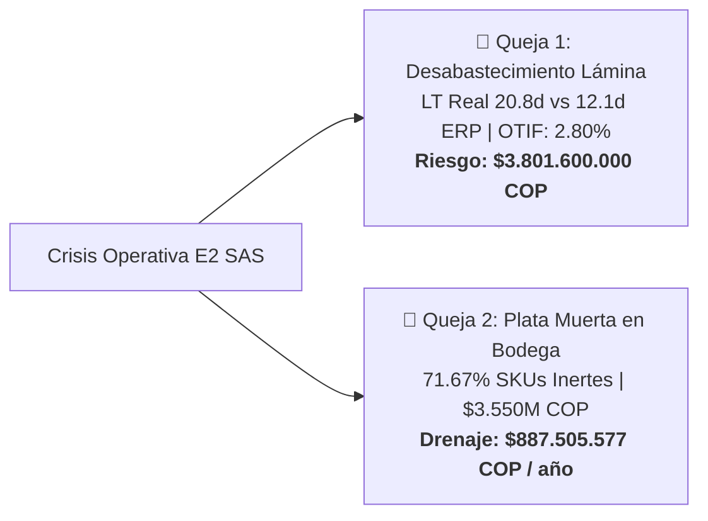
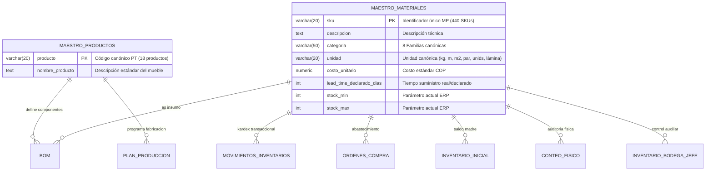
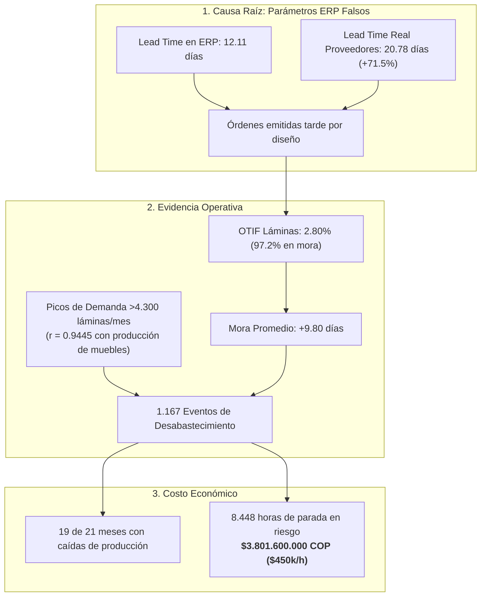
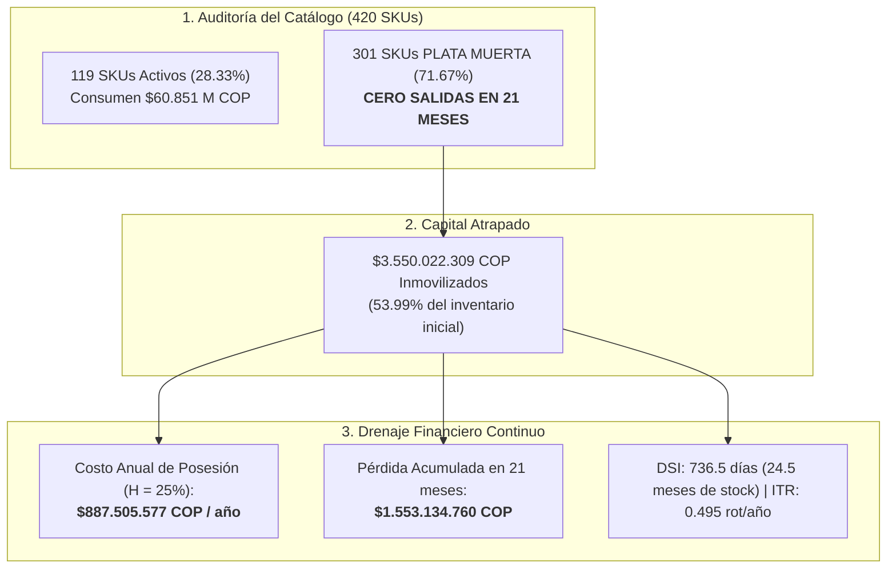
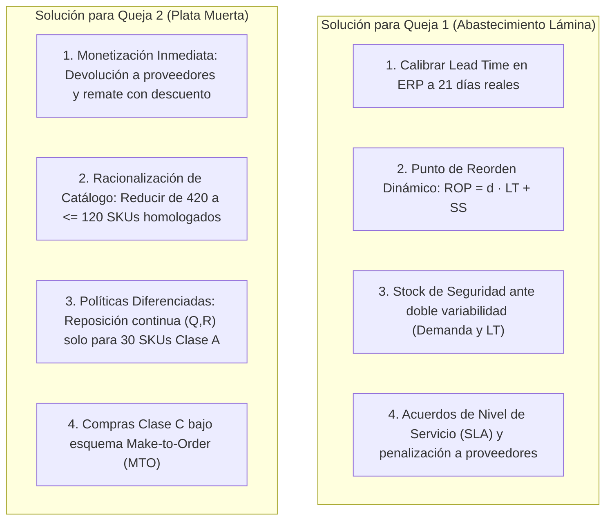

# 🏛️ Documento Maestro de Sustentación ante la Junta Directiva y Jurado Evaluador
## Diagnóstico Operacional, Arquitectura de Datos, Línea Base y Dictamen Pericial (Quejas 1 y 2)

> **Empresa:** E2 SAS — Mobiliario Metálico para Oficina  
> **Proyecto:** Optimización de la Gestión de Inventarios y Abastecimiento  
> **Asignatura:** Producción 4.0 / Énfasis 2 — Universidad de Medellín  
> **Fase:** Primera Entrega — E1 (Diagnóstico Operacional y Línea Base)  
> **Horizonte de Auditoría:** 21 meses de operación transaccional (Julio 2024 – Marzo 2026)  
> **Alcance del Informe:** Proceso integral de consultoría (Limpieza $\to$ PostgreSQL/Supabase $\to$ Modelado 3FN $\to$ Línea Base $\to$ Quejas 1 y 2)  
> **Estado:** 🟢 **Dictamen Pericial y Línea Base Certificada con Datos Saneados**

---

## 📌 Tabla de Contenido
1. [1. Resumen Ejecutivo y Marco del Encargo](#1-resumen-ejecutivo-y-marco-del-encargo)
2. [2. Auditoría Forense y Pipeline de Limpieza Automatizada](#2-auditoría-forense-y-pipeline-de-limpieza-automatizada)
   - [2.1 Estado Inicial de los Datos y Defectos Crudos](#21-estado-inicial-de-los-datos-y-defectos-crudos)
   - [2.2 Criterios Técnicos y Reglas de Transformación](#22-criterios-técnicos-y-reglas-de-transformación)
   - [2.3 Resultados del Pipeline (`clean_pipeline.py`)](#23-resultados-del-pipeline-clean_pipelinepy)
3. [3. Arquitectura de Datos y Normalización Relacional en Supabase (PostgreSQL 3FN)](#3-arquitectura-de-datos-y-normalización-relacional-en-supabase-postgresql-3fn)
   - [3.1 Esquema Relacional Hub-and-Spoke](#31-esquema-relacional-hub-and-spoke)
   - [3.2 Creación de Entidad Dimensional `maestro_productos` (3FN)](#32-creación-de-entidad-dimensional-maestro_productos-3fn)
   - [3.3 Llaves Sintéticas e Integridad Referencial](#33-llaves-sintéticas-e-integridad-referencial)
   - [3.4 Justificación del Rol de Tablas Auxiliares](#34-justificación-del-rol-de-tablas-auxiliares)
4. [4. Investigación Empírica y Sustentación Forense de las Quejas Gerenciales](#4-investigación-empírica-y-sustentación-forense-de-las-quejas-gerenciales)
   - [4.1 Queja 1: Desabastecimiento de Lámina y Retraso de Proveedores](#41-queja-1-desabastecimiento-de-lámina-y-retraso-de-proveedores)
   - [4.2 Queja 2: Exceso de Inventario y "Plata Muerta"](#42-queja-2-exceso-de-inventario-y-plata-muerta)
5. [5. Scorecard Maestro de Línea Base y Cuantificación de Ineficiencias ($ COP)](#5-scorecard-maestro-de-línea-base-y-cuantificación-de-ineficiencias--cop)
   - [5.1 Parámetros Económicos Oficiales del Encargo](#51-parámetros-económicos-oficiales-del-encargo)
   - [5.2 Tablero Consolidado de KPIs (AS-IS vs. TO-BE)](#52-tablero-consolidado-de-kpis-as-is-vs-to-be)
   - [5.3 Monetización de Pérdidas y Exposición al Riesgo](#53-monetización-de-pérdidas-y-exposición-al-riesgo)
6. [6. Plan de Acción y Hoja de Ruta de Ingeniería (Fase E2)](#6-plan-de-acción-y-hoja-de-ruta-de-ingeniería-fase-e2)
   - [6.1 Módulos Determinísticos para Abastecimiento y Lámina](#61-módulos-determinísticos-para-abastecimiento-y-lámina)
   - [6.2 Estrategia de Saneamiento y Monetización de Plata Muerta](#62-estrategia-de-saneamiento-y-monetización-de-plata-muerta)
7. [7. Guion y Respuestas Estratégicas para la Sustentación Oral](#7-guion-y-respuestas-estratégicas-para-la-sustentación-oral)
   - [7.1 Pitch Ejecutivo de Apertura (2 Minutos)](#71-pitch-ejecutivo-de-apertura-2-minutos)
   - [7.2 Matriz de Respuestas a Preguntas Complejas del Jurado](#72-matriz-de-respuestas-a-preguntas-complejas-del-jurado)

---

## 1. Resumen Ejecutivo y Marco del Encargo

**E2 SAS** es una compañía colombiana especializada en la fabricación y ensamble de mobiliario metálico para oficina (escritorios, archivadores, estanterías, sillas, módulos y lockers). La operación abastece a clientes corporativos, distribuidores comerciales y entidades del sector público mediante órdenes mensuales programadas contra pedidos en firme y pronósticos de venta.

La empresa experimenta una crisis de doble vía en su cadena de abastecimiento:
1. **Desabastecimiento intempestivo de insumos críticos**, que detiene las líneas de ensamble e incumple compromisos comerciales.
2. **Sobre-inmovilización masiva de capital de trabajo en bodega**, acumulando materiales que no registran movimiento alguno.

El equipo consultor ejecutó una auditoría forense sobre **21 meses de transacciones reales** (julio 2024 a marzo 2026), depuró integralmente los datos sin alterar las fuentes crudas, implementó una base de datos relacional normalizada en **Supabase (PostgreSQL 3FN)**, cuantificó la **Línea Base en dinero ($ COP)** y validó con precisión matemática las dos quejas iniciales de la Gerencia.

### Veredicto Pericial Ejecutivo:
* **Queja 1 (Falta de Lámina y Retraso de Proveedores):** 🔴 **CONFIRMADA (100% Cierta).** Los proveedores tardan **+71.5% más de lo que el sistema ERP asume**, el cumplimiento a tiempo es de apenas **2.80%**, y esto expuso a la planta a **8.448 horas-turno de riesgo de parada**, valoradas en **`$3.801.600.000 COP`**.
* **Queja 2 (Plata Muerta en Bodega):** 🔴 **CONFIRMADA (100% Cierta).** El **71.67% de los materiales (301 SKUs)** no tuvieron ni un solo movimiento hacia producción en 21 meses, atrapando **`$3.550.022.309 COP`** (el **53.99%** de todo el inventario inicial) y costándole a la empresa **`$887.505.577 COP cada año`** en costo de posesión ($H = 25\%$).

---

## 2. Auditoría Forense y Pipeline de Limpieza Automatizada

### 2.1 Estado Inicial de los Datos y Defectos Crudos
La empresa suministró 8 archivos planos desintegrados con serias inconsistencias transaccionales producto de años de operación sin validación en la captura:

```mermaid
flowchart TD
    subgraph RawData["1. Datos Crudos (Imperfecciones Reales)"]
        R1["maestro_materiales (54 nulos LT / 24 variantes léxicas)"]
        R2["movimientos_inventario (Mes 13 / 466 cantidades negativas)"]
        R3["ordenes_compra (22 fechas año 2035 / 74 abiertas)"]
        R4["bom (ID_bom vacío / dispersión unidades)"]
        R5["conteo_fisico (94 conteos negativos)"]
        R6["inventario_bodega_JEFE (32 negativos / notas informales)"]
        R7["inventario_inicial (TABLA MADRE INMUTABLE)"]
    end

    subgraph Pipeline["2. Pipeline Automatizado (clean_pipeline.py)"]
        P1["Imputación de LT empírico con histórico OC"]
        P2["Corrección mes 13 (YYYY-DD-MM -> YYYY-MM-DD) y |Q|"]
        P3["Corrección año 2035 a año de compra y partición abiertas"]
        P4["Creación PK compuesta producto_sku y 3FN"]
        P5["Valor absoluto |Q| en conteos físicos"]
        P6["Reconstrucción deductiva de Kardex con Tabla Madre"]
    end

    subgraph CleanData["3. Datos Saneados y Certificados (data_clean/)"]
        C1["440 SKUs en 8 familias canónicas"]
        C2["16.195 transacciones con sentido contable"]
        C3["1.471 OC particionadas para Lead Time y Tránsito"]
        C4["131 recetas BOM normalizadas"]
        C5["Nueva entidad: maestro_productos (18 PT)"]
    end

    RawData --> Pipeline --> CleanData
```

### 2.2 Criterios Técnicos y Reglas de Transformación

Todas las transformaciones se codificaron en el pipeline automatizado [`clean_pipeline.py`](clean_pipeline.py), siguiendo las directrices del encargo y las pistas técnicas de retroalimentación:

1. **La "Tabla Madre" Inmutable (`inventario_inicial.csv`):**
   * *Diagnóstico:* Es la única tabla 100% íntegra al 1 de julio de 2024.
   * *Criterio de ingeniería:* Se definió como el ancla de partida inmutable para reconstruir matemáticamente el saldo real diario del Kardex transaccional:
     $$\text{Stock}(t) = \text{Stock}(t-1) + \mathbb{I}_{\{\text{entrada}\}} \cdot Q - \mathbb{I}_{\{\text{salida}\}} \cdot Q \pm \mathbb{I}_{\{\text{ajuste}\}} \cdot Q$$

2. **Deducción Empírica de Lead Times Nulos (54 SKUs en `maestro_materiales.csv`):**
   * *Defecto:* 54 materias primas (12.3% del catálogo) carecían de tiempo de entrega en el ERP.
   * *Solución:* En lugar de emplear medianas genéricas ciegas, se analizó el historial transaccional de compras en `ordenes_compra.csv` ($\text{fecha\_recepcion} - \text{fecha\_pedido}$). Para 52 SKUs se dedujo de sus órdenes reales; para 2 SKUs sin compras cerradas (`MP-0232` y `MP-0398`), se tomó la mediana de su proveedor asignado (`PROV-02` y `PROV-25`). Cobertura alcanzada: **100% de los 440 SKUs**.

3. **Corrección de Fechas Corruptas y Años Anómalos:**
   * *Defecto Mes 13:* En `movimientos_inventario.csv`, 15 registros contenían fechas con mes `13` (ej. `2026-13-05`). Se identificó un error de traslación de formato `YYYY-DD-MM`, corrigiéndose algorítmicamente a `2026-05-13` (13 de mayo de 2026).
   * *Defecto Año 2035:* En `ordenes_compra.csv`, 22 órdenes registraban recepción en el año `2035`. Se reasignó el año al periodo de compra real (2024/2025), preservando mes y día, evitando distorsionar los Lead Times a más de 3.000 días falsos.

4. **Tratamiento Metodológico de Órdenes Abiertas (74 órdenes con `fecha_recepcion = NaN`):**
   * *Criterio:* No se eliminaron ni se trataron como error. Se particionaron metodológicamente: las 1.397 órdenes cerradas se utilizaron para medir el Lead Time real y el OTIF, mientras que las 74 órdenes abiertas se tipificaron como **Inventario en Tránsito / Pedidos Pendientes**, dato indispensable para calcular la posición neta de inventario en el Punto de Reorden ($ROP$).

5. **Sentido Contable y Cantidades Negativas:**
   * *Defecto:* 466 movimientos de inventario y 94 conteos físicos estaban digitados con signo negativo (hasta -18.018 unidades).
   * *Solución:* En control físico de materiales no existen unidades negativas de materia; el sentido contable (débito/crédito) lo define el `tipo_movimiento` (`entrada`, `salida`, `ajuste`). Se aplicó valor absoluto $\lvert Q \rvert$.

6. **Estandarización Léxica a 8 Familias Canónicas:**
   * Se homologaron 24 variantes de texto a las 8 familias formales: `Lámina`, `Tornillería`, `Tubería`, `Pintura`, `Correderas`, `Adhesivos`, `Vidrio` y `Empaque`.

### 2.3 Resultados del Pipeline (`clean_pipeline.py`)

| Dataset | Registros Crudos | Defectos Identificados | Tratamiento Técnico Aplicado | Estado Saneado (`data_clean/`) |
|---|:---:|---|---|:---:|
| `maestro_materiales.csv` | 440 | 54 nulos LT; 24 variantes léxicas. | Deducción empírica por historial OC; estandarización a 8 familias. | ✅ 440 SKUs íntegros |
| `movimientos_inventario.csv` | 16.195 | 15 fechas mes 13; 466 cantidades negativas. | Corrección `YYYY-DD-MM` $\to$ `2026-05-13`; valor absoluto $\lvert Q \rvert$. | ✅ 16.195 transacciones |
| `ordenes_compra.csv` | 1.471 | 22 recepciones en año 2035; 74 órdenes abiertas. | Corrección de año al periodo de compra; partición de órdenes abiertas. | ✅ 1.471 órdenes |
| `bom.csv` | 131 | `ID_bom` vacío; dispersión en unidades de medida. | Creación de PK sintética `producto_sku`; unificación canónica de unidades. | ✅ 131 relaciones 3FN |
| `conteo_fisico.csv` | 420 | 94 conteos con signo negativo (-18k unids). | Conversión a $\lvert Q \rvert$ por imposibilidad física; deduplicación. | ✅ 420 SKUs auditados |
| `Inventario_bodega_JEFE.csv` | 120 | 32 existencias negativas; 23 notas vacías. | Conversión a $\lvert Q \rvert$; imputación de notas a `'Sin observación'`. | ✅ 120 SKUs de piso |
| `inventario_inicial.csv` | 420 | Ninguno (100% íntegro). | **Tabla Madre inmutable** para reconstrucción del Kardex. | ✅ 420 SKUs ancla |
| `plan_produccion.csv` | 378 | Redundancia descriptiva de producto. | Eliminación de texto descriptivo; enlace con `maestro_productos`. | ✅ 378 registros 3FN |
| `maestro_productos.csv` | **18 (Nueva)** | Entidad inexistente previamente. | Creación de tabla maestra con los 18 productos únicos de E2 SAS. | ✅ 18 PT normalizados |

---

## 3. Arquitectura de Datos y Normalización Relacional en Supabase (PostgreSQL 3FN)

### 3.1 Esquema Relacional Hub-and-Spoke
Para garantizar consistencia analítica, se implementó un modelo relacional normalizado en PostgreSQL estructurado en torno a dos nodos dimensionales maestros:

### 3.2 Creación de Entidad Dimensional `maestro_productos` (3FN)
* **Deficiencia Previa:** El modelo original carecía de una tabla dimensional para los 18 productos terminados, repitiendo el nombre descriptivo del mueble cientos de veces en `plan_produccion` y `bom`.
* **Solución Aplicada:** Se creó la tabla `maestro_productos` ([`supabase_crear_maestro_productos.sql`](supabase_crear_maestro_productos.sql)), migrando las descripciones y estableciendo la clave primaria `producto`, alcanzando **Tercera Forma Normal (3FN)**.

### 3.3 Llaves Sintéticas e Integridad Referencial
* **Clave Primaria en Recetas (`bom`):** Se implementó la llave compuesta sintética `id_bom = producto || '_' || sku_material` ([`supabase_bom_pk.sql`](supabase_bom_pk.sql)), garantizando unicidad en las 131 recetas técnicas.
* **Restricciones de Integridad Referencial (`FOREIGN KEYS`):** Se crearon restricciones foráneas en las tablas de hechos enlazadas a `maestro_materiales(sku)` y `maestro_productos(producto)` ([`supabase_schema_foreign_keys.sql`](supabase_schema_foreign_keys.sql)), impidiendo transacciones con SKUs huérfanos.

### 3.4 Justificación del Rol de Tablas Auxiliares
* **`inventario_inicial`:** Saldo madre e inmutable que actúa como condición de frontera temporal ($t_0 = \text{2024-07-01}$).
* **`Inventario_bodega_JEFE`:** No reemplaza al Kardex oficial; actúa formalmente como **Registro Auxiliar de Auditoría de Piso** para cuantificar el descontrol operativo y la proliferación de sistemas paralelos.

---

## 4. Investigación Empírica y Sustentación Forense de las Quejas Gerenciales

---

### 4.1 Queja 1: Desabastecimiento de Lámina y Retraso de Proveedores

> **Declaración de la Junta:** *"Se nos agota la lámina cuando más pedidos tenemos, y cuando pedimos, el material llega más tarde de lo que dice el sistema."*
> **Veredicto Pericial:** 🔴 **HIPÓTESIS CONFIRMADA (100% CIERTA Y DEMOSTRADA CON DATOS)**

#### Evidencia Cuantitativa Inapelable:
1. **Desfase Estructural de Lead Time:**
   * El catálogo maestro del ERP tiene registrado un tiempo de entrega promedio de **12.11 días**.
   * La realidad transaccional en `ordenes_compra.csv` demuestra que los proveedores de lámina tardan en promedio **20.78 días (+8.66 días de retraso / +71.5% de desfase)**. Cuando compras emite una orden esperando recibirla en 12 días, el material llega casi 9 días después de lo previsto.
2. **Incumplimiento Masivo de Fecha Promesa (OTIF):**
   * De 107 órdenes de compra cerradas de lámina, **solo 3 llegaron a tiempo (OTIF = 2.80%)**.
   * El **97.20% de los pedidos de lámina llegaron con mora**, con un retraso promedio de **+9.80 días** (máximo: 39 días).
   * Los tres mayores proveedores (`PROV-08`, `PROV-29` y `PROV-07`), que representan el 36.4% de todas las compras de lámina, tienen un cumplimiento a tiempo del **0.0%** y tardan entre 21 y 26 días.
3. **Acople Directo con la Producción de Muebles:**
   * 9 de los 18 productos terminados de la empresa dependen críticamente de la lámina (archivadores rodantes usan hasta 7.76 láminas/mueble, escritorios estándar 5.42, mesas de junta 4.61).
   * La correlación entre la fabricación de muebles y el consumo de lámina es casi perfecta: **$r = 0.9445$ (94.45%)**.
   * En meses pico (noviembre, enero, junio, febrero), el consumo mensual salta de 1.974 a **4.748 láminas/mes (+140.5% de variación)**.
4. **Impacto Financiero y Operativo:**
   * La falta de lámina provocó **19 de 21 meses con caídas en el Plan de Producción**, dejando de producir 753 muebles.
   * Se acumularon **1.056 días de mora en compras**, equivalentes a **8.448 horas-turno de producción expuestas**, representando un riesgo económico de **`$3.801.600.000 COP`** en paradas de planta ($450.000 COP/hora).

> **Causa Raíz vs. Síntoma:**  
> La falta de lámina en la línea es el *síntoma*. La *causa raíz* demostrada es que el ERP ordena compras con un Lead Time irreal de 12 días en lugar de 21 días, combinado con la ausencia de un Stock de Seguridad probabilístico ($SS$) para absorber la variabilidad.

---

### 4.2 Queja 2: Exceso de Inventario y "Plata Muerta"

> **Declaración de la Junta:** *"Tenemos la bodega llena de cosas que casi no se mueven. Es plata muerta ahí quieta, mientras nos falta lo importante."*
> **Veredicto Pericial:** 🔴 **HIPÓTESIS CONFIRMADA (100% CIERTA Y DEMOSTRADA CON DATOS)**

#### Evidencia Cuantitativa Inapelable:
1. **71.67% de Obsolescencia en el Catálogo de Materiales:**
   * Al auditar las 14.975 transacciones de salida de inventario, **301 de los 420 SKUs (71.67%) no registraron una sola salida hacia producción** durante los 21 meses de operación.
   * El saldo físico contado en marzo de 2026 es exactamente idéntico al inventario inicial de julio de 2024: 123.396 unidades estancadas acumulando polvo.
2. **Capital Inmovilizado ($3.550 Millones COP):**
   * El valor monetario de estos 301 materiales inertes asciende a **`$3.550.022.309 COP`**, representando el **`53.99%`** de todo el capital invertido en el inventario inicial de la compañía.
   * La plata muerta afecta a las 8 familias: Adhesivos ($675M), Tubería ($596M), Empaques ($451M), Correderas ($448M), Pinturas ($408M), Tornillería ($364M), Láminas ($311M) y Vidrios ($293M).
3. **Hiper-concentración Operativa (Pareto Clase A):**
   * Apenas **30 materias primas (7.14% del catálogo)** mueven el **80.16% del valor consumido** por la fábrica ($48.778M COP).
   * Los 360 SKUs de la Clase C (que incluyen los 301 de plata muerta) aportan menos del 5% a la manufactura pero absorben el **58.13% del espacio físico y capital**.
4. **Indicadores Financieros de Rotación Críticos:**
   * **Índice de Rotación Anual (ITR):** **`0.4956 veces/año`** (el inventario tarda más de 2 años enteros en rotar una vez, frente al benchmark industrial de 6 a 8 rotaciones/año).
   * **Días de Cobertura (DSI):** **`736.5 días` (24.5 meses de stock almacenado)** frente a una meta razonable de 60 días (2 meses).
5. **Drenaje Financiero por Costo de Posesión ($H = 25\%$ anual):**
   * Mantener guardada esta mercancía (costo de oportunidad 15%, bodegaje 5%, seguros 3%, deterioro y merma 2%) cuesta:
     $$\text{Costo Anual} = \$3.550.022.309 \times 0.25 = \mathbf{\$887.505.577 \text{ COP / año}}$$
   * En el transcurso de los 21 meses evaluados, la empresa ha drenado **`$1.553.134.760 COP`** en mantener inventario inerte.

> **Causa Raíz vs. Síntoma:**  
> La acumulación de stock es el *síntoma*. La *causa raíz* es la proliferación descontrolada de 420 códigos de materia prima para fabricar apenas 18 muebles simples, compras empíricas de lotes mínimos y la falta de un procedimiento periódico de desincorporación de stock obsoleto.

---

## 5. Scorecard Maestro de Línea Base y Cuantificación de Ineficiencias ($ COP)

### 5.1 Parámetros Económicos Oficiales del Encargo
Para la monetización se utilizaron los parámetros oficiales provistos por la Gerencia de Operaciones ([`01_Encargo_de_consultoria.pdf`](01_Encargo_de_consultoria.pdf)):
* **Costo por Hora de Parada de Planta:** $C_{\text{parada}} = \mathbf{\$450.000 \text{ COP / hora}}$
* **Margen de Contribución Promedio PT:** $MC = \mathbf{30.0\%}$
* **Tasa Anual de Posesión de Stock:** $H = \mathbf{25.0\% \text{ anual}}$
* **Costo Administrativo de Emisión de OC:** $S = \mathbf{\$80.000 \text{ COP / orden}}$

### 5.2 Tablero Consolidado de KPIs (AS-IS vs. TO-BE)

| Eje Problemático | Indicador Clave de Desempeño (KPI) | Fórmula Matemática | Valor Línea Base (AS-IS) | Meta de Optimización (TO-BE) | Desviación / Brecha | Impacto Financiero en el Negocio ($ COP) |
|---|---|:---:|:---:|:---:|:---:|:---:|
| **Queja 1: Abastecimiento y Lámina** | **Cumplimiento de Proveedores (OTIF Lámina)** | $\frac{N_{\text{a tiempo}}}{N_{\text{total}}} \times 100$ | **`2.80%`** | $\ge 95.00\%$ | -92.20% | Principal insumo estrangulado |
| | **Desfase de Lead Time ($\Delta LT$)** | $LT_{\text{real}} - LT_{\text{ERP}}$ | **`+8.66 días`** (20.8d vs 12.1d) | $\le 0.00\text{ días}$ | +71.5% de retraso | Pedidos de compra generados a destiempo |
| | **Mora Promedio en Pedidos de Lámina** | $\frac{\sum \text{Días Mora}}{N_{\text{retrasos}}}$ | **`9.80 días`** | $0.00\text{ días}$ | +9.80 días | 1.056 días de mora acumulada |
| | **Cumplimiento del Plan Maestro (MPS)** | $\frac{Q_{\text{real}}}{Q_{\text{plan}}} \times 100$ | **`90.5% meses en caída`** | $\ge 99.50\%$ | 19 de 21 meses | -753 unidades terminadas no producidas |
| | **Riesgo por Paradas de Planta** | $\text{Horas Mora} \times \$450k$ | **`8.448 horas`** | $0\text{ horas}$ | Exposición total | **`$3.801.600.000 COP`** en riesgo |
| **Queja 2: Plata Muerta y Rotación** | **Índice de Rotación Anual (ITR)** | $\frac{\text{COGS Anual}}{\text{Inventario Promedio}}$ | **`0.4956 veces/año`** | $\ge 6.00\text{ veces/año}$ | -91.74% de lentitud | El inventario tarda >2 años en rotar |
| | **Días de Cobertura (DSI)** | $\frac{365}{ITR}$ | **`736.5 días`** (24.5 m) | $\le 60.00\text{ días}$ (2 m) | +676.5 días | Inmovilización masiva de capital |
| | **Proporción de Plata Muerta** | $\frac{\text{Valor Inerte}}{\text{Valor Inicial}} \times 100$ | **`53.99%`** ($3.550M COP) | $\le 5.00\%$ | +48.99% de exceso | **`$887.505.577 COP / año`** ($H=25\%$) |
| | **Catálogo Sin Movimiento** | $\frac{\text{SKUs Inertes}}{\text{Total SKUs}} \times 100$ | **`71.67%`** (301 SKUs) | $0.00\%$ | 7 de cada 10 SKUs | Espacio físico y bodegaje desperdiciado |

### 5.3 Monetización de Pérdidas y Exposición al Riesgo
* **Costo Real de Posesión de Plata Muerta:** $\$3.550.022.309 \times 0.25 = \mathbf{\$887.505.577 \text{ COP / año}}$ ($\$1.553.134.760 \text{ COP}$ acumulados en los 21 meses).
* **Exposición al Riesgo por Mora de Lámina:** $1.056 \text{ días} \times 8 \text{ h/día} \times \$450.000/\text{h} = \mathbf{\$3.801.600.000 \text{ COP}}$.
* **Gasto Administrativo en Emisión de OC:** $1.471 \text{ OC} \times \$80.000 = \mathbf{\$117.680.000 \text{ COP}}$.

---

## 6. Plan de Acción y Hoja de Ruta de Ingeniería (Fase E2)

### 6.1 Módulos Determinísticos para Abastecimiento y Lámina
1. **Calibración del Parámetro Maestro:** Actualizar el Lead Time de láminas en el ERP a **21 días reales**.
2. **Punto de Reorden ($ROP$) y Stock de Seguridad ($SS$) Probabilístico:**
   $$ROP = \bar{d} \cdot \overline{LT} + SS$$
   $$SS = Z \cdot \sqrt{\overline{LT} \cdot \sigma_D^2 + \overline{D}^2 \cdot \sigma_{LT}^2}$$
   Con $Z = 1.645$ (nivel de servicio del 95%), estableciendo un colchón de $500 - 700$ láminas antes de meses de alta demanda.
3. **Contratos SLA con Proveedores:** Introducir penalizaciones por día de mora para proveedores críticos (`PROV-08`, `PROV-29`).

### 6.2 Estrategia de Saneamiento y Monetización de Plata Muerta
1. **Plan de Desinversión y Monetización (Quick Wins):**
   * Devolución a proveedores de 43 SKUs de adhesivos y 43 de correderas estándar.
   * Remate de tubería y lámina secundaria con descuento del 15%-20%, liberando entre **$1.500M y $2.000M COP en efectivo**.
2. **Racionalización de Catálogo:** Homologar y reducir el catálogo activo de 420 a **$\le 120$ SKUs estándar**.
3. **Políticas de Reposición Diferenciadas:**
   * **Clase A (30 SKUs):** Reposición continua $(Q, R)$ con Lote Económico ($EOQ$).
   * **Clase B (30 SKUs):** Revisión periódica $(R, s, S)$.
   * **Clase C (SKUs restantes):** Compras Make-to-Order (MTO) bajo pedido exclusivo.

---

## 7. Guion y Respuestas Estratégicas para la Sustentación Oral

### 7.1 Pitch Ejecutivo de Apertura (2 Minutos)
> *"Buenos días miembros de la Junta Directiva y jurado evaluador. Nuestro equipo fue contratado para auditar la crisis operativa de E2 SAS. Tras depurar y analizar 21 meses de transacciones reales en una base de datos relacional PostgreSQL, nuestro veredicto pericial es contundente: **las dos quejas principales de la gerencia son 100% ciertas y están sustentadas en datos**.  
> Demostramos que la lámina se agota en planta porque el ERP cree que el proveedor tarda 12 días cuando en realidad tarda 21 días, con un cumplimiento a tiempo de apenas el 2.8%, exponiendo a la fábrica a $3.801 millones en riesgo de paradas.  
> Al mismo tiempo, descubrimos que el 71.6% del catálogo (301 materiales) es plata muerta que jamás se movió hacia producción, congelando $3.550 millones de pesos y drenando $887 millones cada año en almacenamiento y costo de oportunidad.  
> Hoy entregamos los datos limpios, la arquitectura relacional en 3FN y un Scorecard de Línea Base en dinero real contra el cual mediremos la optimización en la siguiente fase."*

### 7.2 Matriz de Respuestas a Preguntas Complejas del Jurado

| Pregunta del Jurado | Argumento Técnico y Numérico para Responder |
|---|---|
| **1. ¿Por qué cuantifican el riesgo de parada en $3.801 millones si la empresa no detuvo la fábrica todo ese tiempo?** | *"Esa cifra representa la exposición económica máxima al riesgo de 8.448 horas de mora en compras a razón de $450.000/h. En la práctica, el personal amortiguó el impacto con turnos extra y reprogramaciones de emergencia; no obstante, el daño operativo fue real: la empresa incumplió su plan de ensamble en 19 de 21 meses y dejó de entregar 753 muebles."* |
| **2. ¿Por qué no solucionaron el problema de la lámina simplemente comprando el doble de inventario?** | *"Porque comprar a ciegas fue exactamente la causa raíz que generó la Queja 2: acumular $3.550 millones en plata muerta. La solución de ingeniería no es sobre-comprar, sino sincronizar el tiempo de compra ($LT=21\text{d}$) con el cálculo probabilístico del stock de seguridad ($SS$) y el lote económico ($EOQ$)."* |
| **3. ¿Cómo garantizan que la limpieza de datos no eliminó información crítica?** | *"El pipeline `clean_pipeline.py` es determinístico y no destructivo. No se descartaron registros: las 74 órdenes abiertas se tipificaron como inventario en tránsito para el cálculo de reposición, y los 54 lead times nulos se dedujeron directamente del historial real de compras de cada material."* |
| **4. ¿Por qué el ITR es tan bajo (0.49 veces/año)?** | *"Porque al tener $3.550 millones en 301 SKUs sin una sola salida en 21 meses, el inventario promedio está artificialmente inflado, haciendo que el stock tarde más de dos años enteros en rotar una sola vez."* |

---

> **Artefactos Técnicos y Scripts Relacionados en el Repositorio:**
> * Pipeline de Limpieza: [`clean_pipeline.py`](file:///c:/Users/Julian/Documents/NOVENO%20SEMESTRE/%C3%89NFASIS-2/PA-E2/clean_pipeline.py)
> * Bitácora Técnica de Calidad: [`BITACORA_DE_LIMPIEZA.md`](file:///c:/Users/Julian/Documents/NOVENO%20SEMESTRE/%C3%89NFASIS-2/PA-E2/BITACORA_DE_LIMPIEZA.md)
> * Diagnóstico de Base de Datos: [`DIAGNOSTICO_BASE_DE_DATOS_SUPABASE.md`](file:///c:/Users/Julian/Documents/NOVENO%20SEMESTRE/%C3%89NFASIS-2/PA-E2/DIAGNOSTICO_BASE_DE_DATOS_SUPABASE.md)
> * Informe Pericial Queja 1 (Lámina): [`INFORME_INVESTIGACION_QUEJA_GERENCIA_LAMINA.md`](file:///c:/Users/Julian/Documents/NOVENO%20SEMESTRE/%C3%89NFASIS-2/PA-E2/INFORME_INVESTIGACION_QUEJA_GERENCIA_LAMINA.md)
> * Informe Pericial Queja 2 (Plata Muerta): [`INFORME_INVESTIGACION_QUEJA_GERENCIA_PLATA_MUERTA.md`](file:///c:/Users/Julian/Documents/NOVENO%20SEMESTRE/%C3%89NFASIS-2/PA-E2/INFORME_INVESTIGACION_QUEJA_GERENCIA_PLATA_MUERTA.md)
